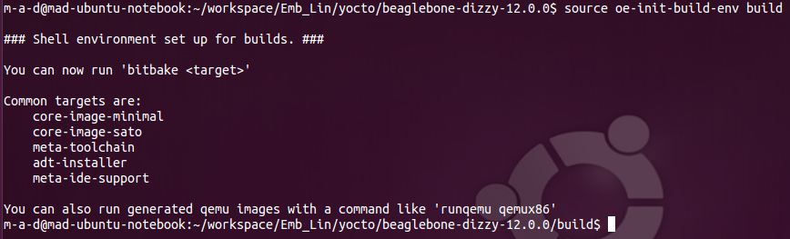

.. include:: etc/kopf.rst

Beschreibung der Hardware
=========================

Für das Projekt wird das Beaglebone Black verwendet. Gründe hierfür sind der günstige Preis, die gute Verarbeitung und die hohe Leistung bei relativ geringem Energiebedarf.

Zunächst werden wir uns einmal mit der Hard- und Software im Orginalzustand wittmen. Verbindet man ein neues Beaglebone Black via USB mit dem Host-/Entwicklungsrechner so wird eine weitere Netzwerkverbindung geöffnet. Über diese kann man via ssh eine Verbindung zum Target starten.

.. code:: bash
    
    ssh debian@192.168.7.2
    # pwd: temppwd

Es befindet sich bereits eine angepasste Debian Version Linux beaglebone 3.8.13-bone47 auf dem 4 GB großen eMMC Speicher. Es wird per default von der eMMC gebootet und unter Verwendung von Maus, Tastatur und Display könnte man das BBB wie einen  rechenpower armen PC verwenden.

.. cat /proc/cpuinfo
.. cat /proc/meminfo
.. cat /proc/version
.. cat /lib/libc.so

.. bootloader
.. printenv
.. 

.. hush.c - shell

Verbindung
----------

.. code:: bash
    
    debian@beaglebone:~# ifconfig
    debian@beaglebone:~# dhclient eth0

.. figure:: img/ssh-ifconfig-BBB.png
   :align: center

Blockschaltplan Beaglebone Black
--------------------------------

Komponenten
-----------

.. figure:: img/BBB-components.png
   :align: center

+-----------------+-------------------------------------+
| Komponenten     | Model / Ausführung                  |
+=================+=====================================+
| CPU             | Sitara AM3358BZCZ100 ARM® Cortex-A8 |
|                 | 1GHz  dual-core mit 2000 MIPS       |
+-----------------+-------------------------------------+
| RAM             | 512 MB DDR3L @ 800 MHz              |
+-----------------+-------------------------------------+
| ROM             | 4 GB eMMC                           |
+-----------------+-------------------------------------+
| IPU             | 4 x ARM® Cortex-M4                  |
+-----------------+-------------------------------------+
| GPU             | - PowerVR SGX544 dual core (3D)     |
|                 | - Vivante GC320 core       (2D)     |
+-----------------+-------------------------------------+
| Power Source    | - mini USB DC Jack                  |
|                 | - 5 V DC Jack                       |
|                 | - TPS65217C PMIC                    |
|                 | - LDO                               |
+-----------------+-------------------------------------+
| User Input      | - Reset Button                      |
|                 | - Boot Button                       |
|                 | - Power Button                      |
+-----------------+-------------------------------------+
| Connectors      | - RJ-45 Ethernet 10 / 100           |
|                 | - USB-A (2.0), mini USB             |
|                 | - mini HDMI (audio / video)         |
|                 | - microSD (3,3V)                    |
|                 | - VDD_ADC (1,8V)                    |
|                 | - GPIO    (3,3V)                    |
|                 | - SPI                               |
|                 | - I2C                               |
|                 | - UART                              |
|                 | - JTAG (20 pin Onboard Header)      |
|                 | - MMC1, MMC2                        |
|                 | - 4 Timer                           |
|                 | - CAN                               |
|                 | - XDMA Interrupt                    |
|                 | - LCD                               |
|                 | - Expansion Board ID                |
+-----------------+-------------------------------------+
| PCB             | - 3,4" x 2,1"                       |
|                 | - 6 Layer                           |
|                 | - 39,68 g                           |
+-----------------+-------------------------------------+

[BBB-BSP]_

Bau einer eigenen Linuxumgebung mit dem Yoctoproject
====================================================

Zu Begin soll eine neue angepasste Linuxumgebung auf dem Beagelbone Black aufgesetzt werden. Hierzu bedienen wir uns des Yoctoproject. [BBB-YOCTO]_

.. code:: bash
	
	# für den bau wurde eine ältere LTS-Version von Ubuntu verwendet es waren folgende zusätzliche Pakete nötig:
	#
	sudo apt-get install libsdl1.2-dev
	#
	sudo apt-get install chrpath
	# 
	sudo apt-get install texinfo
	#
	sudo apt-get install gawk
	# 
	sudo apt-get install diffstat 
	#
	sudo apt-get install g++

[TODO]_
.. beschreibung der Funktion der Pakete hinzufügen

Beziehen der Daten
------------------

Herunterladen der Buildumgebung vom Github des Yoctoproject
+++++++++++++++++++++++++++++++++++++++++++++++++++++++++++

.. code:: bash
	
	# aktuelle Version zum Zeitpunkt des Projektbeginns war Dizzy
    git clone git://git.yoctoproject.org/meta-yocto -b dizzy

Herunterladen des aktuellen images von der webseite des Yoctoproject
++++++++++++++++++++++++++++++++++++++++++++++++++++++++++++++++++++

.. code:: bash

	wget http://downloads.yoctoproject.org/releases/yocto/yocto-1.7/machines/beaglebone/beaglebone-dizzy-12.0.0.tar.bz2

Bauen des Yocto-core-images und des Bootloaders
-----------------------------------------------

Erstellen der Buildumgebung und Überprüfung der Variablen
+++++++++++++++++++++++++++++++++++++++++++++++++++++++++

Um den Bauvorgang einzuleiten empfiehlt es sich in den Ordner "'*'/poky" zu wechseln.

.. code:: bash

	source oe-init-build-env build
	# oder
	. oe-init-build-env build

Der Ordner "build" wurde angelegt und außerdem ist das Terminal gleich in diesen gewechselt. In diesem Ordner befindet sich der Unterordner "conf" und in diesem die Datei "local.conf" diese datei einthält unter anderem Informationen darüber für welches Target das Yocto Image gebaut werden soll. Um den Build-Prozess anstoßen zu können muss sie allerdings noch angepasst werden.

.. code:: bash

	vim conf/local.conf

	# Remove the '#' from the 
	#MACHINE ?= "beaglebone"
	# so that it reads
	MACHINE ?= "beaglebone"

Bitbake eine Build-umgebung für ein angepasstes Yocto-linux
+++++++++++++++++++++++++++++++++++++++++++++++++++++++++++

Im nächsten Schritt kann nun mit dem Bau des Yocto Images begonnen werden dies kann je nach Host-Rechner bis zu mehreren Stunden dauern, deswegen sollte man hier entsprechend viel Zeit einplanen. Außerdem sollte bedacht werden das dieser Vorgang einen Großteil der Zeit annähernd alle Ressourcen auf dem Entwicklungsrechner beansprucht.

.. code:: bash

	bitbake core-image-base

Vorbereiten der microSD Karte
-----------------------------

.. code:: bash

	sudo fdisk -lu <dev/device_name>
	# for my system
	sudo fdisk -lu dev/mmcblk0

.. figure:: img/fdisk-list-volumes.png
   :align: center

* Die aktuelle Partitionierung der microSD Karte löschen

.. code:: bash

	Befehl (m für Hilfe): d
	Selected partition 1
	Partition 1 has been deleted.

* Anlegen der zwei neuen Partitionen boot (min. 100 MB) und root (rest)

.. code:: bash

	Befehl (m für Hilfe): n
	Partition type
	   p   primary (0 primary, 0 extended, 4 free)
	   e   extended (container for logical partitions)
	Select (default p): p
	Partitionsnummer (1-4, default 1): 1
	First sector (2048-30881791, default 2048): 
	Last sector, +sectors or +size{K,M,G,T,P} (2048-30881791, default 30881791): +100M

	Created a new partition 1 of type 'Linux' and of size 100 MiB.

	Befehl (m für Hilfe): n
	Partition type
	   p   primary (1 primary, 0 extended, 3 free)
	   e   extended (container for logical partitions)
	Select (default p): p
	Partitionsnummer (2-4, default 2): 2
	First sector (206848-30881791, default 206848): [ENTER]
	Last sector, +sectors or +size{K,M,G,T,P} (206848-30881791, default 30881791): [ENTER]

	Created a new partition 2 of type 'Linux' and of size 14,6 GiB.

* setzen des bootable flags auf der boot Partition

.. code:: bash

	Befehl (m für Hilfe): a
	Partitionsnummer (1,2, default 2): 1

	The bootable flag on partition 1 is enabled now.

* boot formatieren als FAT32

.. code:: bash

	Befehl (m für Hilfe): t
	Partitionsnummer (1,2, default 2): 1
	Hex code (type L to list all codes): c

	If you have created or modified any DOS 6.x partitions, please see the fdisk documentation for additional information.
	Changed type of partition 'Linux' to 'W95 FAT32 (LBA)'.

* root als "Linux" formatieren

.. code:: bash

	Befehl (m für Hilfe): t
	Partitionsnummer (1,2, default 2): 2
	Hex code (type L to list all codes): 83

	Changed type of partition 'Linux' to 'Linux'.

* Überprüfung der SD Karte im Normalfall sollte es etwar so aussehen

.. code:: bash

	Befehl (m für Hilfe): p
	Disk /dev/mmcblk0: 14,7 GiB, 15811477504 bytes, 30881792 sectors
	Geometry: 255 heads, 63 sectors/track, 482528 cylinders
	Units: sectors of 1 * 512 = 512 bytes
	Sector size (logical/physical): 512 bytes / 512 bytes
	I/O size (minimum/optimal): 512 bytes / 512 bytes
	Disklabel type: dos
	Disk identifier: 0x00000000

	Device         Boot  Start      End  Sectors  Size Id Type
	/dev/mmcblk0p1 *      2048   206847   204800  100M  c W95 FAT32 (LBA)
	/dev/mmcblk0p2      206848 30881791 30674944 14,6G 83 Linux

Die Änderungen auf der SD Karte anwenden
++++++++++++++++++++++++++++++++++++++++

.. code:: bash

	Befehl (m für Hilfe): w
	The partition table has been altered.
	Calling ioctl() to re-read partition table.
	Re-reading the partition table failed.: Das Gerät oder die Ressource ist belegt

	The kernel still uses the old table. The new table will be used at the next reboot or after you run partprobe(8) or kpartx(8).

.. code:: bash

	lsblk
	NAME        MAJ:MIN RM   SIZE RO TYPE MOUNTPOINT
	sda           8:0    0 465,8G  0 disk 
	├─sda1        8:1    0   100M  0 part 
	├─sda2        8:2    0 140,5G  0 part 
	├─sda3        8:3    0   100G  0 part 
	├─sda4        8:4    0     1K  0 part 
	├─sda5        8:5    0 221,6G  0 part /
	└─sda6        8:6    0   3,6G  0 part [SWAP]
	mmcblk0     179:0    0  14,7G  0 disk 
	├─mmcblk0p1 179:1    0   100M  0 part 
	└─mmcblk0p2 179:2    0  14,6G  0 part 

Formatieren der "boot-Partition"
++++++++++++++++++++++++++++++++

Für die boot-Partition benötigt man das FAT16 Format, außerdem muss das sogenannte "bootable" flag gesetzt werden.

.. code:: bash

	sudo mkfs.vfat -F 16 -n "boot" /dev/mmcblk0p1

Formatieren der "root-Partition"
++++++++++++++++++++++++++++++++

Die root-Partition benötigt ein linux kompatibles Filesystem in diesem Beispiel verwenden wir ext3.

.. code:: bash

	sudo mke2fs -j -L "root" /dev/mmcblk0p2
	
	Ein Dateisystems mit 3833856 (4k) Blöcken und 960336 Inodes wird erzeugt.
	UUID des Dateisystems: f013f938-dc87-4a3a-a1c4-9961d1d88215
	Superblock-Sicherungskopien gespeichert in den Blöcken: 
		32768, 98304, 163840, 229376, 294912, 819200, 884736, 1605632, 2654208

	beim Anfordern von Speicher für die Gruppentabellen: erledigt                        
	Inode-Tabellen werden geschrieben: erledigt                        
	Das Journal (32768 Blöcke) wird angelegt: erledgt
	Die Superblöcke und die Informationen über die Dateisystemnutzung werden geschrieben: erledigt

Instalation des Bootloaders
---------------------------

.. code:: bash

	cp MLO /media/<USER>/boot1/MLO
	cp u-boot.img /media/<USER>/boot1/u-boot.img

Kopieren und Entpacken des Filesystems
--------------------------------------

.. code:: bash
	
	sudo cp core-image-<something...>.rootfs.tar.bz2 /media/<USER>/root/
	# die root-Partition der SD-Karte mit einem terminal öffnen und dort das image dort Entpacken
	sudo tar -xf core-image-<something...>.rootfs.tar.bz2
	# Zusätzliche Module installieren
	sudo tar x -C /media/<USER>/root/ -f modules-beaglebone.tgz

.. code:: bash

	sudo cp uImage-am335x-bone.dtb /media/<USER>/root/boot/am335x-bone.dtb
	sudo cp uImage-am335x-boneblack.dtb /media/<USER>/root/boot/am335x-boneblack.dtb
	sudo cp uImage-beaglebone.bin /media/<USER>/root/boot/beaglebone.bin
	sudo cp uImage /media/<USER>/root/boot/uImage
	 

Überprüfung der Instalation
---------------------------

Einstellungen von u-boot überprüfen
+++++++++++++++++++++++++++++++++++

.. code:: bash
	
	strings u-boot.img | grep loaduimage
	# wichtige Ausgabe:
	loaduimage=load mmc ${bootpart} ${loadaddr} ${bootdir}/${bootfile}

 
.. code:: bash

	strings u-boot.img | grep bootpart
	# wichtige Ausgabe:
	bootpart=0:2
	loadfdt=load mmc ${bootpart} ${fdtaddr} ${bootdir}/${fdtfile}

.. code:: bash

	strings u-boot.img | grep bootdir
	# wichtige Ausgabe:
	bootdir=/boot

.. code:: bash

	strings u-boot.img | grep bootfile
	# wichtige Ausgabe
	bootfile=uImage

Zugriff auf das serielle Terminal während des Bootvorganges
-----------------------------------------------------------

Zunächst gilt es das BBB wie auf dem folgenden Bild richtig mit dem PC zu verbinden.

.. figure:: img/Connect-BBB-SerialTerminal.png
	:align: center

Nun muss man herausfinden auf welche Schnittstelle die Verbindung zum BBB im Moment abgebildet wird.

.. code:: bash

	dmesg
	# Normalerweise sollte es auf ttyUSB0 abgebildet werden deshalb lässt sich auch folgender Befehl anwenden:
	dmesg | grep ttyUSB0
	[ 1080.035495] usb 3-1.2: FTDI USB Serial Device converter now attached to ttyUSB0

.. figure:: img/BBB-dmesg.png
   :align: center

Um während des Bootvorganges auf das Serielle Terminal und somit auch auf den Bootloader u-boot zugreifen zu können benötigt man einen serielles Terminal (bzw. einen Emulator) wie z.B. Minicom außerdem werden spezielle Befugnisse für das Zugreifen auf den Port benötigt hierfür gibt es 2 unterschiedliche herangehensweisen: 

a) Ändern der Befugnisse um auf den seriellen Port zugreifen zu dürfen

.. code:: bash

	sudo chmod 0666 dev/tty<Device>
	# for my system
	sudo chmod 0666 dev/ttyUSB0

b) Eigenes Profil zur Gruppe "dialout" hinzufügen um auf den seriellen Port zugreifen zu dürfen

.. code:: bash

	sudo usermod -a -G dialout <username>

Außerdem muss der Terminal Emulator der Wahl noch angepasst werden, bzw. mit den entsprechenden Variablen, wie dem Pfad, der Baudrate, Parity und der Konfiguration an Datenbits und Stopbits aufgerufen werden. Die Vorgehensweise für "minicom" wird im Abschnitt "Tools und Programme" genauer beschrieben.

+------------------------------------+-----------------------+
|                                    | Konfiguration für BBB |
+====================================+=======================+
| Baudrate                           | 115200                |
+------------------------------------+-----------------------+
| Anzahl der Daten-Bits              | 8 Databits            |
+------------------------------------+-----------------------+
| Parity                             | no Parity             |
+------------------------------------+-----------------------+
| Stopbits                           | 1 Stopbit             |
+------------------------------------+-----------------------+

	

Netboot test
============

Im Netboot Teil wurde mangels eines USB auf TTL Adapters kurzerhand zum Raspberry Pi 2 gewechselt. Netzwerkboot bietet sich vor allem an, wenn entweder mit besonders großen Dateinen gearbeitet werden soll oder ein kontinuierlicher geringer Datenstrom verarbeitet werden soll. permanente kleine schreibende Zugriffe (v.A. wenn ein Datensatz erheblich kleiner ist als ein Block des SD-Speichers) vermindern die Lebensdauer einer SD-Karte erheblich. Um diese Probleme zu umgehen bedient man sich eines FTP-Servers (häufig findet man diese auch in modernen Routern und Accesspoints).

Tools und Programme
===================

Minicom ein serial Terminal Emulator
------------------------------------

Installation
++++++++++++

.. code:: bash

	# for ubuntu / debian based distributions
	sudo apt-get install minicom

	sudo minicom -s

Einstellungen des seriellen Anschlusses
	

	
Unter A das richtige Device einrichten
++++++++++++++++++++++++++++++++++++++

.. figure:: img/microcom-setup2.png
   :align: center

Als default Speichern
+++++++++++++++++++++

.. figure:: img/microcom-setup3.png
   :align: center

Minicom beenden und neu starten
+++++++++++++++++++++++++++++++

.. figure:: img/microcom-setup4.png
   :align: center

fdisk partitionierungs tool 
---------------------------

"fdisk" ist das standard Partitionierungstool unter Linux ohne graphische Oberfläche. Mit wenigen Befehlen lässt sich so z.B. eine SD-Karte auf die Linux instalation vorbereiten.

Laufwerk auswählen
++++++++++++++++++

öffnen eines Laufwerks (z.B. mmcblk0 für SD Karte)

.. code:: bash
	
	sudo fdisk /dev/mmcblk0 

Laufwerksinformationen ausgeben
+++++++++++++++++++++++++++++++

* Auflisten der Partitionstabelle eines Laufwerks

.. code:: bash

	sudo fdisk -lu /dev/mmcblk0 
	
	Disk /dev/mmcblk0: 14,7 GiB, 15811477504 bytes, 30881792 sectors
	Units: sectors of 1 * 512 = 512 bytes
	Sector size (logical/physical): 512 bytes / 512 bytes
	I/O size (minimum/optimal): 512 bytes / 512 bytes
	Disklabel type: dos
	Disk identifier: 0x00000000

	Device         Boot Start      End  Sectors  Size Id Type
	/dev/mmcblk0p1       8192 30881791 30873600 14,7G  c W95 FAT32 (LBA)

Sonstige Befehle
++++++++++++++++

.. code:: bash
	
	DOS (MBR)
	   a   toggle a bootable flag
	   b   edit nested BSD disklabel
	   c   toggle the dos compatibility flag

	Generic
	   d   delete a partition
	   l   list known partition types
	   n   add a new partition
	   p   print the partition table
	   t   change a partition type
	   v   verify the partition table

	Misc
	   m   print this menu
	   u   change display/entry units
	   x   extra functionality (experts only)

 	Save & Exit
	   w   write table to disk and exit
	   q   quit without saving changes

	Create a new label
	   g   create a new empty GPT partition table
	   G   create a new empty SGI (IRIX) partition table
	   o   create a new empty DOS partition table
	   s   create a new empty Sun partition table

Unterschiedliche Formatierungen
+++++++++++++++++++++++++++++++

.. code:: bash

	Befehl (m für Hilfe): l

	 0  Leer            24  NEC DOS         81  Minix / altes L bf  Solaris        
	 1  FAT12           27  Hidden NTFS Win 82  Linux Swap / So c1  DRDOS/sec (FAT-
	 2  XENIX root      39  Plan 9          83  Linux           c4  DRDOS/sec (FAT-
	 3  XENIX usr       3c  PartitionMagic  84  OS/2 verst. C:- c6  DRDOS/sec (FAT-
	 4  FAT16 <32M      40  Venix 80286     85  Linux erweitert c7  Syrinx         
	 5  Erweiterte      41  PPC PReP Boot   86  NTFS Datenträge da  Keine Dateisyst
	 6  FAT16           42  SFS             87  NTFS Datenträge db  CP/M / CTOS / …
	 7  HPFS/NTFS/exFAT 4d  QNX4.x          88  Linux Klartext  de  Dell Dienstprog
	 8  AIX             4e  QNX4.x 2. Teil  8e  Linux LVM       df  BootIt         
	 9  AIX bootfähig   4f  QNX4.x 3. Teil  93  Amoeba          e1  DOS-Zugriff    
	 a  OS/2-Bootmanage 50  OnTrack DM      94  Amoeba BBT      e3  DOS R/O        
	 b  W95 FAT32       51  OnTrack DM6 Aux 9f  BSD/OS          e4  SpeedStor      
	 c  W95 FAT32 (LBA) 52  CP/M            a0  IBM Thinkpad Ru eb  BeOS Dateisyste
	 e  W95 FAT16 (LBA) 53  OnTrack DM6 Aux a5  FreeBSD         ee  GPT            
	 f  W95 Erw. (LBA)  54  OnTrackDM6      a6  OpenBSD         ef  EFI (FAT-12/16/
	10  OPUS            55  EZ-Drive        a7  NeXTSTEP        f0  Linux/PA-RISC B
	11  Verst. FAT12    56  Golden Bow      a8  Darwin UFS      f1  SpeedStor      
	12  Compaq Diagnost 5c  Priam Edisk     a9  NetBSD          f4  SpeedStor      
	14  Verst. FAT16 <3 61  SpeedStor       ab  Darwin Boot     f2  DOS sekundär   
	16  Verst. FAT16    63  GNU HURD oder S af  HFS / HFS+      fb  VMware VMFS    
	17  Verst. HPFS/NTF 64  Novell Netware  b7  BSDi Dateisyste fc  VMware VMKCORE 
	18  AST SmartSleep  65  Novell Netware  b8  BSDI Swap       fd  Linux raid auto
	1b  Verst. W95 FAT3 70  DiskSecure Mult bb  Boot-Assistent  fe  LANstep        
	1c  Verst. W95 FAT3 75  PC/IX           be  Solaris Boot    ff  BBT            
	1e  Verst. W95 FAT1 80  Altes Minix    

Literatur und sonstige Quellen
==============================

.. [BBB-BSP] Beaglebone Black Blockschaltpläne
	http://linuxgizmos.com/beagleboard-x15-features-dual-core-cortex-a15-sitara/

.. [ELIN-BBB-OS] Beaglebone Black Operating Systems
	http://elinux.org/BeagleBone_Operating_Systems

.. [ELIN-BBB-Debian] Beaglebone Black Debian
	http://elinux.org/BeagleBoardDebian

.. [BBB-YOCTO] Yocto Project Beaglebone Black
	https://www.yoctoproject.org/downloads/bsps/daisy16/beaglebone

.. [YOCTO] Yocto Project Build
	http://android.serverbox.ch/?p=1273

.. [TODO] Look for comments

.. vim: et sw=4 ts=4
