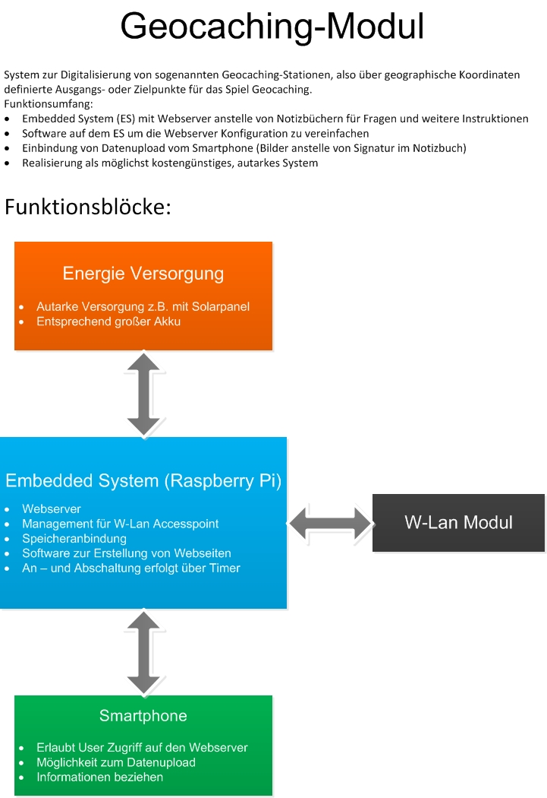

.. include:: etc/kopf.rst

======================
 Das Geocaching-Modul
======================

Die Ursprüngliche Idee zum Projekt wurde in der folgenden Grafik zusammengefasst. Unser Projekt dient der Digitalisierung eines Notizbuches beim Geocaching_. Der Funktionsumfang und die Anzahl der in unserem Projekt verwendeten Programme ist eher gering. Im groben handelt es sich um einen W-Lan Accesspoint, der lediglich zur Verbindung mit dem auf dem Embedded-Linux Rechner befindlichen http-server dient. Dieser soll möglichst einfach von außen mit einer Konfiguration versehen werden, die drei generelle Betriebsmodi erlaubt.

	* Hinweise zum Standort des nächsten Caching Punktes geben -> Anzeigen eines Textes im Browser
	* Hinweise zum Standort des nächsten Caching Punktes geben -> Anzeigen von Bildern
	* Eintragen des eigenen Tags nach Abschluss der Strecke -> Foto-Upload anstelle von Unterschrift

===========================
 Beschreibung der Hardware
===========================

Für das Projekt wird das BeagleBone Black verwendet. Gründe hierfür sind der günstige Preis, die gute Verarbeitung und die hohe Leistung bei relativ geringem Energiebedarf.

Zunächst werden wir uns einmal mit der Hard- und Software im Orginalzustand widmen. Verbindet man ein neues BeagleBone Black via USB mit dem Host-/Entwicklungsrechner so wird eine weitere Netzwerkverbindung geöffnet. Über diese kann man via ssh eine Verbindung zum Target starten.

.. code:: bash
    
    ssh debian@192.168.7.2
    # pwd: temppwd

.. figure:: img/ssh-BBB.png
   :align: center

Es befindet sich bereits eine angepasste Debian Version Linux beaglebone 3.8.13-bone47 auf dem 4 GB großen eMMC Speicher. Es wird per default von der eMMC gebootet und unter Verwendung von Maus, Tastatur und Display könnte man das BBB wie einen  rechenpower armen PC verwenden.

.. cat /proc/cpuinfo
.. cat /proc/meminfo
.. cat /proc/version
.. cat /lib/libc.so

.. bootloader
.. printenv
.. 

.. hush.c - shell

Verbindung
==========

.. code:: bash
    
    debian@beaglebone:~# ifconfig
    debian@beaglebone:~# dhclient eth0

.. figure:: img/ssh-ifconfig-BBB.png
   :align: center

Blockschaltplan Beaglebone Black
================================

.. figure:: img/BBB-Blockschaltplan.png
   :align: center

Komponenten
===========

+-----------------+-------------------------------------+
| Komponenten     | Model / Ausführung                  |
+=================+=====================================+
| CPU             | Sitara AM3358BZCZ100 ARM® Cortex-A8 |
|                 | @ 1GHz                              |
+-----------------+-------------------------------------+
| RAM             | 512 MB DDR3L @ 800 MHz              |
+-----------------+-------------------------------------+
| ROM             | 4 GB eMMC                           |
+-----------------+-------------------------------------+
| IPU             | 4 x ARM® Cortex-M4                  |
+-----------------+-------------------------------------+
| GPU             | - PowerVR SGX544 dual core (3D)     |
|                 | - Vivante GC320 core       (2D)     |
+-----------------+-------------------------------------+
| Power Source    | - mini USB DC Jack                  |
|                 | - 5 V DC Jack                       |
|                 | - TPS65217C PMIC                    |
|                 | - LDO                               |
+-----------------+-------------------------------------+
| User Input      | - Reset Button                      |
|                 | - Boot Button                       |
|                 | - Power Button                      |
+-----------------+-------------------------------------+
| Connectors      | - RJ-45 Ethernet 10 / 100           |
|                 | - USB-A (2.0), mini USB             |
|                 | - mini HDMI (audio / video)         |
|                 | - microSD (3,3V)                    |
|                 | - VDD_ADC (1,8V)                    |
|                 | - GPIO    (3,3V)                    |
|                 | - SPI                               |
|                 | - I2C                               |
|                 | - UART                              |
|                 | - JTAG (20 pin Onboard Header)      |
|                 | - MMC1, MMC2                        |
|                 | - 4 Timer                           |
|                 | - CAN                               |
|                 | - XDMA Interrupt                    |
|                 | - LCD                               |
|                 | - Expansion Board ID                |
+-----------------+-------------------------------------+
| PCB             | - 3,4" x 2,1"                       |
|                 | - 6 Layer                           |
|                 | - 39,68 g                           |
+-----------------+-------------------------------------+

[BBB-BSP]_

======================================================
 Bau einer eigenen Linuxumgebung mit dem Yoctoproject
======================================================

Zu Beginn soll eine neue angepasste Linuxumgebung für das Beagelbone Black kompiliert und auf der MicroSD-Karte platziert werden. Hierzu bedienen wir uns im ersten Teil des Yoctoproject. Bei diesem handelt es sich um eine vereinfachte Version von "". Yocto wurde ist in den letzten Jahren zu einem wichtigen Standard in der Wirtschaft gereift. Yocto ermöglicht den einfachen Bau, von minimal angepassten Linux-distributionen für das eigene Board. Außerdem unterstützt es die Erstellung eines eigenen Paket-servers, von dem aus mit dem Paketmanager "smart" updates auf allen Boards durchgeführt werden können. [BBB-YOCTO]_

Für den Bau der Yocto-distribution empfiehlt sich die Verwendung einer erprobten Linux Distribution. Wir haben Ubuntu 14.04 LTS-Version für den folgenden Bauversuch verwendet. Bevor mit dem Bauen einer eigenen Linux Distribution begonnen werden konnte, mussten noch die folgenden Pakete nachinstalliert werden:

.. code:: bash

	# simple-directmedia-layer - Crossplattform Bibliothek
	sudo apt-get install libsdl1.2-dev
	# change-run-path
	sudo apt-get install chrpath
	# texinfo - gnu Dokumentations System
	sudo apt-get install texinfo
	# GNU - AWaKe
	sudo apt-get install gawk
	# diffstat - make histogramm
	sudo apt-get install diffstat 
	# GNU C++ - Compiler
	sudo apt-get install g++

Herunterladen der Yocto Buildumgebung
=====================================

Von Github des Yoctoproject
---------------------------

.. code:: bash
	
	git clone git://git.yoctoproject.org/poky.git -b <branch>
	# aktuelle Version zum Zeitpunkt des Projektbeginns war Dizzy
	git clone git://git.yoctoproject.org/poky.git -b dizzy

Herunterladen des aktuellen images von der webseite des Yoctoproject
--------------------------------------------------------------------

[TODO]_

.. add a description and the link

.. code:: bash

	wget http://downloads.yoctoproject.org/releases/yocto/yocto-1.7.2/poky-dizzy-12.0.2.tar.bz2
	tar -xzf poky-dizzy-12.0.2.tar.bz2

Bauen des Yocto-core-images und des Bootloaders
===============================================

Erstellen der Buildumgebung und Überprüfung der Variablen
---------------------------------------------------------

Nach dem herunterladen und entpacken, kann mit dem Bau begonnen werden. Dafür wechselt man in das Verzeichnis "poky/". In diesem Verzeichnis befinden sich die Sources und Konfigurations-Dateien, die für den Bauvorgang benötigt werden. Vor jedem neuen Bauvorgang sollte die Buildumgebung gesourced werden. Dies sorgt dafür das die für den Bau benötigten Variablen, wie zum Beispiel Compiler, Kernel und Architekturen im jeweiligen Terminal gesetzt werden. Wechselt man das Terminal muss die Buildumgebung erneut gesourced werden. Eine weitere wichtige Anmerkung, je nach Konfiguration wird für das Bauen zwischen 10 und 25 GB Speicherplatz benötigt, läuft dieser voll bricht der Bauvorgang ab. Er setzt beim nächsten Versuch dafür wieder an der Stelle fort an welcher abgebrochen wurde.

.. code:: bash

	source oe-init-build-env build
	# oder
	. oe-init-build-env build
	# anzeigen verschiedener vorkonfigurierter "Rezepte"
	bitbake-layers show-recipes

Der Ordner *build* wurde angelegt und außerdem ist das Terminal gleich in diesen gewechselt. In diesem Ordner befindet sich der Unterordner *conf* und in diesem die Datei *local.conf* diese datei enthält unter anderem Informationen darüber für welches Target und welche Rezepte mit in das Yocto Image gebaut werden sollen. Um den Build-Prozess anstoßen zu können, muss sie allerdings noch angepasst werden. Außerdem muss in unserem Fall, da wir den Edimax EW-7811Un verwendeten, noch der Treiber als Kernel-Modul mit erstellt werden. 

Anpassungen in der Datei *local.conf*
-------------------------------------

.. code:: bash

	#
	# This file is your local configuration file and is where all local user settings
	# are placed. The comments in this file give some guide to the options a new user
	# to the system might want to change but pretty much any configuration option can
	# be set in this file. More adventurous users can look at local.conf.extended 
	# which contains other examples of configuration which can be placed in this file
	# but new users likely won't need any of them initially.
	#
	# Lines starting with the '#' character are commented out and in some cases the 
	# default values are provided as comments to show people example syntax. Enabling
	# the option is a question of removing the # character and making any change to the
	# variable as required.

	#
	# Parallelism Options
	#
	# These two options control how much parallelism BitBake should use. The first 
	# option determines how many tasks bitbake should run in parallel:
	#
	BB_NUMBER_THREADS ?= "8"
	#
	# Default to setting automatically based on cpu count
	BB_NUMBER_THREADS ?= "${@oe.utils.cpu_count()}"
	# 
	# The second option controls how many processes make should run in parallel when
	# running compile tasks:
	#
	PARALLEL_MAKE ?= "-j 8"
	#
	# Default to setting automatically based on cpu count
	PARALLEL_MAKE ?= "-j ${@oe.utils.cpu_count()}"
	#
	# For a quad-core machine, BB_NUMBER_THREADS = "4", PARALLEL_MAKE = "-j 4" would
	# be appropriate for example.

	#
	# Machine Selection
	#
	# You need to select a specific machine to target the build with. There are a selection
	# of emulated machines available which can boot and run in the QEMU emulator:
	#
	#MACHINE ?= "qemuarm"
	#MACHINE ?= "qemumips"
	#MACHINE ?= "qemuppc"
	#MACHINE ?= "qemux86"
	#MACHINE ?= "qemux86-64"
	#
	# There are also the following hardware board target machines included for 
	# demonstration purposes:
	#

	# [1.] removed the '#' in front of 'MACHINE ?= "beaglebone"'

	MACHINE ?= "beaglebone"
	#MACHINE ?= "genericx86"
	#MACHINE ?= "genericx86-64"
	#MACHINE ?= "mpc8315e-rdb"
	#MACHINE ?= "edgerouter"
	#
	# This sets the default machine to be qemux86 if no other machine is selected:
	MACHINE ??= "qemux86"

	#
	# Where to place downloads
	#
	# During a first build the system will download many different source code tarballs
	# from various upstream projects. This can take a while, particularly if your network
	# connection is slow. These are all stored in DL_DIR. When wiping and rebuilding you
	# can preserve this directory to speed up this part of subsequent builds. This directory
	# is safe to share between multiple builds on the same machine too.
	#
	# The default is a downloads directory under TOPDIR which is the build directory.
	#
	#DL_DIR ?= "${TOPDIR}/downloads"

	#
	# Where to place shared-state files
	#
	# BitBake has the capability to accelerate builds based on previously built output.
	# This is done using "shared state" files which can be thought of as cache objects
	# and this option determines where those files are placed.
	#
	# You can wipe out TMPDIR leaving this directory intact and the build would regenerate
	# from these files if no changes were made to the configuration. If changes were made
	# to the configuration, only shared state files where the state was still valid would
	# be used (done using checksums).
	#
	# The default is a sstate-cache directory under TOPDIR.
	#
	#SSTATE_DIR ?= "${TOPDIR}/sstate-cache"

	#
	# Where to place the build output
	#
	# This option specifies where the bulk of the building work should be done and
	# where BitBake should place its temporary files and output. Keep in mind that
	# this includes the extraction and compilation of many applications and the toolchain
	# which can use Gigabytes of hard disk space.
	#
	# The default is a tmp directory under TOPDIR.
	#
	#TMPDIR = "${TOPDIR}/tmp"

	#
	# Default policy config
	#
	# The distribution setting controls which policy settings are used as defaults.
	# The default value is fine for general Yocto project use, at least initially.
	# Ultimately when creating custom policy, people will likely end up subclassing 
	# these defaults.
	#
	DISTRO ?= "poky"
	# As an example of a subclass there is a "bleeding" edge policy configuration
	# where many versions are set to the absolute latest code from the upstream 
	# source control systems. This is just mentioned here as an example, its not
	# useful to most new users.
	# DISTRO ?= "poky-bleeding"

	#
	# Package Management configuration
	#
	# This variable lists which packaging formats to enable. Multiple package backends 
	# can be enabled at once and the first item listed in the variable will be used 
	# to generate the root filesystems.
	# Options are:
	#  - 'package_deb' for debian style deb files
	#  - 'package_ipk' for ipk files are used by opkg (a debian style embedded package manager)
	#  - 'package_rpm' for rpm style packages
	# E.g.: PACKAGE_CLASSES ?= "package_rpm package_deb package_ipk"
	# We default to rpm:
	PACKAGE_CLASSES ?= "package_rpm"

	#
	# SDK/ADT target architecture
	#
	# This variable specifies the architecture to build SDK/ADT items for and means
	# you can build the SDK packages for architectures other than the machine you are 
	# running the build on (i.e. building i686 packages on an x86_64 host).
	# Supported values are i686 and x86_64
	#SDKMACHINE ?= "i686"

	#
	# Extra image configuration defaults
	#
	# The EXTRA_IMAGE_FEATURES variable allows extra packages to be added to the generated 
	# images. Some of these options are added to certain image types automatically. The
	# variable can contain the following options:
	#  "dbg-pkgs"       - add -dbg packages for all installed packages
	#                     (adds symbol information for debugging/profiling)
	#  "dev-pkgs"       - add -dev packages for all installed packages
	#                     (useful if you want to develop against libs in the image)
	#  "ptest-pkgs"     - add -ptest packages for all ptest-enabled packages
	#                     (useful if you want to run the package test suites)
	#  "tools-sdk"      - add development tools (gcc, make, pkgconfig etc.)
	#  "tools-debug"    - add debugging tools (gdb, strace)
	#  "eclipse-debug"  - add Eclipse remote debugging support
	#  "tools-profile"  - add profiling tools (oprofile, exmap, lttng, valgrind)
	#  "tools-testapps" - add useful testing tools (ts_print, aplay, arecord etc.)
	#  "debug-tweaks"   - make an image suitable for development
	#                     e.g. ssh root access has a blank password
	# There are other application targets that can be used here too, see
	# meta/classes/image.bbclass and meta/classes/core-image.bbclass for more details.
	# We default to enabling the debugging tweaks.

	# [2.] tools-sdk & tools-debug added
	EXTRA_IMAGE_FEATURES = "debug-tweaks tools-sdk tools-debug"

	#
	# Additional image features
	#
	# The following is a list of additional classes to use when building images which
	# enable extra features. Some available options which can be included in this variable 
	# are:
	#   - 'buildstats' collect build statistics
	#   - 'image-mklibs' to reduce shared library files size for an image
	#   - 'image-prelink' in order to prelink the filesystem image
	#   - 'image-swab' to perform host system intrusion detection
	# NOTE: if listing mklibs & prelink both, then make sure mklibs is before prelink
	# NOTE: mklibs also needs to be explicitly enabled for a given image, see local.conf.extended
	USER_CLASSES ?= "buildstats image-mklibs image-prelink"

	#
	# Runtime testing of images
	#
	# The build system can test booting virtual machine images under qemu (an emulator)
	# after any root filesystems are created and run tests against those images. To
	# enable this uncomment this line. See classes/testimage(-auto).bbclass for
	# further details.
	#TEST_IMAGE = "1"
	#
	# Interactive shell configuration
	#
	# Under certain circumstances the system may need input from you and to do this it 
	# can launch an interactive shell. It needs to do this since the build is 
	# multithreaded and needs to be able to handle the case where more than one parallel
	# process may require the user's attention. The default is iterate over the available
	# terminal types to find one that works.
	#
	# be applied, to use the devshell or the kernel menuconfig
	#
	# Supported values are auto, gnome, xfce, rxvt, screen, konsole (KDE 3.x only), none
	# Note: currently, Konsole support only works for KDE 3.x due to the way
	# newer Konsole versions behave
	#OE_TERMINAL = "auto"
	# By default disable interactive patch resolution (tasks will just fail instead):
	PATCHRESOLVE = "noop"

	#
	# Disk Space Monitoring during the build
	#
	# Monitor the disk space during the build. If there is less that 1GB of space or less
	# than 100K inodes in any key build location (TMPDIR, DL_DIR, SSTATE_DIR), gracefully
	# shutdown the build. If there is less that 100MB or 1K inodes, perform a hard abort
	# of the build. The reason for this is that running completely out of space can corrupt
	# files and damages the build in ways which may not be easily recoverable.
	BB_DISKMON_DIRS = "\
	    STOPTASKS,${TMPDIR},1G,100K \
	    STOPTASKS,${DL_DIR},1G,100K \
	    STOPTASKS,${SSTATE_DIR},1G,100K \
	    ABORT,${TMPDIR},100M,1K \
	    ABORT,${DL_DIR},100M,1K \
	    ABORT,${SSTATE_DIR},100M,1K" 

	#
	# Shared-state files from other locations
	#
	# As mentioned above, shared state files are prebuilt cache data objects which can 
	# used to accelerate build time. This variable can be used to configure the system
	# to search other mirror locations for these objects before it builds the data itself.
	#
	# This can be a filesystem directory, or a remote url such as http or ftp. These
	# would contain the sstate-cache results from previous builds (possibly from other 
	# machines). This variable works like fetcher MIRRORS/PREMIRRORS and points to the 
	# cache locations to check for the shared objects.
	# NOTE: if the mirror uses the same structure as SSTATE_DIR, you need to add PATH
	# at the end as shown in the examples below. This will be substituted with the
	# correct path within the directory structure.
	#SSTATE_MIRRORS ?= "\
	#file://.* http://someserver.tld/share/sstate/PATH;downloadfilename=PATH \n \
	#file://.* file:///some/local/dir/sstate/PATH"

	#
	# Qemu configuration
	#
	# By default qemu will build with a builtin VNC server where graphical output can be
	# seen. The two lines below enable the SDL backend too. This assumes there is a
	# libsdl library available on your build system.
	PACKAGECONFIG_append_pn-qemu-native = " sdl"
	PACKAGECONFIG_append_pn-nativesdk-qemu = " sdl"
	ASSUME_PROVIDED += "libsdl-native"

	# CONF_VERSION is increased each time build/conf/ changes incompatibly and is used to
	# track the version of this file when it was generated. This can safely be ignored if
	# this doesn't mean anything to you.
	CONF_VERSION = "1"

Erstellen des Konfigurationsfragments mit menuconfig
----------------------------------------------------

Das Yocto Projekt bietet eine Reihe von leistungsfähigen Kernel-Tools zur Verwaltung von Linux-Kernel-Quellen und Konfigurationsdaten. Diese Tools können verwendet werden um eine einzige Konfigurationsänderung vorzunehmen, mehrere Patches zu verwenden, oder um gleich mit eigenen Kernel-Quellen zu arbeiten. Insbesondere ermöglichen es die Kernel-Tools Konfigurationsfragmente zu generieren, die ausschließlich die gewünschten Änderungen beinhalten. Diese Fragmente können mithilfe des menuconfig Systems bereitgestellt werden.

Um ein Konfigurationsfragment zu erstellen sind folgende Schritte nötig:

1) Zunächst ausführen eines Kernel-builds um die Kernel-Konfiguration zu ermöglichen(.config wird miterstellt)

.. code:: bash

	$ bitbake linux-yocto -c kernel_configme -f

2) Kommando *menuconfig* ausführen um Treiber für wlan-Stick hinzuzufügen(erstellt neue *.config* und benennt alte in *.config.old*)

.. code:: bash
	  
	  $ bitbake linux-yocto -c menuconfig

.. code:: bash

	  Device Drivers  --->
	       [\*] Network device support  --->
	       [\*] Wireless LAN  --->
	       <*>   Realtek rtlwifi family of devices (NEW)  --->
	             --- Realtek rtlwifi family of devices
		     <M>   Realtek RTL8192CU/RTL8188CU USB Wireless Network Adapter
		     [\*]   Debugging output for rtlwifi driver family

3) *diffconfig* Kommando ausführen um das Konfigurationsfragment *fragment.cfg* zu erstellen, welches die Änderungen der *.config* und *.config.old* beiinhaltet

.. code:: bash

	  $ bitbake linux-yocto -c diffconfig

Anlegen der meta-custom Layer für Anpassungen am Yocto-Standard-Build
---------------------------------------------------------------------

Es ist sehr einfach, eine neue Schicht für eigene Anpassungen am Yocto Image, zu erstellen.

Erstellen der neuen Schicht meta-custom:

1) Erstellen der Ordnerstruktur für die Schicht

.. code:: bash

	  # im Verzeichnis ../yocto/poky/
	  mkdir meta-custom
	  mkdir meta-custom/conf

2) Anlegen der Layer-Konfigurationsdatei. Innerhalb jeder Schicht ist es notwendig eine conf/layer.conf file zu erstellen. Am einfachsten ist es diese von schon bestehenden Schichten zu kopieren und anschließend anzupassen.

.. code:: bash
	  
	  # We have a conf and classes directory, add to BBPATH
	  BBPATH .= ":${LAYERDIR}"

	  # We have recipes-* directories, add to BBFILES
	  BBFILES += "${LAYERDIR}/recipes-*/*/*.bb \
          ${LAYERDIR}/recipes-*/*/*.bbappend"
     
	  BBFILE_COLLECTIONS += "custom"
	  BBFILE_PATTERN_custom = "^${LAYERDIR}/"
	  BBFILE_PRIORITY_custom = "5"
	  LAYERVERSION_custom = "1"

3) Das anpassen der /../yocto/poky/conf/bblayers.conf ist wichtig, da beim bauen des Images nur in den Schichten gesucht wird, die in der bblayers.conf aufgeführt werden.

.. code:: bash

	  # LAYER_CONF_VERSION is increased each time build/conf/bblayers.conf
	  # changes incompatibly
	  LCONF_VERSION = "6"

	  BBPATH = "${TOPDIR}"
	  BBFILES ?= ""
	  
	  BBLAYERS ?= " \
	  /../yocto/poky/meta \
	  /../yocto/poky/meta-yocto \
	  /../yocto/poky/meta-yocto-bsp \
	  /../yocto/poky/meta-custom \ 
	  "
	  BBLAYERS_NON_REMOVABLE ?= " \
	  /../yocto/poky/meta \
	  /../yocto/poky/meta-yocto \

 
Erstellen der Recipes in meta-custom
------------------------------------

* Um die Änderungen der *fragment.cfg* hinzuzufügen, muss ein neues Rezept erstellt werden. Dazu wird die Ordnerstruktur recipes-kernel/linux/files erstellt und darin dann die *fragment.cfg* abgelegt werden.

* Danach wird im Ordner recipes-kernel/linux/ die Datei linux-yocto_3.14.bbappend angelegt, die wie folgt aussieht:

.. code:: bash
	  
	  FILESEXTRAPATHS_prepend := "${THISDIR}/files:"
	  SRC_URI += "file://rtl8192.cfg"

* Damit die Funktionalität eines Accesspoints auf dem Beaglebone mithilfe des Yocto-Images gewährleistet werden kann, werden außer dem Treiber für den W-Lan-Stick, noch die Rezepte für die Konnektivität *recipes-connectivity* und die Rezepte für das Web-Framework Flask *recipes-flask* erstellt. Der Ordner *recipes-connectivity* besteht aus den Rezepten dnsmasq, hostapd, und iw. *recipes-flask* enthält alle Rezepte die benötigt werden damit Flask läuft, die da wären, flask selber, itsdangerous, jinja2, markupsafe und werkzeug. Die Vorgehensweise zum Hinzufügen der einzelnen Rezepte, unterscheidet sich kaum.

Bsp. anhand des Werkzeug-recipes:

* erstellen der Ordnerstruktur
  
.. code:: bash

	  meta-custom/recipes-flask
	  meta-custom/recipes-flask/werkzeug

* anlegen der bb Datei im Ordner werkzeug

.. code:: bash 

	  # Wenn man ein Rezept benennt, muss die folgende Namenskonvention eingehalten werden
	  # <basename>_<version>.bb. In diesem Fall werkzeug_0.10.4.bb
	  
	  
	  DESCRIPTION = "The Swiss Army knife of Python web development"
	  HOMEPAGE = "https://https://pypi.python.org/pypi/Werkzeug"
	  SECTION = "devel/python"
	  LICENSE = "BSD"
	  LIC_FILES_CHKSUM = "file://LICENSE;md5=a68f5361a2b2ca9fdf26b38aaecb6faa"

	  PR = "r0"
	  SRCNAME = "Werkzeug"
	  PV = "0.10.4"

	  SRC_URI = "https://pypi.python.org/packages/source/W/Werkzeug/Werkzeug-0.10.4.tar.gz"
	  SRC_URI[md5sum] = "66a488e0ac50a9ec326fe020b3083450"
	  SRC_URI[sha256sum] = "9d2771e4c89be127bc4bac056ab7ceaf0e0064c723d6b6e195739c3af4fd5c1d"

	  S = "${WORKDIR}/${SRCNAME}-${PV}"

	  inherit setuptools

	  CLEANBROKEN = "1"

* anlegen einer bbappend file, damit für den lighttpd die module: fastcgi, alias und rewrite mitinstalliert werden, da diese für die Konfiguration des lighttpd benötigt werden.

.. code:: bash

	  FILESEXTRAPATHS_prepend := "${THISDIR}/${BP}:"

	  RDEPENDS_${PN} += " \
                lighttpd-module-fastcgi \
                lighttpd-module-alias \
                lighttpd-module-rewrite \
	  "

	  

Abschließende Anpassungen in der local.conf
-------------------------------------------

Damit die erstellten Rezepte beim bauen des Images darauf enthalten sind, muss noch die local.conf so angepasst werden dass diese mitgebaut und auf dem Image installiert werden. Dazu werden folgende Zeilen der *local.conf* Datei hinzugefügt:

.. code:: bash

	  # [3.] slim ssh-client dropbear added
	  CORE_IMAGE_EXTRA_INSTALL += "dropbear"
	  # [4.] git-vcn added
	  CORE_IMAGE_EXTRA_INSTALL += "git"
	  # [5.] slim htpd-server added
	  CORE_IMAGE_EXTRA_INSTALL += "lighttpd"
	  # [6.] wireless-tools and functions for the hot-spot functionality
	  CORE_IMAGE_EXTRA_INSTALL += "wireless-tools"
	  # [7.] dhcp-server
	  CORE_IMAGE_EXTRA_INSTALL += "dhcp-server"
	  # [8.] dhcp-client
	  CORE_IMAGE_EXTRA_INSTALL += "dhcp-client"
	  # [9.] linux firmware for wlan stick
	  IMAGE_INSTALL_append += " linux-firmware-rtl8192cu"
	  # [10.] flask micro-framework added
	  IMAGE_INSTALL_append += " flask"
	  # [11.] werkzeug wsgi added
	  IMAGE_INSTALL_append += " werkzeug"
	  # [12.] jinja2 template engine added
	  IMAGE_INSTALL_append += " jinja2"
	  # [13.] itsdangerous Various helpers to pass trusted data to untrusted environments and back
	  IMAGE_INSTALL_append += " itsdangerous"
	  #[14.] markupsafe Implements a XML/HTML/XHTML Markup safe string for Python
	  IMAGE_INSTALL_append += " markupsafe"
	  # [15.] flup needed for fastcgi support
	  IMAGE_INSTALL_append += " flup"

Finale Ordnerstruktur in meta-custom
------------------------------------

.. code:: bash

	  
	  meta-custom
	  │  
	  ├── conf
	  │   └── layer.conf
	  ├── recipes-connectivity 
	  │   ├── hostapd
	  │   │   ├── hostapd-2.2
	  │   │   │   ├── defconfig
	  │   │   │   ├── hostapd.service
	  │   │   │   └── init
	  │   │   └── hostapd_2.2.bb
	  │   └── iw
	  │       ├── iw
	  │       │   └── 0001-iw-version.sh-don-t-use-git-describe-for-versioning.patch
	  │       └── iw_3.15.bb
	  ├── recipes-extended
	  │   └── lighttpd
	  │       └── lighttpd_1.4.33.bbappend
	  ├── recipes-flask
	  │   ├── flask
	  │   │   └── flask_1.0.0.bb
	  │   ├── flup
	  │   │   └── flup_1.0.2.bb
	  │   ├── itsdangerous
	  │   │   └── itsdangerous_0.24.bb
	  │   ├── jinja2
	  │   │   └── jinja2_2.7.3.bb
	  │   ├── markupsafe
	  │   │   └── markupsafe_0.23.bb
	  │   └── werkzeug
	  │       └── werkzeug_0.10.4.bb
	  └── recipes-kernel
	      └── linux
                  ├── files
                  │   └── rtl8192.cfg
                  └── linux-yocto_3.14.bbappend

	  

Bitbake eine Build-umgebung für ein angepasstes Yocto-linux
-----------------------------------------------------------

Im nächsten Schritt kann nun mit dem Bau des Yocto Images begonnen werden. Dies kann je nach Host-Rechner bis zu mehreren Stunden dauern, deswegen sollte man hier entsprechend viel Zeit einplanen. Außerdem sollte bedacht werden das dieser Vorgang einen Großteil der Zeit annähernd alle Ressourcen auf dem Entwicklungsrechner beansprucht.

.. code:: bash

	# eine Linuxumgebung, die neben den vorgeingestellten Komponenten die wichtigsten Grundfunktionen enthält
	# die von uns gewählte Konfiguration
	bitbake core-image-base
	
	# weitere wichtige Basiskonfigurationen:
	
	# minimale Linuxumgebung
	bitbake core-image-minimal
	
	# real-time unterstützte Linuxumgebung
	bitbake core-image-rt

.. figure:: img/Yocto-build1.png
   :align: center

hob und toaster - graphische Oberflächen für die Konfiguration von Yocto
------------------------------------------------------------------------

===============================
 Vorbereiten der microSD Karte
===============================

.. code:: bash

	sudo fdisk -lu <dev/device_name>
	# for my system
	sudo fdisk -lu dev/mmcblk0

.. figure:: img/fdisk-list-volumes.png
   :align: center

* Die aktuelle Partitionierung der microSD Karte löschen

.. code:: bash

	Befehl (m für Hilfe): d
	Selected partition 1
	Partition 1 has been deleted.

* Anlegen der zwei neuen Partitionen boot (min. 100 MB) und root (rest)

.. code:: bash

	Befehl (m für Hilfe): n
	Partition type
	   p   primary (0 primary, 0 extended, 4 free)
	   e   extended (container for logical partitions)
	Select (default p): p
	Partitionsnummer (1-4, default 1): 1
	First sector (2048-30881791, default 2048): 
	Last sector, +sectors or +size{K,M,G,T,P} (2048-30881791, default 30881791): +100M

	Created a new partition 1 of type 'Linux' and of size 100 MiB.

	Befehl (m für Hilfe): n
	Partition type
	   p   primary (1 primary, 0 extended, 3 free)
	   e   extended (container for logical partitions)
	Select (default p): p
	Partitionsnummer (2-4, default 2): 2
	First sector (206848-30881791, default 206848): [ENTER]
	Last sector, +sectors or +size{K,M,G,T,P} (206848-30881791, default 30881791): [ENTER]

	Created a new partition 2 of type 'Linux' and of size 14,6 GiB.

* setzen des bootable flags auf der boot Partition

.. code:: bash

	Befehl (m für Hilfe): a
	Partitionsnummer (1,2, default 2): 1

	The bootable flag on partition 1 is enabled now.

boot formatieren als FAT16 (LBA)
================================

.. code:: bash

	Befehl (m für Hilfe): t
	Partitionsnummer (1,2, default 2): 1
	Hex code (type L to list all codes): e

	If you have created or modified any DOS 6.x partitions, please see the fdisk documentation for additional information.
	Changed type of partition 'Linux' to 'W95 FAT16 (LBA)'.

root als "Linux" formatieren
============================

.. code:: bash

	Befehl (m für Hilfe): t
	Partitionsnummer (1,2, default 2): 2
	Hex code (type L to list all codes): 83

	Changed type of partition 'Linux' to 'Linux'.

* Überprüfung der SD Karte im Normalfall sollte es etwar so aussehen

.. code:: bash

	Befehl (m für Hilfe): p
	Disk /dev/mmcblk0: 14,7 GiB, 15811477504 bytes, 30881792 sectors
	Geometry: 255 heads, 63 sectors/track, 482528 cylinders
	Units: sectors of 1 * 512 = 512 bytes
	Sector size (logical/physical): 512 bytes / 512 bytes
	I/O size (minimum/optimal): 512 bytes / 512 bytes
	Disklabel type: dos
	Disk identifier: 0x00000000

	Device         Boot  Start      End  Sectors  Size Id Type
	/dev/mmcblk0p1 *      2048   206847   204800  100M  c W95 FAT32 (LBA)
	/dev/mmcblk0p2      206848 30881791 30674944 14,6G 83 Linux

Die Änderungen auf der SD Karte anwenden
========================================

.. code:: bash

	Befehl (m für Hilfe): w
	The partition table has been altered.
	Calling ioctl() to re-read partition table.
	Re-reading the partition table failed.: Das Gerät oder die Ressource ist belegt

	The kernel still uses the old table. The new table will be used at the next reboot or after you run partprobe(8) or kpartx(8).

.. code:: bash

	lsblk
	NAME        MAJ:MIN RM   SIZE RO TYPE MOUNTPOINT
	sda           8:0    0 465,8G  0 disk 
	├─sda1        8:1    0   100M  0 part 
	├─sda2        8:2    0 140,5G  0 part 
	├─sda3        8:3    0   100G  0 part 
	├─sda4        8:4    0     1K  0 part 
	├─sda5        8:5    0 221,6G  0 part /
	└─sda6        8:6    0   3,6G  0 part [SWAP]
	mmcblk0     179:0    0  14,7G  0 disk 
	├─mmcblk0p1 179:1    0   100M  0 part 
	└─mmcblk0p2 179:2    0  14,6G  0 part 

Anlegen des Filesystem und der Partitionstabelle
================================================

"boot-Partition"
----------------

Für die boot-Partition benötigt man das FAT16 Format, außerdem muss das sogenannte "bootable" flag gesetzt werden.

.. code:: bash

	sudo mkfs.vfat -F 16 -n "boot" /dev/mmcblk0p1

"root-Partition"
----------------

Die root-Partition benötigt ein Linux kompatibles Filesystem in diesem Beispiel verwenden wir ext3.

.. code:: bash

	sudo mke2fs -j -L "root" /dev/mmcblk0p2
	
	Ein Dateisystems mit 3833856 (4k) Blöcken und 960336 Inodes wird erzeugt.
	UUID des Dateisystems: f013f938-dc87-4a3a-a1c4-9961d1d88215
	Superblock-Sicherungskopien gespeichert in den Blöcken: 
		32768, 98304, 163840, 229376, 294912, 819200, 884736, 1605632, 2654208

	beim Anfordern von Speicher für die Gruppentabellen: erledigt                        
	Inode-Tabellen werden geschrieben: erledigt                        
	Das Journal (32768 Blöcke) wird angelegt: erledgt
	Die Superblöcke und die Informationen über die Dateisystemnutzung werden geschrieben: erledigt

=======================================
 Platzieren der Daten auf der SD-Karte
=======================================

Installation des Bootloaders
============================

.. code:: bash

	cp MLO /media/<USER>/boot1/MLO
	cp u-boot.img /media/<USER>/boot1/u-boot.img

Kopieren und Entpacken des Filesystems
======================================

.. code:: bash
	
	# Dateisystem direkt auf der SD-Karte entpacken (von manchen systemen nicht unterstützt)
	sudo tar -xvpf core-image-<something...>.tar.bz2 -C /media/<USER>/root/

	# Sollte das nicht möglich sein kann man das Archiv alternativ auf die SD-Karte kopieren und dort entpacken
	sudo cp core-image-<something...>.rootfs.tar.bz2 /media/<USER>/root/
	# die root-Partition der SD-Karte in einem terminal öffnen und dort entpacken
	sudo tar -xf core-image-<something...>.rootfs.tar.bz2
	# falls nötig Zusätzliche Module installieren
	sudo tar x -C /media/<USER>/root/ -f modules-beaglebone.tgz

.. code:: bash

	# da in unseren Versuchen die Ergebnisse nicht einheitlich waren sollte noch angemerkt werden,
	# dass auf der "root-Partition" im Verzeichnis "/boot" die folgenden Dateien vorhanden sein sollten:
	# boot/ 
	# ├─am335-bone.dtb
	# ├─am335-boneblack.dtb
	# ├─beaglebone.bin
	# └─uImage
	# falls nicht sollten diese manuel in das Verzeichnis kopiert werden.

	sudo cp uImage-am335x-bone.dtb /media/<USER>/root/boot/am335x-bone.dtb
	sudo cp uImage-am335x-boneblack.dtb /media/<USER>/root/boot/am335x-boneblack.dtb
	sudo cp uImage-beaglebone.bin /media/<USER>/root/boot/beaglebone.bin
	sudo cp uImage /media/<USER>/root/boot/uImage
	 

============
 Das u-boot
============

Das u-boot ist einer der am meisten verbreiteten bootloader im Bereich Embedded Linux. Für die Meisten Boards und Systeme wird man auch ohne großen Aufwand eine angepasste u-boot Konfiguration finden. Mit dieser, einem Kernel, Treibern, einem Root-File-System und einigen Programmen ist eine minimale Embedded Linux Distribution bereits voll funktionsfähig.

Der Bootvorgang bei einem Embedded Linux System mit u-boot läuft entsprechend dem folgenden Muster ab.

* CPU springt an eine spezifische Stelle im Speicher und fängt an Ort und Stelle an den Code auszuführen
	- der Level 1 Bootloader wird in den Cache der CPU geladen
	- ein einfaches Speicherlayout wird geladen um den Arbeitsspeicher für die CPU zugänglich zu machen
* Der Levle 1 Bootloader lädt teile von u-boot von einer definierten Adresse im Festspeicher oder mit Hilfe des ftp-Protokolls über Ethernet
	- meist in mindestens 2 Vorgängen, da u-boot zu groß ist um auf einmal geladen zu werden
* Der Levle 2 Bootloader lädt den Kernel, meistens ein sogenanntes uImage, dies enthält neben dem Linux-Kernel außerdem die wichtigsten Treiber
	- von hier beginnt die eigentliche Initialisierung von Linux, die sich im wesentlichen nicht mehr von der Initialisierung eines Linux Desktops unterscheidet

u-boot unter yocto
==================

Wird Yocto als Buildumgebung für das Root-File-System eingesetzt wird automatisch ein passender bootloader und ein uImage (Kernel) inklusive Treibern für das Board gebaut. Diese müssen dann nur noch, wie bereits oben beschrieben auf die Partitionen der SD-Karte kopiert werden. Ohne eine solche Umgebung müssen die Folgenden Schritte durchlaufen werden.

u-boot selbst kompilieren
=========================

Um u-boot selbst zu kompilieren muss zunächst das entsprechende Repositories von GitHub geclont werden.

.. code:: bash

	user@host:~/workspace/$ git clone git://git.denx.de/u-boot.git
	Nach »u-boot« wird geklont
	remote: Counting objects: 328911, done.
	remote: Compressing objects: 100% (64169/64169), done.
	remote: Total 328911 (delta 263337), reused 324204 (delta 258799)
	Objekte werden empfangen: 100% (328911/328911), 73.97 MiB | 1.33 MiB/s, done.
	Unterschiede werden aufgelöst: 100% (263337/263337), done.
	Verbundenheit wird überprüft … Fertig.
	Checking out files: 100% (10648/10648), done.

Außerdem benötigt man einen passenden Cross-Compiler. Hierzu empfiehlt sich eine kurze Recherche im Internet, da sich manche Cross-Compiler mehr für bestimmte Boards eignen als andere. Für das BBB und den Raspberry Pi lässt sich der "gcc-arm-linux-gnueabihf" gleichermaßen einsetzten, aber sowohl Texas Instruments als auch die Raspberry Pi Foundation bieten spezielle Crosscompiler an. Etwas mehr dazu folgt im Absatz "Netboot".

.. code:: bash
	
	# installation eines Cross-Compilers
	user@host:~/workspace/u-boot$ sudo apt-get install gcc-arm-linux-gnueabihf

Nun müssen noch einige Variablen im Terminal gesetzt werden.

.. code:: bash
	
	# setzen der Ziel Architektur
	user@host:~/workspace/u-boot$ export ARCH=arm
	# setzen des gewünschten Cross-Compilers
	user@host:~/workspace/u-boot$ export CROSS_COMPILE=arm-linux-gnueabihf-

.. code:: bash

	# um die Einstellungen zu testen empfiehlt sich ein test-build ohne weitere Konfiguration
	user@host:~/workspace/u-boot$ make distclean
	  CLEAN   scripts/basic
	  CLEAN   scripts/kconfig
	  CLEAN   include/config include/generated

	# BOARD_CONFIG ist ein Platzhalter für die vorgefertigte config file für das Board
	# zu finden sind diese unter "u-boot/configs"
	user@host:~/workspace/u-boot$ make <BOARD_CONFIG>
	#
	# configuration written to .config
	#

	# u-boot bauen
	# -j <ANZAHL_DER_ZUR_VERFÜGUNG_STEHENDEN_CORES>
	user@host:~/workspace/u-boot$ make -j 4

Nach Abschluss des Vorgangs befindet sich jetzt im Verzeichnis "/u-boot", die speziell für das spezifizierte Embedded Linux Board angepasste "u-boot" Datei.

.. code:: bash

	user@host:~/workspace/u-boot$ file u-boot
	u-boot: ELF 32-bit LSB  shared object, ARM, EABI5 version 1 (SYSV), dynamically linked (uses shared libs), not stripped

Einstellungen von u-boot überprüfen
===================================

.. code:: bash
	
	strings u-boot.img | grep loaduimage
	# wichtige Ausgabe:
	loaduimage=load mmc ${bootpart} ${loadaddr} ${bootdir}/${bootfile}

.. code:: bash

	strings u-boot.img | grep bootpart
	# wichtige Ausgabe:
	bootpart=0:2
	loadfdt=load mmc ${bootpart} ${fdtaddr} ${bootdir}/${fdtfile}

.. code:: bash

	strings u-boot.img | grep bootdir
	# wichtige Ausgabe:
	bootdir=/boot

.. code:: bash

	strings u-boot.img | grep bootfile
	# wichtige Ausgabe
	bootfile=uImage

Zugriff auf das serielle Terminal während des Bootvorganges
===========================================================

Nachdem das Beaglebone Black mit dem USB-to-ttl mit dem Entwicklungsrechner verbunden wurde müssen noch einige Einstellungen getätigt werden, um das arbeiten mit einem "Serial-Terminal-Emulator" möglich zu machen.

.. figure:: img/Connect-BBB-SerialTerminal.png
	:align: center

Unter anderem muss die richtige Schnittstelle, auf die die Verbindung zum BBB im Moment abgebildet wird gefunden werden.

.. code:: bash

	dmesg | grep serial

	# Normalerweise sollte es auf ttyUSB0 abgebildet werden deshalb lässt sich auch folgender Befehl anwenden:
	dmesg | grep ttyUSB0
	[ 1080.035495] usb 3-1.2: FTDI USB Serial Device converter now attached to ttyUSB0

.. figure:: img/BBB-dmesg.png
   :align: center

Um während des Bootvorganges auf das Serielle Terminal und somit auch auf den Bootloader u-boot zugreifen zu können, benötigt man einen serielles Terminal (bzw. einen Emulator) wie z.B. Minicom außerdem werden spezielle Befugnisse für das Zugreifen auf den Port benötigt hierfür gibt es 2 unterschiedliche herangehensweisen: 

a) Ändern der Befugnisse um auf den seriellen Port zugreifen zu dürfen

.. code:: bash

	sudo chmod 0666 dev/tty<Device>
	# for my system
	sudo chmod 0666 dev/ttyUSB0

b) Eigenes Profil zur Gruppe "dialout" hinzufügen um auf den seriellen Port zugreifen zu dürfen

.. code:: bash

	sudo usermod -a -G dialout <username>

Außerdem muss der Terminal Emulator der Wahl noch angepasst werden, bzw. mit den entsprechenden Variablen, wie dem Pfad, der Baudrate, Parity und der Konfiguration an Datenbits und Stopbits aufgerufen werden. Die Vorgehensweise für "minicom" wird im Abschnitt "Tools und Programme" genauer beschrieben.

+------------------------------------+-----------------------+
|                                    | Konfiguration für BBB |
+====================================+=======================+
| Baudrate                           | 115200                |
+------------------------------------+-----------------------+
| Anzahl der Daten-Bits              | 8 Databits            |
+------------------------------------+-----------------------+
| Parity                             | no Parity             |
+------------------------------------+-----------------------+
| Stopbits                           | 1 Stopbit             |
+------------------------------------+-----------------------+

==============
 Netboot test
==============

Netboot, also das booten von einer Netzwerkquelle gehört nicht notwendigerweise zu unserem eigentlichen Projekt, allerdings sollte man im Rahmen des Praktikums darauf eingehen. Aufgrund einer Lieferverzögerung wurde der folgende Teil auf einem bereits vorhandenen Raspberry Pi 2 getestet. Vom Netzwerk zu booten bietet sich vor allem an, wenn entweder mit besonders großen Dateinen gearbeitet werden soll oder ein kontinuierlicher geringer Datenstrom verarbeitet werden soll. Permanente kleine schreibende Zugriffe wie beim "loggen" (v.A. wenn ein Datensatz erheblich kleiner ist als ein Block des SD-Speichers) vermindern die Lebensdauer einer SD-Karte erheblich. Um diese Probleme zu umgehen bedient man sich eines FTP-Servers (häufig findet man diese auch in modernen Routern und Accesspoints). Oder um mechanischen Beschädigungen am SD-Karten Leser des Microcontrollers vorzubeugen, wenn man des öffteren den Kernel oder das Rootfile System wechselt, oder auch um endlich wieder eine Verwendung für eine alte 16 MB große SD-Karte zu haben.

Da die meisten Embedded-Linux Systeme mit dem Bootloader u-boot betrieben werden können wird in diesem Abschnitt auch nur auf diesen spezifisch eingegangen. Generell gibt es zwei unterschiedliche Möglichkeiten mit u-boot vom Netzwerk zu booten, die erste Möglichkeit empfiehlt sich, wenn man häufig die Kernel-version wechselt ohne direkten Zugang zur SD-Karte des Systems. Die zweite eignet sich eher für Vorgänge mit intensivem logging oder große Datenmengen.

[AHUT]_

Netboot via nfs
===============

Netboot via ftp/tftp
====================

=====================================
 Debian 8.0 für das BeagleBone Black
=====================================

Da sich das arbeiten und entwickeln unter der selbst gebauten Yocto-distribution als zunehmend schwierig herausgestellt hat und wir bereits Erfahrungen mit dem Selbst bauen und kompilieren von Images für unser BBB gesammelt haben, wurde beschlossen für die Fertigstellung unseres Projektes auf ein Debian zu wechseln. Vor allem um auf den Komfort eines Paketmanagers zurückgreifen zu können.

.. code:: bash

	# einfach ein passendes SD-Karten abbild finden und herunterladen
	# Achtung für das BBB gibt es sowohl flasher images für den eMMC als auch SD-Karten images
	wget https://rcn-ee.com/rootfs/2015-05-08/microsd/bone-debian-8.0-console-armhf-2015-05-08-2gb.img.xz

	# image entpacken
	unxz bone-debian-8.0-console-armhf-2015-05-08-2gb.img.xz

	# image auf die SD-Karten kopieren
	sudo dd if=./bone-debian-8.0-console-armhf-2015-05-08-2gb.img of=/dev/sdX

Die ersten Schritte nach dem erfolgreichen platzieren des images:
=================================================================

.. code:: bash

	# aufgrund der Voreinstellungen im image ist es wieder möglich über die mini-USB Schnittstelle per ssh mit dem Board zu verbinden
	ssh debian@192.168.7.2
	passwd: temppwd
	
	# oder
	ssh debian@arm 
	passwd: temppwd 

	# image der größe der SD-Karten anpassen
	sudo sh /opt/scripts/tools/growpartition.sh

	# danach sollte das Betriebssystem neu gestartet werden um die durchgeführten Änderungen abzuschließen
	sudo reboot

	# richtige Zeitzone angeben
	echo "Europe/Berlin" > /etc/timezone
	dpkg-reconfigure -f noninteractive tzdata

	# Installieren von "build-essentials"
	sudo apt-get install build-essentials

	# Installieren von "lighttpd"
	sudo apt-get install lighttpd

	# Installation von "hostapd"
	sudo apt-get install hostapd

	# Installation von "dnsmasq"
	sudo apt-get install dnsmasq

	# Installation von "isc-dhcp-server"
	sudo apt-get install isc-dhcp-server

=======================================================
 Einrichten eines Accesspoint auf dem BeagleBone Black
=======================================================

Um eine Accesspoint Funktion zu ermöglichen benötigt ein Rechner oder ein Embedded System neben einem W-Lan Adapter einen dhcp-server, einen http-server, wie zum Beispiel (Apache - im Desktop Bereich oder lighttpd - im ES-Bereich) und einen DNS-Server. Außerdem müssen diverse Einstellungen entsprechend der geplanten Verwendungsweise getroffen werden. Im folgenden wird dieser Vorgang behandelt.

Um die Anleitung möglichst allgemein zu halten werden in der folgenden Erklärung die eigentlichen Werte durch die Lables in der Tabelle ersetzt die von uns verwendeten Konfigurationen wurden in den Dateien unter "../config-files/" abgelegt.

+-----------------+-----------------------------+--------------------------------+------------------------------------------------------------------+
| Name            | Lable                       | Value in unserer Konfiguration | Funktion                                                         |
+=================+=============================+================================+==================================================================+
| ssid            | <Your-SSID>                 | GeoSpotAp                      | der Name des lokalen W-Lan Netzwerkes                            |
+-----------------+-----------------------------+--------------------------------+------------------------------------------------------------------+
| wpa_passphrase  | <Your-Passphrase>           | geospotap                      | das Passwort für den Zugang zum W-Lan                            |
+-----------------+-----------------------------+--------------------------------+------------------------------------------------------------------+
| interface       | <YOUR-WIFI-INTERFACE>       | wlan0                          | der Name des W-Lan Interfaces (gewöhnlich wlan0)                 |
+-----------------+-----------------------------+--------------------------------+------------------------------------------------------------------+
| bridge          | <YOUR-BRIDGE-NAME>          |                                | Name der lokalen bridge (gewöhnlich br0)                         |
+-----------------+-----------------------------+--------------------------------+------------------------------------------------------------------+
| driver          | <GENERIC-DRIVER-IF>         |                                | Treiber Interface für "hostapd"                                  |
+-----------------+-----------------------------+--------------------------------+------------------------------------------------------------------+
| channel         | <YOUR-WIFI-CHANNEL>         | 09                             | der Kanal des W-Lan Netzes (auf lokale Gegebenheiten reagieren!) |
+-----------------+-----------------------------+--------------------------------+------------------------------------------------------------------+
| country_code    | <YOUR-COUNTRY-CODE>         | Ländercode (GER = Deutschland) |                                                                  |
+-----------------+-----------------------------+--------------------------------+------------------------------------------------------------------+
| subnet          | <YOUR-SUBNET>               | 192.168.4.0                    |                                                                  |
|                 | <x>.<y>.<z>.0               |                                |                                                                  |
+-----------------+-----------------------------+--------------------------------+------------------------------------------------------------------+
| range           | <FIRST-FREE-IP>             | 192.168.4.4                    |                                                                  |
+                 +-----------------------------+--------------------------------+                                                                  +
|                 | <LAST-FREE-IP>              | 192.168.4.64                   |                                                                  |
+-----------------+-----------------------------+--------------------------------+------------------------------------------------------------------+
| adress          | <x>.<y>.<z>.<BASE-ADRESS>   | 192.168.4.1                    | Basis Adresse des w-lan Moduls                                   |
+-----------------+-----------------------------+--------------------------------+------------------------------------------------------------------+
| netmask         | <YOUR-NETMASK>              | 191 (= 255 - 64)               | Zum ausmaskieren von Werten z.B. 255.255.255.<#-of-free-ips>     |
|                 |                             |                                | oder 255.255.255.0                                               |
+-----------------+-----------------------------+--------------------------------+------------------------------------------------------------------+
| Router          | <YOUR-ROUTER>               | 192.168.2.1                    | die IP-Adresse des lokalen Routers                               |
+-----------------+-----------------------------+--------------------------------+------------------------------------------------------------------+
    

Finden und identifizieren des W-Lan Devices
===========================================

Da es sich bei Boards wie dem BeagleBone Black oder dem Raspberry Pi eigentlich ausschließlich um USB W-Lan Sticks handelt sollte es möglich sein mit dem Befehl "lsusb" die verfügbaren USB-Schnittstellen auf angeschlossene Geräte zu überprüfen. Hat man also seinen W-Lan Stick mit dem Board verbunden sollte man zunächst folgendes versuchen:

.. code:: bash

	root@arm:~# lsusb
    # sollte eine ähnliche Ausgabe erzeugen
    Bus 001 Device 002: ID 0846:9030 NetGear, Inc. WNA1100 Wireless-N 150 [Atheros AR9271]
    Bus 001 Device 001: ID 1d6b:0002 Linux Foundation 2.0 root hub

Auf "Bus 001 Device 002" befindet sich unser W-Lan stick mit dem Chipsatz "Atheros AR9271", nun kann überprüft werden ob dieser bereits im Kernel angemeldet ist.

.. code:: bash

	root@arm:~# dmesg | grep AR9271
    [   19.484197] ieee80211 phy0: Atheros AR9271 Rev:1

Diese meldung zeigt uns, dass der Stick bereits als W-Lan Device erkannt wurde und auch, dass sein Treiber bereits vorhanden ist. Das vorangestellte "ieee80211" verweist auf den IEEE Standart für W-Lan Geräte. Ist dies nicht der Fall hilft eine kurze Recherche meist weiter. Die meisten Hersteller bieten Firmware Pakete an, die über den "apt-get Mechanismus" heruntergeladen werden können. Anschließend sollte ein Neustart des Gerätes dazu führen das der W-Lan Stick betriebsbereit ist.

Finden, identifizieren und laden des Treibers
=============================================

Unter Linux gibt es eigentlich keine Treiber, sondern Kernelmodule oder kurz lkms (linux-kernel-modules).

.. code:: bash

    root@arm:~# lsmod 
    
    # sollte eine ähnliche Ausgabe wie die Folgende erzeugen:
    
    Module                  Size  Used by
    arc4                    1586  2 
    8021q                  19046  0 
    garp                    4872  1 8021q
    stp                     1316  1 garp
    mrp                     6444  1 8021q
    llc                     3179  2 stp,garp
    
    # [!] hier folgen die Treiber für unser W-lan Modul
    
    ath9k_htc              53619  0 
    ath9k_common            1644  1 ath9k_htc
    ath9k_hw              380797  2 ath9k_common,ath9k_htc
    ath                    17798  3 ath9k_common,ath9k_htc,ath9k_hw
    mac80211              442829  1 ath9k_htc
    cfg80211              381814  3 ath,mac80211,ath9k_htc
    
    bnep                   11802  2 
    pruss_remoteproc       12796  0 
    c_can_platform          5951  0 
    c_can                   9427  1 c_can_platform
    can_dev                 7532  1 c_can
    usb_f_ecm               7909  1 
    g_ether                 1802  0 
    usb_f_rndis            17823  2 g_ether
    u_ether                 9444  3 usb_f_ecm,usb_f_rndis,g_ether
    libcomposite           38891  3 usb_f_ecm,usb_f_rndis,g_ether
    bluetooth             315943  7 bnep
    6lowpan_iphc           10090  1 bluetooth
    rfkill                 14657  3 cfg80211,bluetooth
    uio_pdrv_genirq         2824  0 
    uio                     7008  1 uio_pdrv_genirq

Sollte das Modul, welches für ein Gerät benötigt wird zwar auf dem Gerät verfügbar aber nicht geladen sein ist es möglich dies mit dem Befehl "modprobe" nachzuholen.

.. code:: bash

	root@arm:~# modprobe <DIRECTORY/SOMETHING.ko>

Ist der richtige Treiber für das W-Lan Modul geladen ist es außerdem nötig zu überprüfen, ob das Modul auch die nötigen Funktionen unterstützt, die für einen Wifi-Accesspoint nötig sind.

.. code:: bash

    root@arm:~# modinfo ath9k_htc
    ...

Einrichten des W-Lan Interfaces
===============================

.. code:: bash

	# modifizieren der Netzwerk Interfaces
	vi /etc/network/interfaces

	# folgende Zeilen sind nur ein beispiel, aber ähnliches sollte hinzugefügt werden:
	auto wlan0
		iface <YOUR-WIFI-INTERFACE> inet dhcp
        address   <YOUR-SUBNET>.1
        network   <YOUR-SUBNET>.0
        netmask   <YOUR-NETMASK>
        broadcast <YOUR-SUBNET>.<LAST-FREE-IP>

	# den Netzwerk Service reseten
	/etc/init.d/networking restart

	# das wifi device starten
	rfkill unblock <DEVICE>
	# in unserem Beispiel
	rfkilll unblock wlan0
	# oder
	iwconfig <YOUR-WIFI-INTERFACE> txpower on 

	# ruft man nun ifconfig auf sollte das Interface wlan0 sichtbar sein
	usb0    Link encap:Ethernet  HWaddr ce:24:9f:01:71:88  
            inet addr:192.168.7.2  Bcast:192.168.7.3  Mask:255.255.255.252
            inet6 addr: fe80::cc24:9fff:fe01:7188/64 Scope:Link
            UP BROADCAST RUNNING MULTICAST  MTU:1500  Metric:1
            RX packets:1075 errors:0 dropped:0 overruns:0 frame:0
            TX packets:725 errors:0 dropped:0 overruns:0 carrier:0
            collisions:0 txqueuelen:1000 
            RX bytes:87654 (85.5 KiB)  TX bytes:86496 (84.4 KiB)

	wlan0   Link encap:Ethernet  HWaddr e0:46:9a:0d:61:a3  
	        UP BROADCAST MULTICAST  MTU:1500  Metric:1
	        RX packets:0 errors:0 dropped:0 overruns:0 frame:0
	        TX packets:0 errors:0 dropped:0 overruns:0 carrier:0
	        collisions:0 txqueuelen:1000 
	        RX bytes:0 (0.0 B)  TX bytes:0 (0.0 B)

Die Ausgabe von "iwconfig" zeigt, dass dem Interface "wlan0" eine Hardwareadresse hinzugefügt wurde, nun kann man überprüfen ob das W-Lan Device auch den "AP-Mode" unterstützt. Dieser Modus ist unbedingt nötig um mit seinem Board einen Wifi-Accesspoint aufbauen zu können.

.. code:: bash

	root@arm iw list
	    
	# hier folgt nun eine relativ lange Auflistung für die gewünschte Funktion sind vor allem die folgenden Zeilen interessant
	# ...
	Supported RX frame types:
		 * IBSS: 0x40 0xb0 0xc0 0xd0
		 * managed: 0x40 0xd0
		 * AP: 0x00 0x20 0x40 0xa0 0xb0 0xc0 0xd0
		 * AP/VLAN: 0x00 0x20 0x40 0xa0 0xb0 0xc0 0xd0
		 * mesh point: 0xb0 0xc0 0xd0
		 * P2P-client: 0x40 0xd0
		 * P2P-GO: 0x00 0x20 0x40 0xa0 0xb0 0xc0 0xd0
		 * P2P-device: 0x40 0xd0
		
	software interface modes (can always be added):
		 * AP/VLAN
		 * monitor
	valid interface combinations:
		 * #{ managed, P2P-client } <= 2, #{ AP, mesh point, P2P-GO } <= 2,
		   total <= 2, #channels <= 1
	HT Capability overrides:
		 * MCS: ff ff ff ff ff ff ff ff ff ff
		 * maximum A-MSDU length
		 * supported channel width
		 * short GI for 40 MHz
		 * max A-MPDU length exponent
		 * min MPDU start spacing
	Device supports TX status socket option.
	# ...

Konfiguration des hostapd
=========================

.. code:: bash

	vi /etc/default/hostapd
	# setzen der option
	DAEMON_CONF="/etc/hostapd/hostapd.conf"

	# erstellen der "hostapd.conf" Datei
	touch /etc/hostapd/hostapd.conf

	# anpassen der "hostapd.conf" Datei
	vi /etc/hostapd/hostapd.conf

	
In der Datei "hostapd.conf" werden die Standard Parameter für den Wifi-Accesspoint gesetzt. Diese werden bei jedem Startvorgang geladen. In der folgenden Beispiel Datei wurden die Parameter, die unbedingt ersetzt werden müssen durch gekennzeichnete Lables ersetzt. Eine kurze Erklärung der Lables folgt.

.. code:: bash

	### wireless network configuration ###
	### interface ###
	interface=<YOUR-WIFI-INTERFACE>
	### bridge name ###
	#bridge=<YOUR-BRIDGE-NAME>
	### driver ###
	driver=<YOUR-WIFI-DRIVER>
	### Country Code ###
	country_code=<YOUR-COUNTRY-CODE>
	### SSID ###
	ssid=<YOUR-WIFI-NAME>
	### Channel ###
	channel=<YOUR-WIFI-CHANNEL>
	### HW-Mode ###
	hw_mode=g
	### Static WPA2 key configuration ###
	# chose one of the following options
	# 1=wpa1, 2=wpa2, 3=both
	wpa=2
	### WPA-Passphrase ###
	wpa_passphrase=<YOUR-WIFI-PASSWORD>
	### Key management algorithms ###
	# chose one of the following options
	# WEP | WPA2-PSK | WPA2-Enterprise
	wpa_key_mgmt=WPA-PSK
	### Set cipher suites (encryption algorithms) ##
	# TKIP = Temporal Key Integrity Protocol
	# CCMP = AES in Counter mode with CBC-MAC
	wpa_pairwise=TKIP
	rsn_pairwise=CCMP
	### Shared Key Authentication ###
	auth_algs=1
	### Accept all MAC address ###
	macaddr_acl=0

Konfiguration des isc-dhcp-servers
==================================

Da das BeagleBone Black später als selbstständiger DHCP-Server fungieren soll, muss ein Subnetz deklariert werden. Mit der Konfigurations-Datei bestimmt man, welche IP-Adressen der DHCP-Server vergeben kann und somit auch die maximale Anzahl der möglichen Verbindungen. Hierzu wird die Datei unter "/etc/dhcp/dchpd.conf" entsprechend dem folgenden Muster Ergänzt.

.. code:: bash

	subnet <YOUR-SUBNET>.0 netmask <YOUR-NETMASK> {
	range <FIRST-FREE-IP> <LAST-FREE-IP>;
	option domain-name-servers 8.8.4.4;
	# alternativ: option domain-name-servers 8.8.8.8;
	option routers <YOUR-ROUTER>;
	interface <YOUR-WIFI-INTERFACE>;
	}

Damit der dhcp-server auch automatisch beim booten mitstartet, wurde folgender Befehl ausgeführt:

.. code:: bash
	  
	  ln -s /etc/dhcp/dhcpd.conf /etc/rc5.d/S70dhcp-server

Erstellen einer DNS-Maske zur weiterleiten einer bestehenden Netzwerkverbindung
===============================================================================

Um die volle Funktionalität eines Wifi-Accesspoints zu ermöglichen muss eine DNS-Maske erstellt werden. Für unser Projekt war dies nicht nötig, da wir nur auf eine auf den BeagleBone Black gespeicherte Webseite zugreifen müssen. Allerdings bietet es sich an hier auch noch den letzten Schritt zu beschreiben. Hierzu wird die Konfigurationsdatei unter "../dnsmasq/dnsmasq.conf" um die folgenden Einstellungen ergänzt.

.. code:: bash

	### wifi-interface-name ###
	interface=<YOUR-WIFI-INTERFACE>
	### dhcp-option ###
	## mode, wifi-adress
	# mode 3 := router
	dhcp-option=3,<YOUR-SUBNET>.1
	### dhcp-range ###
	## first free adress, last free adress, netmask, time the ip is locked for
	# typically
	# first free ip adress: <x>.<y>.<z>.3
	# last free ip adress:  <x>.<y>.<z>.254
	# broadcast adress:     <x>.<y>.<z>.255 (last adress of the adress space)
	# this means we have up to 251 possible divice ips @ the subnet <x>.<y>.<z>
	dhcp-range=<FIRST-FREE-IP>,<LAST-FREE-Ip>,<actual time the ip is reserved>

[BBB-AP]_

======================
 Httpserver mit Flask
======================

Um eine Geocaching Station darzustellen, soll ein kleiner Server implementiert werden, auf den man Dateien hochladen, und herunterladen kann. Ebenso soll eine Wegbeschreibung für Wegpunkte, die nicht das Ziel sind zu Lesen sein.
Verwendete Imports

Flask wird nicht komplett benötigt, also wird nur ein Teil davon importiert.

Verwendete Imports
==================

Flask wird nicht komplett benötigt, also wird nur ein Teil davon importiert. 

.. Flask für die wichtigsten Basisfunktionalitäten von Flask

.. request um auf die Requestmethoden zugreifen zu können

.. session Um einen User zu speichern

.. g 

.. redirect für den redirect auf die listen seite

.. url_for für spezifische urls und dynamische url generierung

.. abort  

.. render_template um html seiten als template mit parametern anzuzeigen

.. flash

======================================
 GPIO - General-Purpose-In-and-Output
======================================

Unter GPIO versteht man gemeinhin allgemeine Ein- und Ausgabepins. Das BeagleBone Black besitzt 66 frei zugängliche freie GPIO-Pins, aufgeteilt auf die zwei Header P8 und P9.

Unter Linux 

.. figure:: img/BBB-pin-out.png
	:align: center

[BBB-PIN-OUT]_

+----------------------------------------------------------------------+
| P9                                                                   |
+=======+==========+================+=======+==========+===============+ 
| PIN   | LABLE    | Verbunden mit  | PIN   | LABLE    | Verbunden mit |
+-------+----------+----------------+-------+----------+---------------+
| P9_01 | GND      | PIN_2 (GND)    | P9_02 | GND      |               |
+-------+----------+----------------+-------+----------+---------------+
| P0_03 | 3,3V     | PIN_1 (3,3V)   | P9_04 | 3,3V     |               |
+-------+----------+----------------+-------+----------+---------------+
| P9_05 | 5V RAW   |                | P9_06 | 5V RAW   |               |
+-------+----------+----------------+-------+----------+---------------+
| P9_07 | 5V       |                | P9_08 | 5V       |               |
+-------+----------+----------------+-------+----------+---------------+
| P9_09 |          |                | P9_10 |          |               |
+-------+----------+----------------+-------+----------+---------------+
| P9_11 | GPIO0_30 | PIN_4 (Taster) | P9_12 | GPIO1_28 |               |
+-------+----------+----------------+-------+----------+---------------+
| P9_13 | GPIO0_31 | PIN_3 (LED)    | P9_14 | GPIO1_18 |               |
+-------+----------+----------------+-------+----------+---------------+
| ...   |          |                | ...   |          |               |
+-------+----------+----------------+-------+----------+---------------+

Verwendung des sogenannten "sysfs"
==================================

.. code:: bash

	# Anlegen eines Deskriptors für den gewünschten Pin
	root@arm:~# echo <PIN#> > /sys/class/gpio/export
	
	# im GPIO Verzeichnis erscheint ein Verzeichnis für den Pin
	root@arm:~# ls /sys/class/gpio/
	export	gpio<PIN#>  gpiochip0  gpiochip32  gpiochip64  gpiochip96  unexport

	# für einen Test mit einer LED wird ein Ausgang benötigt
	root@arm:~# echo out > /sys/class/gpio/gpio<PIN#>/direction

	# Zuweisen einer logischen 1 am Pin führt dazu, das am Ausgang eine Spannung angelegt wird, nun sollte die LED leuchten
	root@arm:~# echo 1 > /sys/class/gpio/gpio<PIN#>/value

	# Zum Ausschalten können nun die folgenden Befehle verwendet werden
	echo 0 > /sys/class/gpio/gpio<PIN#>/value
	echo <PIN#> > /sys/class/gpio/unexport  

============================
 lkms - Linux-Kernel-Module
============================

[TLKM]_

Installation der Linux-header
=============================

.. code:: bash

	debian@arm:~$ sudo apt-get install linux-headers-$(uname -r)
	Reading package lists... Done
	Building dependency tree       
	Reading state information... Done
	The following NEW packages will be installed:
	  linux-headers-3.14.43-ti-r67
	0 upgraded, 1 newly installed, 0 to remove and 0 not upgraded.
	Need to get 6,520 kB of archives.
	After this operation, 49.1 MB of additional disk space will be used.
	Get:1 http://repos.rcn-ee.com/debian/ jessie/main linux-headers-3.14.43-ti-r67 armhf 1jessie [6,520 kB]
	Fetched 6,520 kB in 4s (1,529 kB/s)                       
	Selecting previously unselected package linux-headers-3.14.43-ti-r67.
	(Reading database ... 29972 files and directories currently installed.)
	Preparing to unpack .../linux-headers-3.14.43-ti-r67_1jessie_armhf.deb ...
	Unpacking linux-headers-3.14.43-ti-r67 (1jessie) ...
	Setting up linux-headers-3.14.43-ti-r67 (1jessie) ...

Bauen eines eigenen Treibers
============================

Der folgende Abschnitt wurde unter Debian 8.1 mit dem Kernel 3.14.43-ti-r67 ausgeführt und getestet. Im laufe dieses Versuchs sollte ein eigener Dummy-treiber geschrieben und geladen werden. Während dies unter buildroot oder yocto bereits während der Konfiguration der recipes mit einigen wenigen Befehlen möglich ist, muss beim selbst schreiben ein wenig mehr Aufwand in Kauf genommen werden.

Ein einfaches Beispiel für eine eigenes Kernelmodul könnte in etwar wie die folgende Datei aussehen:

.. code:: c 

	/**
	 * @file hello.c
	 * @brief main file for a simple kernel module example
	 * @author m-a-d
	 * @date 22.06.2015
	 **/

	# include <linux/init.h>
	# include <linux/module.h>
	# include <linux/kernel.h>

	/**
	 * function that is executed during the launch of the kernel module
	 **/
	static int __init hello_init(void) {
	        printk(KERN_ALERT "Hello, world\n");
	        return 0;
	}

	/**
	 * function that is called during the shutdown of the kernel module
	 **/
	static void __init hello_exit(void) {
	        printk(KERN_ALERT "Goodbye, cruel world\n");
	}

	module_init(hello_init);
	module_exit(hello_exit);

	/**
	 * To Remove the licence warning you can specify it like this
	 * MODULE_LICENSE("<NAME_OF_LICENCE>")
	 **/
	MODULE_LICENSE("GPL");

	/**
	 * You can also specify a driver Author and add a Description like this
	 * MODULE_AUTHOR("<NAME <e-mail-adress>>")
	 * MODULE_DESCRIPTION("<YOUR_DESCRITION>")
	 **/
	MODULE_AUTHOR("Matthias Pfitzmayer <mail@something.org>");
	MODULE_DESCRIPTION("Just a simple basic kernel module that basically does nothing");

	/**
	 * With the MODULE_SUPPORTED_DEVICE(<DEVICE_NAME>) you can specify a device the module is
	 * used for. Right now it is not used it only adds a line more to the kernel module documentation
	 **/
	MODULE_SUPPORTED_DEVICE("testdevice");
	

Die einfachste Möglichkeit um ein eigenes Kernelmodul zu bauen, ist es eine eigene Makefile zu schreiben. Meine Makefile enthielt folgende Zeilen:

.. code:: make

	# @file Makefile
	# @brief makefile for a simple test kernel module
	# @author m-a-d
	# @date 22.06.2015

	obj-m += hello.o

	all:
	        make -C /lib/modules/$(shell uname -r)/build M=$(PWD) modules

	clean:
	        make -C /lib/modules/$(shell uname -r)/build M=$(PWD) clean
	        rm -rf *~ *.o

Nach dem anlegen der Dateien kann der Buildprozess in der Konsole angestoßen, das Modul überprüft und geladen werden.

.. code:: bash

	# der build Vorgang
	debian@arm:~/workspace/hello_kernel_module$ make all 
	make -C /lib/modules/3.14.43-ti-r67/build M=/home/debian/workspace/hello_kernel_module modules
	make[1]: Entering directory '/usr/src/linux-headers-3.14.43-ti-r67'
	  Building modules, stage 2.
	  MODPOST 1 modules
	make[1]: Leaving directory '/usr/src/linux-headers-3.14.43-ti-r67'

	# directory nach dem Compiliervorgang
	debian@arm:~/workspace/hello_kernel_module$ ls -l
	total 28
	-rw-r--r-- 1 debian debian 1263 Jun 25 17:09 hello.c
	-rw-r--r-- 1 debian debian 2772 Jun 25 17:09 hello.ko
	-rw-r--r-- 1 debian debian  660 Jun 25 17:09 hello.mod.c
	-rw-r--r-- 1 debian debian 1860 Jun 25 17:09 hello.mod.o
	-rw-r--r-- 1 debian debian 1608 Jun 25 17:09 hello.o
	-rw-r--r-- 1 debian debian  274 Jun 25 15:58 Makefile
	-rw-r--r-- 1 debian debian   59 Jun 25 17:19 modules.order
	-rw-r--r-- 1 debian debian    0 Jun 25 17:09 Module.symvers

	# Informationen über das Modul
	debian@arm:~/workspace/hello_kernel_module$ sudo modinfo hello.ko
	filename:       /home/debian/workspace/hello_kernel_module/hello.ko
	description:    Just a simple basic kernel module that basically does nothing
	author:         Matthias Pfitzmayer <mail@something.org>
	license:        GPL
	depends:        
	vermagic:       3.14.43-ti-r67 SMP preempt mod_unload modversions ARMv7 p2v8

Laden des selbst compilierten Treibers
======================================

.. code:: bash

	# Laden des Moduls
	debian@arm:~/workspace/hello_kernel_module/ sudo insmod hello.ko

	debian@arm:~/workspace/hello_kernel_module$ lsmod 
	Module                  Size  Used by
	hello                    473  0 
	8021q                  19046  0 
	garp                    4872  1 8021q
	stp                     1316  1 garp
	mrp                     6444  1 8021q
	llc                     3179  2 stp,garp
	bnep                   11802  2 
	pruss_remoteproc       12796  0 
	c_can_platform          5951  0 
	c_can                   9427  1 c_can_platform
	can_dev                 7532  1 c_can
	usb_f_ecm               7909  1 
	g_ether                 1802  0 
	usb_f_rndis            17823  2 g_ether
	u_ether                 9444  3 usb_f_ecm,usb_f_rndis,g_ether
	libcomposite           38891  3 usb_f_ecm,usb_f_rndis,g_ether
	bluetooth             315943  7 bnep
	cfg80211              381814  0 
	6lowpan_iphc           10090  1 bluetooth
	rfkill                 14657  3 cfg80211,bluetooth
	uio_pdrv_genirq         2824  0 
	uio                     7008  1 uio_pdrv_genirq

Entfernen des eigenen Kernelmoduls
==================================

.. code:: bash

	debian@arm:~/workspace/hello_kernel_module$ sudo rmmod -f hello

	debian@arm:~/workspace/hello_kernel_module$ make clean 
	make -C /lib/modules/3.14.43-ti-r67/build M=/home/debian/workspace/hello_kernel_module clean
	make[1]: Entering directory '/usr/src/linux-headers-3.14.43-ti-r67'
	  CLEAN   /home/debian/workspace/hello_kernel_module/.tmp_versions
	  CLEAN   /home/debian/workspace/hello_kernel_module/Module.symvers
	make[1]: Leaving directory '/usr/src/linux-headers-3.14.43-ti-r67'
	rm -rf *~ *.o

=====================
 Tools und Programme
=====================

Minicom ein serial Terminal Emulator
====================================

Installation
------------

.. code:: bash

	# for ubuntu / debian based distributions
	sudo apt-get install minicom

	sudo minicom -s

Einstellungen des seriellen Anschlusses
	
.. figure:: img/microcom-setup1.png
   :align: center

Unter A das richtige Device einrichten
--------------------------------------

.. figure:: img/microcom-setup2.png
   :align: center

Als default Speichern
---------------------

Minicom beenden und neu starten
-------------------------------

.. figure:: img/microcom-setup4.png
   :align: center

fdisk partitionierungs tool
===========================

"fdisk" ist das standard Partitionierungstool unter Linux ohne graphische Oberfläche. Mit wenigen Befehlen lässt sich so z.B. eine SD-Karte auf die Linux installation vorbereiten.

Laufwerk auswählen
------------------

öffnen eines Laufwerks (z.B. mmcblk0 für SD Karte)

.. code:: bash
	
	sudo fdisk /dev/mmcblk0 

Laufwerksinformationen ausgeben
-------------------------------

* Auflisten der Partitionstabelle eines Laufwerks

.. code:: bash

	sudo fdisk -lu /dev/mmcblk0 
	
	Disk /dev/mmcblk0: 14,7 GiB, 15811477504 bytes, 30881792 sectors
	Units: sectors of 1 * 512 = 512 bytes
	Sector size (logical/physical): 512 bytes / 512 bytes
	I/O size (minimum/optimal): 512 bytes / 512 bytes
	Disklabel type: dos
	Disk identifier: 0x00000000

	Device         Boot Start      End  Sectors  Size Id Type
	/dev/mmcblk0p1       8192 30881791 30873600 14,7G  c W95 FAT32 (LBA)

Sonstige Befehle
----------------

.. code:: bash
	
	DOS (MBR)
	   a   toggle a bootable flag
	   b   edit nested BSD disklabel
	   c   toggle the dos compatibility flag

	Generic
	   d   delete a partition
	   l   list known partition types
	   n   add a new partition
	   p   print the partition table
	   t   change a partition type
	   v   verify the partition table

	Misc
	   m   print this menu
	   u   change display/entry units
	   x   extra functionality (experts only)

 	Save & Exit
	   w   write table to disk and exit
	   q   quit without saving changes

	Create a new label
	   g   create a new empty GPT partition table
	   G   create a new empty SGI (IRIX) partition table
	   o   create a new empty DOS partition table
	   s   create a new empty Sun partition table

Unterschiedliche Formatierungen
-------------------------------

.. code:: bash

	Befehl (m für Hilfe): l

	 0  Leer            24  NEC DOS         81  Minix / altes L bf  Solaris        
	 1  FAT12           27  Hidden NTFS Win 82  Linux Swap / So c1  DRDOS/sec (FAT-
	 2  XENIX root      39  Plan 9          83  Linux           c4  DRDOS/sec (FAT-
	 3  XENIX usr       3c  PartitionMagic  84  OS/2 verst. C:- c6  DRDOS/sec (FAT-
	 4  FAT16 <32M      40  Venix 80286     85  Linux erweitert c7  Syrinx         
	 5  Erweiterte      41  PPC PReP Boot   86  NTFS Datenträge da  Keine Dateisyst
	 6  FAT16           42  SFS             87  NTFS Datenträge db  CP/M / CTOS / …
	 7  HPFS/NTFS/exFAT 4d  QNX4.x          88  Linux Klartext  de  Dell Dienstprog
	 8  AIX             4e  QNX4.x 2. Teil  8e  Linux LVM       df  BootIt         
	 9  AIX bootfähig   4f  QNX4.x 3. Teil  93  Amoeba          e1  DOS-Zugriff    
	 a  OS/2-Bootmanage 50  OnTrack DM      94  Amoeba BBT      e3  DOS R/O        
	 b  W95 FAT32       51  OnTrack DM6 Aux 9f  BSD/OS          e4  SpeedStor      
	 c  W95 FAT32 (LBA) 52  CP/M            a0  IBM Thinkpad Ru eb  BeOS Dateisyste
	 e  W95 FAT16 (LBA) 53  OnTrack DM6 Aux a5  FreeBSD         ee  GPT            
	 f  W95 Erw. (LBA)  54  OnTrackDM6      a6  OpenBSD         ef  EFI (FAT-12/16/
	10  OPUS            55  EZ-Drive        a7  NeXTSTEP        f0  Linux/PA-RISC B
	11  Verst. FAT12    56  Golden Bow      a8  Darwin UFS      f1  SpeedStor      
	12  Compaq Diagnost 5c  Priam Edisk     a9  NetBSD          f4  SpeedStor      
	14  Verst. FAT16 <3 61  SpeedStor       ab  Darwin Boot     f2  DOS sekundär   
	16  Verst. FAT16    63  GNU HURD oder S af  HFS / HFS+      fb  VMware VMFS    
	17  Verst. HPFS/NTF 64  Novell Netware  b7  BSDi Dateisyste fc  VMware VMKCORE 
	18  AST SmartSleep  65  Novell Netware  b8  BSDI Swap       fd  Linux raid auto
	1b  Verst. W95 FAT3 70  DiskSecure Mult bb  Boot-Assistent  fe  LANstep        
	1c  Verst. W95 FAT3 75  PC/IX           be  Solaris Boot    ff  BBT            
	1e  Verst. W95 FAT1 80  Altes Minix    

lighttpd - ein leichtgewichtiger http-server
============================================

Als Webserver wurde der lighttpd verwendet, da dieser ein schlichter, robuster und Resourcen-sparender Server ist. Außerdem ist die Anbindung von Flask Web-Applikationen mittels FastCGI möglich.

Anpassung der lighttpd.conf
---------------------------

.. code:: bash

	  server.modules              = (                                      
          "mod_rewrite",                       
          "mod_alias",                         
          "mod_access",                        
          "mod_fastcgi",                       
          )  
	  server.document-root        = "/www/geoCaching/"                           
          
	  server.errorlog             = "/www/logs/lighttpd.error.log"               
          
	  # files to check for if .../ is requested                                  
	  index-file.names            = ( "index.php", "index.html",                 
          "index.htm", "default.htm" )   

	  ## deny access the file-extensions                                         
	  #                                                                          
	  # ~    is for backupfiles from vi, emacs, joe, ...                         
	  # .inc is often used for code includes which should in general not be part 
	  #      of the document-root                                                
	  url.access-deny             = ( "~", ".inc" )                              
          
	  $HTTP["host"] == "www2.example.org" {                                      
	       $HTTP["url"] =~ "\.pdf$" {                                         
	       server.range-requests = "disable"                                
	       }                                                                  
	  }                                                                          

	  ##                                                                         
	  # which extensions should not be handle via static-file transfer           
	  #                                                                          
	  # .php, .pl, .fcgi are most often handled by mod_fastcgi or mod_cgi        
	  static-file.exclude-extensions = ( ".php", ".pl", ".fcgi" )   

	  fastcgi.server = ("/httpFlask.py" =>                                       
	          ((                                                                  
		     "host" => "127.0.0.1",                                     
		     "port" => "5000",                                          
		     "bin-path" => "/www/geoCaching/httpFlask.py",
		     "check-local" => "disable",                                                           
		     "max-procs" => 1                                                                      
		  ))                                                                                                
	  )   

	  url.rewrite-once = (                                                                                  
	      "^(/geoCaching($|/.*))$" => "$1",                                                                 
	      "^(/.*)$" => "httpFlask.py$1"                                                                     
	  )  

[LTPD]_

================================
 Literatur und sonstige Quellen
================================

.. [AHUT] A hany u-boot trick, von Bharath Bhushan, Linux Journal, Dezember 2013
	http://www.linuxjournal.com/content/handy-u-boot-trick?page=0,0

.. [BBB-AP] Wifi Accesspoint on a BeagleBone Black
	https://fleshandmachines.wordpress.com/2012/10/04/wifi-acces-point-on-beaglebone-with-dhcp/

.. [BBB-BSP] BeagleBone Black Blockschaltpläne
	http://linuxgizmos.com/beagleboard-x15-features-dual-core-cortex-a15-sitara/

.. [BBB-YOCTO] Yocto Project BeagleBone Black
	https://www.yoctoproject.org/downloads/bsps/daisy16/beaglebone

.. [ELIN-BBB-OS] BeagleBone Black Operating Systems
	http://elinux.org/BeagleBone_Operating_Systems

.. [ELIN-BBB-Debian] BeagleBone Black Debian
	http://elinux.org/BeagleBoardDebian

.. [BBB-PIN-OUT] Pin-Out des BeagleBone Black
	http://cholla.mmto.org/computers/beagle/hardware/pinout1-1024x585.png

.. [LTPD] lighttpd
	http://www.lighttpd.net/

.. [TLKM] The Linux Kernel Modul Guide
	http://www.tldp.org/LDP/lkmpg/2.6/html/c119.html

.. [TLWN] Wifi Driver for TL-WN725N V2
	http://brilliantlyeasy.com/ubuntu-linux-tl-wn725n-tp-link-version-2-wifi-driver-install/

.. [YOCTO] Yocto Project Build
	http://android.serverbox.ch/?p=1273

.. [VICS] VI Cheat Sheet
	http://www.lagmonster.org/docs/vi.html

.. [WIKI] Wikipedia the free Encyclopedia

..	(just mentioned to gather links for further information)

..	_Geocaching: https://de.wikipedia.org/wiki/Geocaching

.. [TODO] Look for comments

.. vim: et sw=4 ts=4
