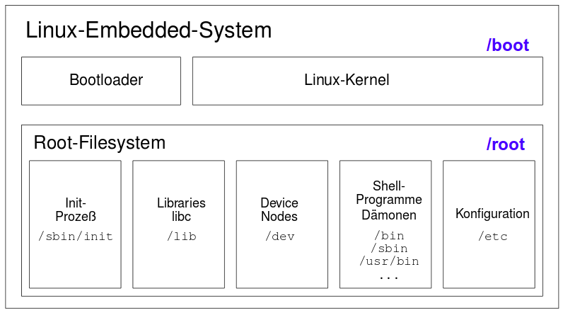
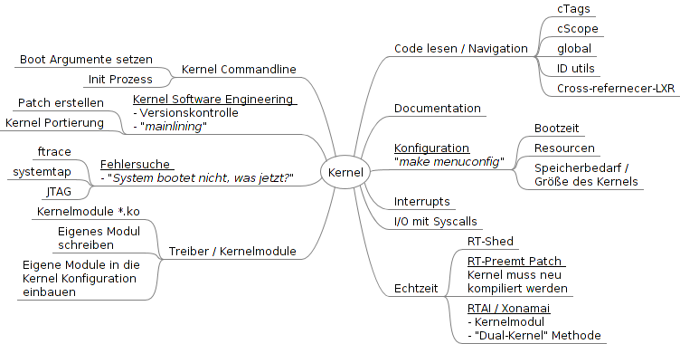
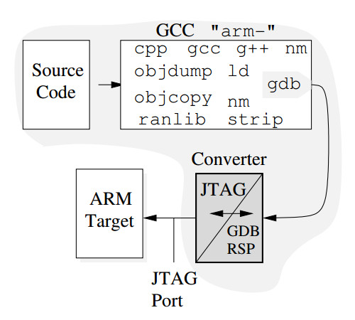
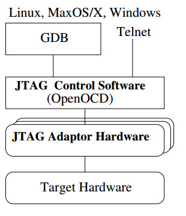
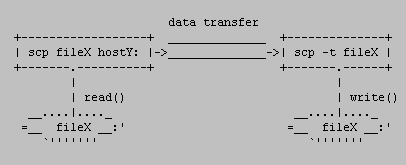

.. include:: etc/kopf.rst

Freie / offene Software
=======================

Freie_Software_

.. figure:: img/800px-Konzept-karte_der_Freien_Software.svg.png
   :align: center

[WIKI]_

+--------------------------------------------------------------------------------+-----+------+------+-----+-----+-----+
| Kriterium                                                                      | GPL | LGPL | AGPL | BSD | MPL | CC  |
+================================================================================+=====+======+======+=====+=====+=====+
| kann für jeden Zweck verwendet werden                                          |  X  |  X   |  X   |     |     |     |
+--------------------------------------------------------------------------------+-----+------+------+-----+-----+-----+
| kann den eigenen Bedürfnissen angepasst werden                                 |  X  |  X   |  X   |  X  |     |     |
+--------------------------------------------------------------------------------+-----+------+------+-----+-----+-----+
| kann mit Freunden und Nachbarn geteilt werden                                  |  X  |  X   |  X   |  X  |     |     |
+--------------------------------------------------------------------------------+-----+------+------+-----+-----+-----+
| eigene Änderungen dürfen verbreitet werden                                     |  X  |  X   |  X   |  X  |     |     |
+--------------------------------------------------------------------------------+-----+------+------+-----+-----+-----+
| auf Freier Software basierende Programme müssen freie Software bleiben         |  X  |      |      |     |     |     |
+--------------------------------------------------------------------------------+-----+------+------+-----+-----+-----+
| Aufzählung aller Copyright besitzer der vorhergehenden Sources                 |     |      |  X   |  X  |     |     |
+--------------------------------------------------------------------------------+-----+------+------+-----+-----+-----+
| Änderungen müssen dem Urheber der Software angezeigt und übermittelt werden    |     |      |  X   |     |     |     |
+--------------------------------------------------------------------------------+-----+------+------+-----+-----+-----+

Was bedeutet die "GPL"?
-----------------------

GPL - GNU Public License ist eine form der Softwarelizensierung und einer der Grundpfeiler der Open-Source Bewegung. Bei Freier Software bezieht sich das "frei" die Freiheiten und nicht auf den Preis. Die Grundpfeiler der GPL sind hierbei das sogenannte Copyleft-Prinzip und die vier Freiheiten der GPL. 

Das Copyleft-Prinzip besagt, dass Software, die auf unter der GNU General Public License (GPL_) veröffentlichten Software basiert nur mit den gleichen Freiheiten veröffentlicht werden darf. Dies stellt sicher, das freie Software für alle zugänglich und frei bleibt.

Niemand sollte von der Software, die er verwendet eingeschränkt werden. Es gibt vier Freiheiten, die jeder Benutzer haben sollte.

    * die Freiheit die Software für jeden Zweck zu verwenden
    * die Freiheit die Software an die eigenen Bedürfnisse anzupassen
    * die Freiheit die Software mit Freunden und Nachbarn zu teilen
    * die Freiheit die eigenen Änderungen zu teilen

Erfüllt ein Programm diese Kriterien kann es als freie Software bezeichnet werden.

[EMLP]_

.. 4 Punkte

Was ist "Open Source"?
----------------------

Open-Source oder Quelloffene Software bezeichnet Software, die die Definitionen der Open Source Initiative (OSI) erfüllt. Das bedeutet, das die Software einer der Open-Source-Lizenzen unterliegen muss. Außerdem muss der Sourcecode für jeden Benutzer frei zugänglich ist. Im groben Ähneln sich die Ansätze der OSS und FSF, allerdings legt die OSS mehr Wert auf die praktischen Vorteile, wie zum Beispiel eine höhere Entwicklungsgeschwindigkeit durch Open-Source. Die FSF hingegen legt mehr Wert auf den sozialen, politischen und ethnischen Wert Freier Software ("Kontrolle des Nutzers über die Software und nicht umgekehrt").

[EMLP]_

.. 2 Punkte

Wie unterscheidet sich die LGPL von der GPL?
--------------------------------------------

Die Lesser GNU Public License (LGPL_) unterscheidet sich von der GNU Public License (GPL_) in der Copyleft Regelung während bei der GPL alle von der Software abgeleiteten Programme ebenfalls unter der selben Lizenz veröffentlicht werden müssen kann aus unter der LGPL veröffentlichten Quellen auch proprietäre Software geschrieben werden.

Wie unterscheidet sich die BSD Lizenz von der GPL?
--------------------------------------------------

Die BSD_Licence_ verlangt, dass nach einer Änderung der Urheber entsprechende des Musters "Copyright (c) <YEAR>, <OWNER>" auch in der geänderten Version bekannt gegeben wird.

Was sind Duale Lizenzen? Nennen Sie ein Beispiel.
-------------------------------------------------

Mehrfach_Lizenzen_ erlauben es 

Beispiele: Qt, MySQL, Asterisk, Sendmail und Perl

Vorteile
++++++++

Mit diesem Lizenzierungsprinzip können Unternehmen eigene Anwendungen entwickeln, ohne diese selbst wieder der Open-Source-Lizenz unterwerfen zu müssen. So ist es einerseits möglich, das Open-Source-Modell zur Entwicklung und Distribution von Software zu fördern, und andererseits ein professionelles Geschäftsmodell zu etablieren, bei dem Softwarelizenzen ohne Einschränkungen verkauft werden können. Für eine Mehrfachlizenzierung spricht des Weiteren die Möglichkeit, die Software mit proprietären Erweiterungen zu versehen.

Käufer einer mehrfach lizenzierten Software sind darüber hinaus nicht an die teils sehr restriktiven Vorgaben zur Weitergabe von Software unter einer freien Lizenz gebunden. Die Entwicklung freier Software wird gefördert, ohne auf Spenden angewiesen zu sein.

Nachteile
+++++++++

Gegen eine Mehrfachlizenzierung spricht, dass das lizenzierende Unternehmen die Arbeit der Open-Source-Entwickler ausnutzen könnte. Darüber hinaus könnte das entwickelnde Unternehmen es sich vorbehalten, irgendwann die Weiterentwicklung der offenen Version zu stoppen.

Umstritten und selten erwähnt ist jedoch die Tatsache, dass bei einigen Open-Source-Lizenzen die Kontrolle über die Entwicklung der Software leicht an die Community oder an finanziell überlegene Unternehmen gehen kann. Ein Entwicklungsstopp einer unter GPL lizenzierten Software besagt noch lange nicht, dass die Software nicht mehr weiterentwickelt wird. Die GPL räumt jedem Nutzer das Recht ein, die Software beliebig zu modifizieren, also auch weiterzuentwickeln.

Heftig umstritten ist, ob der Initiator eines Open-Source-Projektes, welcher seine Software unter einer dualen Lizenz auf den Markt bringt, die Weiterentwicklungen der Community in sein Produkt einfließen lassen kann, um diese unter einer anderen Lizenz als der GPL zu vertreiben.

Kleine Unternehmen laufen generell Gefahr, ihre Open-Source-Softwareprojekte an große Unternehmen zu „verlieren“.

Darf man mit dem freien GNU C Compiler kommerzielle geschlossene Programme schreiben?
-------------------------------------------------------------------------------------

Ja, da dieser in der LGPL_ und nicht in der GPL_ veröffentlicht wird.

Was halten Sie von geschlossenen Kernelmodulen?
-----------------------------------------------

Für den Hersteller kann ein geschlossenes Kernelmodul Betriebsgeheimnisse und Details über die Funktionsweise seiner Hardware schützen. Für den Benutzer bedeutet es, dass er nicht einsehen kann über welche Möglichkeiten ein Program des Kernelspace verfügt, da diese keiner weiteren Kontrolle unterstehen ist es theoretisch möglich dem Benutzer mit so einem Modul erheblichen Schaden zuzufügen (Verletzung der Persönlichkeitsrechte, Spionage, etc. ).

Embedded Linux
==============

Was erwartet Sie hinsichtlich der Lizenzen, wenn Sie Linux wählen?
------------------------------------------------------------------

Open-Source und Freie Software unter der GPL_ oder einer ähnlichen freien Lizenz.

Was ist eine Embedded Linux Distribution?
-----------------------------------------

Eine speziell für ein Target (bzw. eine Gruppe von Targets mit sehr ähnlicher Architektur) angepasste Linux Distribution. Häufig werden diese noch durch Speicher und Leistungsoptimierte Programme, bzw. Programm-substitutionen (im Vergleich zu ihren Desktopvarianten) ergänzt.

.. Aus wie vielen Paketen besteht eine Distribution ungefähr?
.. ---------------------------------------------------------- 

.. Beantworten Sie folgende Fragen:

Welche anderen CPUs unterstützt Linux neben dem x86?
----------------------------------------------------

* Power Prozessoren (IBM)
* ARM
* MIPS
* AVR
* etc.

.. Warum lässt sich Linux einfach auf fast beliebige Prozessoren portieren?
.. ------------------------------------------------------------------------

Wie sieht die Schichtung der Software eines Embedded Linux Systems in etwa aus?
-------------------------------------------------------------------------------

+---------------------+---------------+-----------------------------------------------------------------+
| Komponente          | Beispiel      | Aufgabe                                                         |
+=====================+===============+=================================================================+
| CPU                 |               | springt an eine spezifische Stelle im Festspeicher und lädt     |
+---------------------+---------------+-----------------------------------------------------------------+
| bootloader          | u-boot        | lädt das u-image                                                |
+---------------------+---------------+-----------------------------------------------------------------+
| u-image             | uImage        | lädt den Device-Tree-Blob & das Betriebssystem                  |
+---------------------+---------------+-----------------------------------------------------------------+
| Device-Tree-Blob    | <xyz>.dtb     | Enthält Informationen über die verbauten Komponenten des Boards |
+---------------------+---------------+-----------------------------------------------------------------+
| Kernel              | vmlinuz       | Der Linux Kernel als Basis des Embedded-Linux                   |
+---------------------+---------------+-----------------------------------------------------------------+
| System Software     |               | Unterstützung des OS bei seinen Aufgaben                        |
+---------------------+---------------+-----------------------------------------------------------------+
| User-Space-Software | browser       | System/Benutzer interaktion                                     |
+---------------------+---------------+-----------------------------------------------------------------+

Welche Sprachen werden zur Programmierung verwendet?
----------------------------------------------------

Zur Programmierung eines Embedded-Linux Systems wird hauptsächlich C/C++ und Python eingesetzt.

Warum Linux?
------------

* Linux hat sich zu einer ausgereiften, hoch performanten und stabilen alternative zu üblichen proprietären Embedded-Betriebssystemen entwickelt
* Linux unterstützt eine große Bandbreite an Anwendungen und Netzwerkprotokollen
* Linux ist gut skalierbar, angefangen bei kleinen Konsumentenorientierten Geräten, bis hin zu großen Switches und Routern
* Linux kann ohne die nötigen lizensierungs Gebühren die für proprietäre Embedded-Betriebssystemen nötig sind eingesetzt werden
* Linux hat eine große Anzahl an Entwicklern angezogen, dies ermöglicht eine schnelle Unterstützung neuer Hardware-Architekturen, Plattformen und Geräten
* Eine steigende Anzahl an Hardware- und Software Herstellern, nahezu alle Marktführern und Unabhängige Softwarehersteller eingeschlossen unterstützen Linux

[EMLP]_

.. 6 Punkte

Welche Anforderungen sprechen für Linux?
----------------------------------------

* Hohe Performance Anforderungen (z.B. Datenraten im Netzwerk)
* Erfordert komplexe, standartisierte Anwendungen (z.B. GUI, Webserver, etc. )
* Verwendung standartisierter, aber complexer Interfaces (z.B. USB, Ethernet, erweiterte Speicherverwaltung, etc. )
* Das System soll erweiterbar sein
* Das System soll skalierbar sein 

[TPEL]_

.. (5 Stück)

Wie "bezahlt" man die Vorteile von Linux?
-----------------------------------------

* Für den langfristigen Einsatz eines Produktes empfieht es sich eine eigenständige Distribution spezifisch für diesen Einsatzzweck anzulegen. Deshalb könnte man davon sprechen, dass die nötige Entwicklungszeit für diese angepasste Distribution als Preis für den Einsaz von Linux bezahlt wird.  
* Außerdem sollte die Beachtet werden, dass die meisten Programme unter Linux mit der GPL_ lizensiert wurden. Diese beinhaltet, dass alle Programme, die auf diesen aufbauen ebenfalls unter der GPL veröffentlicht werden müssen. Deshalb muss auch der Sourcecode des eigenen Projektes veröffentlicht werden. 

[TPEL]_

Aus welchen Einzelteilen besteht Embedded Linux?
------------------------------------------------

* Bootloader - für die Initialisierung der Hardware, das Laden der Linux-Kernel, und System-Updates
* Linux Kernel - ermöglicht den Zugriff auf Hardware und Standardservices des Betriebssystems
* Root-Dateisystem - Grunddateisystem und Anwendungen die gebraucht werden, damit Linux läuft. Kann auch grafische Toolkits usw. enthalten
* Anwendungen - der Teil des Systems, den der Benutzer sieht und der meist für jedes Gerät angepasst ist
* Tools - Compiler und andere Tools, die erforderlich sind um das System zu Erstellen und Debuggen
* Wartung - wie wird das Projekt in zukunft Aktualisiert

.. 6 Punkte

[TPEL]_

Welche Fähigkeiten braucht man, um einen Rechner mit Embedded Linux auszustatten und zu programmieren?
------------------------------------------------------------------------------------------------------

Die wichtigste Fähigkeit die man besitzen muss um ein Embedded Linux System zu entwerfen ist es, den Code eines anderen zu verwenden, integrieren und zu debuggen. Weitere nützliche Fähigkeiten sind ein gutes Verständnis von Hardware, Computerarchitektur und Betriebssystemen. Erfahrung und Wissen, mit komplexen modernen eingebetteten Linux-Systemen fertig zu werden ist der Schlüssel zum Erfolg. Außerdem ist es wichtig, in der Lage zu sein den richtigen Personen Fragen zu stellen. Meist kann man diese Personen über Mailinglisten erreichen.

[TPEL]_

Welche Kosten sind zu erwarten?
-------------------------------

Obwohl Linux und unterstützende Technologien kostenlos in Geräten genutzt werden können, müssen die Kosten für die Implementierung und Wartung einer Lösung berücksichtigt werden. Es gibt viele Wege, um ein System zu implementieren. Wie bei den meisten Projekten, kann man Regalfertige Lösungen kaufen um die Vorlaufkosten zu senken. Mit höheren Volumina(mehr Inhalten????)ist es aber oft sinnvoll, eine kundenspezifische Lösung zu implementieren. Die kosten liegen bei der Zeit die ein Entwickler investieren muss um eine Aufgabe zu erfüllen.

[TPEL]_

Welche Risiken gibt es?
-----------------------

* Unterschätzen der Komplexität
* Start des Projekts mit dem falschen Zeug(???start the project with the wrong stuff)
* ein Treiber ist für die verwendete Hardware nicht verfügbar
* Das Board Support Package (BSP), das für den verwendeten Prozessor zur Verfügung gestellt wird, ist von geringer Qualität oder nicht gut in die Mainstreamquellen integriert
* Es gibt Probleme die schwer zu debuggen sind

[TPEL]_

Was umfasst der Lebenszyklus des Produktes?
-------------------------------------------

* Dauer, wie lange das Produkt verkauft wird
* Zukünftige Erweiterungen der Funktionalität des Produkt
* bug fixing und security support
* Kundenwünsche um dem Produkt eigens Erweiterungen hinzuzufügen oder anpassen wie dieses Produkt verwendet wird

[TPEL]_

Was erwartet Sie hinsichtlich der Lizenzen, wenn Sie Linux wählen?
------------------------------------------------------------------

* Man muss die Quelle zum Linux-Kernel und anderen Anwendungen die unter der GPL lizenziert sind und verwendet werde n, bereitstellen
* Normalerweise gibt es nichts proprietäres, bei Änderungen, an GPL lizenziertem Code in einem Linux-System.
* Man kan die Anwendungen proprietär halten. Dadurch wird das Produkt von anderen unterscheiden
* Man muss sicherstellen, dass der Sourcecode für alle im Produkt verwendeten Open Source Komponenten vorhanden ist

[TPEL]_

Was verstehen Sie unter "Linux Standard Base"?
----------------------------------------------

Linux Standard Base (kurz LSB_) ist einer der relevantesten Linux Standards. Er spezifiziert allgemeine Attribute einer Linuxdistribution, wie die Verzeichnisstruktur, Binärschnittstellen, Programmbibliotheken und andere Betriebssystem Bestandteile mit dem Ziel die Kompatiblität zwischen unterschiedlichen Linux Distributionen im Hinblick auf Lauffähigkeit von Programmen zu verbessern. An vielen Stellen sind diese Standards aber noch nicht ausreichend und es halten sich bei weitem nicht alle Distributionen an diese Standards.

[EMLP]_

.. 2 Punkte

Welche Distribution für Embedded Linux werden erwähnt?
------------------------------------------------------

* Debian
* Gentoo

[ATES]_

Ist der Apache Webserver eine gute Wahl? Welche anderen Webserver gibt es noch?
-------------------------------------------------------------------------------

Nein, ein Apache Webserver ist für Desktoprechner und Server durchaus geeignet für wesentlich leistungsschwächere Embedded-Linux-Systeme empfiehlt sich z.B. "lighttpd".

[ATES]_

Was ist ein monolithischer Kern?
--------------------------------

Bei einem monolithischen Kernel befinden sich im Sourcecode nicht nur Funktionen zur Speicher, Prozess und Interprozesskommunikation, sondern auch Treiber und erweiterte Funktionen.

.. Virtual Memory Management
.. -------------------------

.. Damit die Linux Speicherverwaltung (virtual memory) funktioniert, muss der Mikrocontroller eine bestimmte Hardware-Komponente haben. Wie heisst diese?

.. Wie heisst die Linux Variante, die ohne diese Hardware-Komponente auskommt?
.. ---------------------------------------------------------------------------

 

BeagleBone Black
================

.. Beschreiben Sie knapp die technischen Eigenschaften des Embedded Linux Boards, das Sie in Ihrem Projekt verwendet haben. Denken Sie an folgende Punkte: [8 Punkte, je 2]

Mikrocontroller (Taktfrequenz, CPU-Typ)
---------------------------------------

Sitara AM3358BZCZ100 ARM® Cortex-A8 @ 1 GHz

Nicht-flüchtige Speicher
------------------------

.. ROM oder Festspeicher

4 GB eMMC (NAND-Flash)

Arbeitsspeicher
---------------

512 MB DDR3L @ 800 MHz

Ungefähre Leistungsaufnahme
---------------------------

.. code:: c
	
	P = U   * I
	
	P[max] = 5 V * 460 mA
	P[max] = 5 V * 460 * 10^-3 A
	P[max] = 2,3 W

	P[min] = 5 V * 210 mA
	P[min] = 5 V * 210 * 10^-3 A
	P[min] = 1,05 W

Fragen zum Entwicklungsrechner
==============================

Für welche Aufgaben wird der Hostrechner (Entwicklungsrechner) verwendet?
-------------------------------------------------------------------------

* Cross kompilieren(Kernel, Module, Rootfs...)
* Terminal Emulation(picocom, filetransfer, screen...)
* Hilfswerkzeuge(python, dd, fdisk, automake, ssh...) 
* Flashen(Bootloader, OpendOCD)
* Root Baukästen(Buildroot, Yocto)
* Debuggen(gdb, printf, openocd)
* Quelltext bearbeiten(git, cscope, ctags, IDE)
* Internet(www, mailinglisten, ip-forward)

.. 4 Punkte

Welche Programme installieren Sie darauf?
-----------------------------------------

* picocom, kermit (ckermit), minicom
* rsync
* git, stgit
* mercurial (hg)
* svn
* gcc, gdb (nativ)
* gcc, gdb (cross, für Zielrechner)
* vim, emacs
* exuberant ctags
* screen, tmux
* mkfs.ext2/3/4, fsck.ext2/3/4 (e2fsprogs)
* fdisk, cfdisk (util-linux)
* cscope
* expect
* Python, pyexpect, pyserial
* xinetd
* TFTP server
* NFS server
* wireshark

.. 4 Punkte

Nennen Sie zwei Terminalprogramme und geben Sie die üblichen Aufrufparameter an.
--------------------------------------------------------------------------------

* minicom
	
	Minicom wird im voraus konfiguriert über "sudo minicom -s" kann minicom entsprechend den Anforderungen des Targetrechners angepasst werden.

* microcom -t <BAUDRATE> <DEV>
* picocom -b <BAUDRATE> <DEV>

.. 4 Punkte

Terminal Multiplexer und ihre Anwendungen
-----------------------------------------

.. Was ist ein Terminal Multiplexer und warum ist er auf dem Targetrechner (und auf dem Hostrechner) sehr praktisch?

Ein Terminal-Multiplexer ist eine Softwareanwendung die verwendet werden kann, um mehrere virtuelle Konsolen zu multiplexen. Damit ist der Benutzer in der Lage auf mehrere getrennte Terminalsitzungen in einem einzigen Terminal-Fenster oder einer Remote-Terminal-Sitzung zuzugreifen.
Es kann auch auf dem Targetrechner sehr nützlich sein, da man mit einem Terminalprogramm meist nur ein Konsolenfenster zur Verfügung hat.

.. 4 Punkte

Wie nennt man die nicht-native Kompilierung auch?
-------------------------------------------------

"Cross-Kompilierung" - Das kompilieren von nativer Software auf einem Hostrechner für ein spezifisches Target mit Hilfe von Cross-Kompilierungs Toolchain und im Terminal gesetzten Variablen wie z.B. "$ARCH", "$CROSS_COMPILE", etc.

Was ist native Kompilierung? Ab welcher Rechenleistung macht sie Sinn?
----------------------------------------------------------------------

Native Kompilierung bedeutet das Software für den Target-Rechner auf diesem Kompiliert wird, dies macht nur Sinn wenn das Board für die Kompilierung ausreichende Ressourcen, neben dem Betrieb von Linux zur Verfügung hat. Generell sollten es mindestens 600 MHz Prozessortakt und 128 MB RAM sein.

Unterschiede zwischen "Linux" und "Embedded-Linux"
==================================================

Markieren Sie von folgenden Begriffen diejenigen, die meist nur bei Embedded Linux relevant sind:
-------------------------------------------------------------------------------------------------

+------------------------------------------------+-----+-----+
| Begriff                                        | ES  | PC  |
+================================================+=====+=====+
| Netzwerk                                       |     |     |
+------------------------------------------------+-----+-----+
| U-Boot                                         |  x  |     |
+------------------------------------------------+-----+-----+
| JFFS                                           |  x  |     |
+------------------------------------------------+-----+-----+
| Systemprogrammierung                           |     |     |
+------------------------------------------------+-----+-----+
| Bootzeit                                       |     |     |
+------------------------------------------------+-----+-----+
| Shellprogrammierung                            |     |     |
+------------------------------------------------+-----+-----+
| Interrupts                                     |     |     |
+------------------------------------------------+-----+-----+
| Kernel-Module                                  |     |     |
+------------------------------------------------+-----+-----+
| Stromverbrauch                                 |  x  |     |
+------------------------------------------------+-----+-----+
| Buildroot                                      |  x  |     |
+------------------------------------------------+-----+-----+
| Watchdog/Ausfallschutz                         |     |     |
+------------------------------------------------+-----+-----+
| Hardware-Schnittstellen SPI/I2C/GPIO/UART      |  x  |     |
+------------------------------------------------+-----+-----+
| Kernel-Konfiguration                           |     |     |
+------------------------------------------------+-----+-----+
| Echtzeit                                       |  x  |     |
+------------------------------------------------+-----+-----+
| JTAG Debugger                                  |  x  |     |
+------------------------------------------------+-----+-----+
| Fernwartung                                    |     |     |
+------------------------------------------------+-----+-----+
| glibc                                          |     |  x  |
+------------------------------------------------+-----+-----+
| Kommandozeile                                  |     |     |
+------------------------------------------------+-----+-----+
| System-V init                                  |     |     |
+------------------------------------------------+-----+-----+
| uClibc                                         |  x  |     |
+------------------------------------------------+-----+-----+

Welche Unterschiede gibt es beim Kernel im Vergleich zum PC?
------------------------------------------------------------

Man weiss meist schon vorher welche Hardware verwendet wird, somit können alle Treiber als Teil des Kernels enthalten sein und müssen nicht als Module geladen werden.

[ATES]_

Welche Bedeutung hat die C Bibliothek?
--------------------------------------

Die C-Bibliothek ist die Schlüsselkomponente in jedem Linux-System. Sie stellt die Userspace-Anwendungen mit einer vordefinierten Schnittstelle zur Verfügung, sodass sie zwischen verschiedenen Versionen des Linux-Kernels und auch verschiedenen UNIX dialekten portabel ist.

[ATES]_

Was ist die “Busybox”?
----------------------

Die meisten Standard-Applikationen wie ls, cd, mkdir, ping... teilen eine Menge an Code. Wenn jedes Programm seperat compiliert würde, würden sich Dinge wie Befehlszeilenargumente in jeder Applikation wiederholen. BusyBox löst diese probleme indem es ein einzelnes Programm zur Verfügung stellt, busybox, welche alle Aufgaben der Standard Applikationen verarbeitet, indem Softlinks für alle individuellen Kommandos erzeugt werden und auf die Busybox gerichtet werden.

[ATES]_

Fragen zur Speichertechnik
==========================

NAND Flash Bausteine
--------------------

.. 12 Punkte

Was steckt in einer MicroSD Karte?
++++++++++++++++++++++++++++++++++

* Serielle NAND-Flash Speicherblöcke
* Speicher-controller (Memmory-Management-Unit)
* 8 Pins als Schnittstelle zum Speicher-controller
  
+-----+-----------+----------------------------------+
| PIN | Abkürzung | Funktion                         |
+=====+===========+==================================+
| 1   | DAT2      | Datenleitung 2                   |
+-----+-----------+----------------------------------+
| 2   | DAT3      | Datenleitung 3 / Card Detect     |
+-----+-----------+----------------------------------+
| 3   | CMD       | Comand Line                      |
+-----+-----------+----------------------------------+
| 4   | VDD       | Versorgungsspannung 2,7 - 3,6 V  |
+-----+-----------+----------------------------------+
| 5   | CLK       | Clock (Takteingang)              |
+-----+-----------+----------------------------------+
| 6   | GND       | Ground                           |
+-----+-----------+----------------------------------+
| 7   | DAT0      | Datenleitung 0                   |
+-----+-----------+----------------------------------+
| 8   | DAT1      | Datenleitung 1                   |
+-----+-----------+----------------------------------+

Welche Filesysteme verwendet man meist bei MicoSD Karten?
+++++++++++++++++++++++++++++++++++++++++++++++++++++++++

Da MicroSD Karten heute meist über eine relativ große Speicherkapazität verfügen verwendet man meist Desktop Filesysteme wie z.B.

* EXT3
* EXT4
* XFS
* oder REISERFS4

Wie funktioniert Flash Speicher?
--------------------------------

Flash-Speicher kann generell als eine Ansammlung von Speicherblöcken, die im Reset zustand eine logische eins enthalten. Flash-Speicher lässt sich grundsätzlichen nach seinen Grundbausteinen (NOR und NAND) unterscheiden, außerdem gibt es Flash Speicher mit (eMMC, MicroSD Karte) und ohne (NOR-Flash) Memmory Management.

[STFS]_

Welche grundsätzlichen Bausteintypen gibt es?
---------------------------------------------

NOR-Flash
+++++++++

Vorteile
********

* linear adressierbarer Speicher ermöglicht XIP
* schnell bei kleinen Speichermengen
* einzelne Bits sind im schreibenden Zugriff änderbar

Nachteile
*********

* relativ hoher Energieverbrauch
* langsam bei großen Speichermengen
* nur geringe Speichermengen vorhanden (typischerweise < 1 GB)

NAND-Flash
++++++++++

Vorteile
********

* geringerer Preis und geringere Leistungsaufnahme
* hohe Schreib- und Lesegeschwindigkeit bei großen Datenmengen
* Standartisierte Bus-Schnittstelle zur Kommunikation erlaubt es die Speicherkapazitäten zu ändern ohne die Schaltung zu ändern

Nachteile
*********

* Zur Kommunikation ist ein nicht unerheblicher Aufwand nötig (Software)
* Kann nicht direkt auf dem Board eingesetzt werden eine Verbindungslogik ist nötig (Memmory-Controller)
* Begrenzte Anzahl an Schreibzyklen 

[STFS]_

Was sind “bad blocks” und “wear leveling”?
------------------------------------------

bad blocks
++++++++++

Bad Blocks sind defekte Speicherblöcke in einem NADN-Flash Speichermedium. Bei NAND-Flash werden immer mehrere Pages (zwischen 512 und 8192 Bytes pro Page) zu einem Block zusammengefasst. Die größe eines Blocks liegt heute zwischen 16 und 2048 kilo Byte.

wear leveling
+++++++++++++

Da NAND-Flash nur eine bestimmte Menge an Schreibzyklen übersteht wird sogenanntes wear-leveling betrieben, hierbei wird ein Controller eingesetzt, der die anzahl der Schreibzyklen für jeden Block zählt und anhand dessen entscheidet welchen überschreibbaren Block er für die nächste Schreiboperationen verwendet.

[AFFS]_

Welche besonderen Filesysteme gibt es für Embedded Linux?
---------------------------------------------------------

- initramfs: Filesystem das in das Kernel Image eingebettet ist und während der Laufzeit im RAM liegt.
             Alle Änderungen gehen beim Neustart verloren.

- cramfs/squashfs: Beides gepackte read-only Filesystems. Beide Systeme erlauben es, dass ein gepacktes Image
                   zur Laufzeit erstellt und dann auch geladen werden kann. Die Dateisysteme können
                   ausgetauscht werden ohne den Kernel zu berühren

- jffs2/ubifs:

[ATES]_

Wann verwendet man das "MTD" Subsystem?
---------------------------------------

Memory-Technology-Device (MTD) bezeichnet eine Abstraktionsschicht mit einheitlicher Schnittstelle zur Kommunikation mit dem Speicher eines Linux-Systems. Der Benutzer kann somit ohne genaue Kenntnisse der Interna (z.B. des verwendeten Filesystems) mit Hilfe der API auf den Speicher zugreifen, außerdem können die selben Funktionen auch bei einem Wechsel des darunterliegenden Flash-Speichers angewandt werden. Es kommt hautsächlich bei der verwendung von "rohem Flash-Speicher" also Flash-Speicher ohne Memmory-Management-Unit (MMU) zum Einsatz.

Was bedeutet "XIP"?
-------------------

Execute in Place (XIP) ist eine Methode bei der man Programme, die auf Speicherkarten gespeichert sind, direkt starten und ausführen kann, ohne diese in den Arbeitsspeicher zu laden. Es ist eine Erweiterung von Shared Memory, bei dem der erforderliche Speicherplatz reduziert wird.

eXecute-In-Place (XIP_) bedeutet das ein Programm direkt vom Festspeicher (ROM) aus ausgeführt und nicht erst in den Hauptspeicher (RAM) gleaden wird. Unter anderem wird dies bei Level 1 Bootloadern eingesetzt, diese werden auf einer speziellen Adresse des ROM abgelegt und von dort aus ausgeführt.

.. 2 Punkte

Hauptspeicher
=============

.. 4 Punkte

In welcher Speichertechnologie ist der Hauptspeicher des Embedded Linux Rechners realisiert?
--------------------------------------------------------------------------------------------

Der Hauptspeicher eines Embedded Linux Rechners ist in SDRAM realisiert. Bei neueren oder Leistungsstärkeren Boards (Siehe Raspberry Pi oder BeagleBone Black) wird häufig DDR3L RAM eingesetzt.

Minimale Grösse des Hauptspeichers, damit man aktuelle Distributionen ohne GUI verwenden kann?
----------------------------------------------------------------------------------------------

Bereits mit 4 MB lässt sich eine sehr einfache Linuxdistribution auf einem Embedded System betreiben, allerdings lässt sich damit keines der üblichen Paket-Management-Systeme betreiben. Für diese sind mindestens 8 MB RAM nötig. Um das komplette Spektrum an üblichen Funktionen eines minimalen Embedded Systems abzudecken sind 16 MB RAM als mindestvorraussetzung empfohlen.

Root Filesystem
===============

Welche Komponenten brauchen Sie für ein minimales RootFS, das in vier Megabyte Flash-Speicher passt?
----------------------------------------------------------------------------------------------------

* Bootloader
* Kernel
* uClibc
* busybox

Welche Baukästen für Root Filesysteme kennen Sie, die auch für Embedded Boards geeignet sind?
---------------------------------------------------------------------------------------------

* Buildroot
* Yocto Project
* Linux from Scratch (LFS)
* OpenEmbedded
* Embedded-Linux-Development-Kit (ELDK)
* Gentoo Embedded

In welche Regionen ist der Flash Speicher bei Linux in der Regel aufgeteilt?
----------------------------------------------------------------------------

* boot
		/<bootloader>
		/uImage

* root
		/kernel
		/boot/Device-Tree-Blob
		/bin
		/etc
		...

Wie sieht grob die memory map des gesamten Rechners aus?
--------------------------------------------------------

Was ist JFFS2 und wozu braucht man es?
--------------------------------------

Journalling-Flash-File-System-Version-2 (JFFS2) ist ein log-Datei basiertes Filesystem mit wear-leveling und wurde ursprünglich entwickelt und die Verwendung von Flash-Speicher bei eingebetteten Systemen zu verbessern. Bis zu seiner Entwicklung wurden Pseudo-filesysteme, die ein standartisiertes Blockspeicher Device emulierten und auf die dan ein normales Filesystem aufgespielt wurden eingesetzt.

Welche Vorteile hat das YAFFS im Vergleich zu JFFS2?
----------------------------------------------------

Vorteile:

	* Weniger Hauptspeicher verbrauch um den Status währen der Laufzeit festzuhalten, deshalb eignet es sich auch besser für skalierbare Projekte. Es eignet sich generell besser für die Verwaltung großer NAND-Speicher.
	* Die "Garbage Collection" ist einfacher und schneller, was typischer Weise für eine Bessere Performance bei vielen Schreibzugriffen sorgt
	* Als Fausregel lässt sich festhalten für NAND-Speicher > 64 MB eignet sich YAFFS besser als JFFS2

Nachteile:

	* Eignet sich kaum für NOR-Speicher
	* NOR-Speicher ist meist zu klein um von den Vorzügen von YAFFS zu profitieren
	* Benutzt eine komplette Page als Header für jede Datei und Unterstützt dabei keine Komprimierung. Das heißt auf kleinen Flash-Speichern, die mit gut komprimierbaren Dateien belegt werden sollen, sollte eher auf JFFS2 ausgewichen werden

[YVSJ]_

Was ist das CRAMFS?
-------------------

CRAMFS (Compressed ROM Filesystem) ist ein freies unter der GPL stehendes Read-Only-Dateisystem mit integrierter Datenkompression

Beim Compressed-ROM-File-System handelt es sich um ein einfaches, effizientes Filesystem mit integrierter Datenkompression, das hauptsächlich bei eingebetteten Systemen zum Einsatz kommt. Im Gegensatz zu komprimierten herkömmlichen Dateisystemen muss ein CramFS nicht erst entpackt werden. Die Dateien sind mit der "zlib" komprimiert, nur die Metainformationen liegen in unkomprimierter Form vor. Da ein schreibender Zugriff auf komprimierte Daten schwer realisierbar ist kann auf CramFS-Dateisysteme nur lesend zugegriffen werden.

Einschränkungen:

	* maximale Größe einer Datei 16 MB
	* maximale Größe eines Datenträgers 256 MB

.. Was kann man über die Mount-Zeit von verschiedenen Flash Filesystemen sagen?
.. ----------------------------------------------------------------------------

.. AFFS

Fragen zum Bootloader
=====================

Nennen Sie zwei gebräuchliche Bootloader
----------------------------------------

* Das u-boot
* RedBoot		(RedHat)
* rrload 		(ARM)
* FILO 
* CRL/OHH 
* PPCBOOT 
* Alios
* Apex 			(Gnublin)

Wieso gibt es second level bootloader?
--------------------------------------

.. Wieso kann der first level bootloader im Mikrocontroller im Allgemeinen nicht den allgemeinen Bootvorgang des Linux Kernels einleiten?

Weil der first level bootloader nur eine begrenzte Menge an Bytes auf einmal laden kann, deshalb wird normalerweise der second level bootloader zwischengeschoben um den Kernel zu laden.

+----------------------------------------------------------------------------------------+---------+
| Komponente / Programm                                                                  | Level   |
+========================================================================================+=========+
| **Run-Level**                                                                          | USER    |
| a) services unter "etc/rc.d" werden geladen                                            |         |
| b) services unter "etc/init.d"                                                         |         |
+----------------------------------------------------------------------------------------+---------+
| **Init**                                                                               | Kernel2 |
| a) /etc/rc.sysinit wird ausgeführt daraus resultiert der sogenannte "init-Prozess"     |         |
| b) Treiber / Kernelmodule werden geladen (insmod "/lib/modules/<VERSION>/<MOD>)        |         |
+----------------------------------------------------------------------------------------+---------+
| **Kernel**                                                                             | Kernel1 |
| a) mount initrd                                                                        |         |
| b) linuxrc/ -> mount RootFS                                                            |         |
+----------------------------------------------------------------------------------------+---------+
| **U-Boot**                                                                             |    L3   |
| Lädt je nach Konfiguration den Kernel in den RAM                                       |         |
| a) Laden von lokalem Flash Speicher (microSD, eMMC)                                    |         |
| b) Laden vom Netzwerk (via ftp oder nfs)                                               |         |
+----------------------------------------------------------------------------------------+---------+
| **BootStrap** (optionale Vorstufe zu U-Boot)                                           |    L2   |
| lädt den rest von U-Boot in den RAM                                                    |         |
+----------------------------------------------------------------------------------------+---------+
| **Bootrom**                                                                            |    L1   |
| a) CPU spring an spezifische Adresse (je nach Modell eine andere) und fängt an Ort und |         |
| Stelle an den Code aus zu führen. Legt die Ergebnisse im internen SRAM des uC ab.      |         |
| b) Initialisierung von Speicher, Serieller UART Konsole und Netzwerkschnittstelle zu   |         |
| diesem Zeitpunkt bereits möglich                                                       |         |
+----------------------------------------------------------------------------------------+---------+

Wie bootet ein Embedded Linux Rechner?
--------------------------------------

.. als Ergänzung zu den folgenden Fragen eingefügt

.. figure:: img/bootloader.jpg
  :align: center

Der Prozessor springt zu einer spezifischen Adresse, an dieser erwartet er den bootloader zu finden. Deshalb benötigen unterschiedliche Prozessoren unterschiedliche Konfigurationen und Formatierungen beim Festspeicher (eMMC / SD). Der Prozessor beginnt nun den Code an der Stelle auszuführen.
Nachdem der Bootloader geladen und konfiguriert wurde werden alle Treiber und Geräte initialisiert und die Dateisysteme gemountet. Der Kernel wird geladen und die Userspace Programme werden geladen.

[ATES]_

Wozu braucht man einen Bootloader?
----------------------------------

Initialisieren des Systems
++++++++++++++++++++++++++

Hierbei kann unter anderem auch eine UART-Schnittstelle als serielle Debug-Konsole gestartet werden (z.B. BeagleBone Black interaktion mit u-boot). Außerdem wird dabei der Memmory-Controller des Systems initialisiert so das sowohl auf den Haupt- als auch auf den Festspeicher entsprechend seiner Eigenschaften zugegriffen werden kann. Während der Initialisierung kann der Bootvorgang unterbrochen werden und man kann mit Hilfe der seriellen Konsole Boot-Befehle (engl. bootargs) absetzen.

Laden des Kernels
+++++++++++++++++

Erst nach der Initialisierung des Memmory-Controllers ist es überhaupt möglich gezielt auf den Festspecher zuzugreifen und genau darin besteht auch die nächste Aufgabe des Bootloaders. Er muss den häufig System-spezifischen Kernel in den Hauptspeicher des Embedded-Linux Rechners laden. Hierbei werden auch die Informationen des Device-Tree-Blob (einer low-level zusammenfassung der zugrunde liegenden Hardware) verwendet um die nötigen Kernelmodule mit zu laden.

[ATES]_

Wozu dient die folgende U-Boot Kommandosequenz:
-----------------------------------------------

.. code:: bash

    set bootargs root=/dev/nfs nfsroot=192.168.1.1:/srv/rootfs \
    ip=192.168.1.2:192.168.1.1::255.255.255.0::eth0:none
    nfs 0x10400000 /srv/rootfs/boot/uImage
    bootm

Bei dieser Kommandosequenz handelt es sich um eine netboot Anweisung, bei der das uImage von einem Net-File-System Server (nfs-server) geladen wird. In diesem speziellen Fall wird von der adresse in Zeile 1 (nfsroot=192.168.1.1:/srv/rootfs) über den Ethernetanschluss das uImage geladen. Dies bedeutet, das sich zum Zeitpunkt des Startes nur der Bootloader und die Konfigurationsdatei (z.B. uEnv.txt) auf dem Festspeicher des Systems befindet.

Welche Möglichkeiten gibt es, die Bootzeiten zu reduzieren?
-----------------------------------------------------------

* Verkürzen des sogenannten "bootdelay" Parameters in u-Boot

.. code:: bash

	setenv bootdelay 0
	saveenv

* Abschalten der Überprüfung der "Checksum" in u-Boot

.. code:: bash

	verify = n

* Auswahl eines schnelleren Filesystems
* Verkleinerung des Filesystems
* Kernel Optimierung (nicht benötigte Dienste entfernen)
* Verwendung eines eintpackten Kernels bei langsamen CPUs
* Verwendung eines gepackten Kernels bei langsamem Festspeicher
* Ethernet Delay entfernen

[FSTL]_

.. 6 Punkte

Wie gross sind typische Bootloader wie z.B. U-Boot und Apex?
------------------------------------------------------------

Die aktuelle u-boot Version benötigt ca. 350 kilo Byte.

[ELPB]_

Welchen Funktionsumfang hat der U-Boot Bootloader?
--------------------------------------------------

Neben der üblichen Funktion den Kernel vom Festspeicher zu laden verfügt u-boot außerdem noch über Funktionen, die es erlauben über nfs oder tftp zu booten. Außerdem verfügt es noch über einige Hilfsfunktionen wie "printenv" die bei der Überprüfung eines eigenen Aufbaus, bzw. eines selbst kompilierten Kernels helfen können.

[ELPB]_

Was ist ein uImage und wie erzeugt man es?
------------------------------------------

Bei einem uImage handelt es sich um ein "binary kernel image", das mit einem u-boot wrapper versehen wurde. Es wird mit der mkimage utility erzeugt.

.. explain / build uImage

Booten ohne ein Root-File System im ROM
---------------------------------------

.. Wie kann man das Embedded Linux Board booten, obwohl nur das U-Boot im Flash Speicher vorhanden ist? Das Board verfügt über eine Netzwerkschnittstelle.

U-Boot ermöglicht es ein RootFS über das Netz zu booten, Hierfür benötigt man lediglich einen ftp-server, der nfs Unterstützung bietet.

.. code:: bash

	# from file env.txt

	tftpboot <file> [<load_addr>]
	...
	netboot=tftp ${image}; run addip;bootm

Fragen zum Kernel
=================

.. 10 Punkte

Überblick über den Kernel
-------------------------

.. Auf der Tafel hatten wir ein Diagramm gezeichnet mit den wichtigsten Bereichen, mit denen man beim Kernel zu tun hat. Zeichnen Sie es hin.

Wieso ist es wünschenswert, dass ein Embedded Linux Board im Mainline Kernel unterstützt wird?
----------------------------------------------------------------------------------------------

Durch den Mainline-Support eines Embedded Linux Boards ist die kontinuierliche Unterstützung in späteren Versionen des Mainline Kernels gewährleistet.

Wie kompiliert man den Kernel auf der Kommandozeile?
----------------------------------------------------

.. code:: bash

	make menuconfig

Wo stehen die Namen der make targets?
-------------------------------------

.. code:: bash 

	# Path to the cross-compiler could look like:
	# make ARCH=arm CROSS_COMPILE=${CROSS_TOOLS}/bin/arm-none-linux-gnueabi- menuconfig
	make ARCH=arm CROSS_COMPILE=... menuconfig
	# targets unter user/src/linux/.config
    
    # make <#cores> <Path_to_CC> <Image-Name>
    # make -j5 ARCH=armCROSS_COMPILE=path/to/bin/arm-none-linux-gnueabi- zImage
    make ARCH=arm CROSS_COMPILE=... zImage
    # targets unter arch/<arch>/boot/zImage
    
    # make -C kernel_build_dir M=`pwd` ARCH=arm CROSS_COMPILE=<...> modules
    make ARCH=arm CROSS_COMPILE=... modules
    # targets unter 

    make modules_install INSTALL_MOD_PATH=<your-module-path>

Kernel kompilieren ohne ".config" file
--------------------------------------

.. Sie möchten einen Linux Kernel kompilieren für ein Board auf dem bereits Linux läuft, haben aber keine .config Datei. Welche Möglichkeiten gibt es?

* extrahieren der vorhandenen ".config-file" unter "/prog/"uname -r"/.config"

Geben Sie die Kommandozeilen an, um einen Kernel mit einem Cross-Kompiler zu kompilieren
----------------------------------------------------------------------------------------

Konfiguration erstellen
+++++++++++++++++++++++

.. code:: bash

    export CCPREFIX=/path/to/your/compiler/binary/prefix-of-binary-
    make ARCH=<TARGET_ARCH> CROSS_COMPILE=<CCPREFIX> menuconfig

Kernel und Module bauen
+++++++++++++++++++++++

.. code:: bash

    make ARCH=<TARGET_ARCH> CROSS_COMPILE=<CCPREFIX>
    make ARCH=<TARGET_ARCH> CROSS_COMPILE=<CCPREFIX> modules 

Installation
++++++++++++

.. code:: bash

    sudo INSTALL_MOD_PATH=/media/rootfs make ARCH=arm CROSS_COMPILE=arm-linux-gnueabi- modules_install

Wichtigste Gründe für einen Kernelupdate
----------------------------------------

.. Wieso kann es wichtig sein, dass man bei einem Embedded System den Kernel auf eine neuere Version updaten kann?

Es kann wichtig sein, da ein Kernel-Update Bugfixes, Sicherheitsupdates und neue Kernelfeatures(neue Hardwareunterstützung) mit sich bringen kann. 

Gibt es im Kernel Quelltext auch eine Dokumentation?
----------------------------------------------------

Ja

[TODO]_

.. wo???

Linux Kernel Module
===================

Kann man in einem Kernelmodul auf die C Bibliothek zugreifen?
-------------------------------------------------------------

Bei der Kernel-Modul-Entwicklung nutzt man nur speziell dafür vorgesehene Header, die Standard-Library gehört nicht dazu.

[LKMS]_

Beschreiben Sie, wie man ein einfaches Kernelmodul nativ als auch cross-kompiliert.
-----------------------------------------------------------------------------------

nativ kompiliert
++++++++++++++++

.. code:: make

	# Makefile

	obj-m += hello.o

	all:
		make -C /lib/modules/$(shell uname -r)/build M=$(PWD) modules

	clean:
		make -C /lib/modules/$(shell uname -r)/build M=$(PWD) clean
		rm -rf *~ *.o
	

cross-kompiliert
++++++++++++++++

.. code:: make
	
	# Makefile

	TARGET  := hello
	WARN    := -W -Wall -Wstrict-prototypes -Wmissing-prototypes
	INCLUDE := -isystem /lib/modules/`uname -r`/build/include
	CFLAGS  := -O2 -DMODULE -D__KERNEL__ ${WARN} ${INCLUDE}
	CC      := ${CROSS_TOOLS}/bin/arm-none-linux-gnueabi-

	${TARGET}.o: ${TARGET}.c

	.PHONY: clean

	clean:
		rm -rf ${TARGET}.o	

[LKMS]_

Wie lädt man ein Kernelmodul in den Kernel?
-------------------------------------------

- Mit **insmod** werden Kernelmodule eingehängt. Wenn jedoch nichtaufgelöste Symbole referenziert werden bricht **insmod** ab
- Mit **modprobe** werden ebenfalls Kernelmodule eingehängt, dabei werden nach Modulen mit den fehlenden Symbolen im Standard-Verzeichnis für installierte Kernel-Module sucht und diese, falls gefunden dann auch einhängt
- Mit **rmmod** kann ein Kernel-Modul, falls es gerade nicht vom Kernel benötigt wird ausgehängt werden.

[LKMS]_

Was sind Gerätenummern?
-----------------------

Wenn man im Verzeichnis */dev* ls -l eingibt, werden alle Gerätedateien aufgelistet. Dabei sind die zwei mit einem Komma getrennten Zahlen, welche normalerweise an der Stelle stehen, an der die Größe der Datei steht, die Gerätenummern. Die erste Zahl, ist die Major-Nummer und gibt an welcher Treiber zu diesem Gerät gehört. Die zweite Zahl, ist die Minor-Nummer und wird nur vom durch die Major-Nummer angegebenen Gerätetreiber benutzt. Die Minor-Nummer wird vom Treiber verwendet um Geräte zu unterscheiden.

[LKMS]_

Wie legt man Gerätedateien an?
------------------------------

Mit dem skript *MAKEDEV* können ganz einfach Gerätedateien erzeugt werden.

[LKMS]_

Was sind zeichenorientierte Treiber (character driver)?
-------------------------------------------------------

Character driver sind Kernel-Module, die mit angeschlossenen Zeichenorientierten Geräten kommunizieren können.

[LKMS]_

Ansteuerung von Peripherie
==========================

.. 10 Punkte

Schnittstellen für Hardware-Erweiterungen
-----------------------------------------

.. Nennen Sie fünf verschiedene Arten, wie Sie Hardware-Erweiterungen an Ihr Embedded Linux Board elektrisch anschliessen könnten.

* USB
* GPIO
* UART
* SPI
* I2C

.. 5 Punkte

Alternativen für Userspace Programme zur Steuerung
--------------------------------------------------

.. Welche alternativen Möglichkeiten gibt es zur programmiertechnischen Ansteuerung von Hardware-Erweiterungen aus dem Userspace?

Eine Alternative zu Programmen aus dem Userspace wäre das schreiben eines eigenen Linux Kernel Moduls, das die Steuerung der Hardware-Erweiterungen übernimmt. Ist dieses sauber geschrieben und verwendet hauptsächlich Interrupts anstatt "polling-routinen" sollte man ein solches Modul stets dem Userspace Program vorziehen.

.. 5 Punkte

Echtzeit in Embedded Linux
==========================

.. 6 Punkte

Prinzipielle Lösungsansätze um Linux mit Echtzeit-Eigenschaften auszustatten
----------------------------------------------------------------------------

Verwendung eines getrennten Echtzeit-Kernels der den Linux-Kernel kontrolliert, dies ist der so genannte DualKernel-Ansatz(z.B. RTAI).
Bereitstellung von Patches, mit denen der Linux-Kernel selbst Echtzeit-Fähigkeit erhält(RealtimePreempt-Patch).

[LTRT]_

Etablierte Lösungsansätze
-------------------------

.. Wie heissen die seit Jahren etablierten praktischen Implementierungen der prinzipiellen Lösungsansätze?

* RealtimePreempt-Patch
* RTAI ("co-kernel" - Lösung)

[LTRT]_

Welchen Vorteil hat der "Preempt-RT" Ansatz, auch wenn er nicht für harte Echtzeit geeignet ist
-----------------------------------------------------------------------------------------------

kein “co-kernel” notwendig; gleiches Programmiermodell wie bei normalem Kernel

[LTRT]_ 

Nennen Sie Anwendungsgebiete, die es notwendig machen, dem Linux Kern Echtzeit-Fähigkeit zu geben.
--------------------------------------------------------------------------------------------------

- Aufnahme und Wiedergabe von Audiosignalen
- Embedded-Systeme in der Maschinenindustrie und in militärischen Projekten
- zeitkritische Anwendungen bei Business-Software, z.B. zuverlässige Zeitstempel bei Datenbank Transaktionen
- Voice-over-IP und Streaming-Video für den Einsatz bei Telekommunikations-Providern

[SURT]_

Beschreiben Sie die wichtigsten Komponenten des Realtime-Preempt Patches.
-------------------------------------------------------------------------

- Interrupt-Threading:

- High-Resolution Timers:
  Der hrtimer entkoppelt zeitgesteuerte Interaktionen vom periodischen Timer-Interrupt, welcher bei Linux normalerweise alle 4 bzw alle 10 Millisekunden auftritt. Da ein Standardkernel Interrupts nur zu bestimmten Zeitpunkten auslöst, kommt es immer dann zu unerwünschten Latenzzeit-Verlängerungen, wenn der Interrupt nicht zufällig mit dem gewünschten Aufweckzeitpunkt zusammenfällt. Der hrtimer löst dieses Problem. Legt sich ein Prozess für eine definierte Zeitdauer schlafen, sorgt der Timer dafür, dass ihn das System asynchron genau zum gewünschten Zeitpunkt weckt.

- Priority Inheritance/Realtime-Mutexe:
  Bei Prioritätsumkehr, erbt ein höher priorisierter Prozess, eine nur einem Prozess zur Verfügung stehende System-Resource, welche von einem niedrip priorisierten Prozess verwendet wird, anstatt die Priorität auf die des niedrig priorisierten Prozesses zu setzen. Durch Realtime-Mutexe wird die Priority Inheritance(Prioritätsvererbung) gewährleistet

- Vollständige Kernel-Unterbrechbarkeit:

[SURT]_

Welche Funktion hat die Organisation OSADL?
-------------------------------------------

Die Entwicklung von Open-Source-Software für den Maschinen- und Anlagenbau und für die Automatisierungsindustrie zu fördern und zu koordinieren.

[SURT]_

Wie kann man das Scheduling von Prozessen im Anwendungsprogramm setzen?
-----------------------------------------------------------------------

   Mit der Funktion,

.. code:: c

	#include <sched.h>
    sched_setScheduler(pid_t pid, int policy, const struct sched_param \*p);

kann die Priorität eines Prozesses eingestellt werden.

[SURT]_

Was versteht man unter “Interrupt Latenzzeiten”?
------------------------------------------------

Die Interrupt Latenzzeit ist die Zeit die zwischen dem eingehen eines Interrupts und seiner Verarbeitung verstreicht.

[GRTL]_

Wie werden im Kernel kritische Abschnitte geschützt?
----------------------------------------------------

Kritische Abschnitte werden durch unterschiedliche Mechanismen geschützt, viele dieser Mechanismen ähneln den Mechanismen der Thread-programmierung.

* atomic Befehlen 
* Semaphore
* Mutexe 
* Spinlocks 
* Sequencelocks
* wait-states (warten bis eine Meldung erfolgt)

[GRTL]_

Linux Debugging
=============== 

Beschreiben Sie, wie das Debuggen über die JTAG-Schnittstelle des Mikroprozessors funktioniert
----------------------------------------------------------------------------------------------

[TSLD]_

.. 8 Punkte

In welchem Fall ist diese Debug-Art unbedingt notwendig?
--------------------------------------------------------

Wenn es darum geht einen Microcontroller zu debuggen und auf dem Controller noch kein Betriebssystem läuft. [TSLD]_

Wie sieht die Verschaltung der nötigen Einzelteile aus?
-------------------------------------------------------

Man benötigt auf dem Hostrechner einen converter, welcher das Remote Serial Protocol(RSP) in die JTAG bitstream commands umwandelt. Alles grau hinterlegte im Bild oben, läuft auf dem Hostrechner.

[TSLD]_

Open-Source Programme und Schnittstellen für JTAG-Debugging
-----------------------------------------------------------

.. Welches freie Programm wird auf dem Hostrechner benötigt, so dass man mit dem GNU Debugger gdb über JTAG debuggen kann? Welche Schnittstellen stellt das Programm bereit (Diagramm)?

Um code auf dem target mithilfe des GDB über JTAG debuggen zu können, besteht OpenOCD aus zwei Schnittstellen. Diese können jeweils eine Netzwerkverbindungen öffnen, eine für GDB/RS und eine für Telnet. Der OpenOCD Server und der debugger können somit auf verschiedenen Rechnern laufen.

[TSLD]_

Weitere Anwendungen für JTAG
----------------------------

.. Neben dem Debuggen gibt es eine weitere wichtige Funktion, die häufig über JTAG erledigt wird. Denken Sie an frisch aus der Fertigung kommende Boards.

Eine weitere wichtige Funktion ist das Verfahren des  Boundary Scan Tests. Der Zweck dieses Verfahrens ist es, integrierte Schaltungen (ICs) auf Funktion zu testen, während sie sich bereits in ihrer Arbeitsumgebung befinden, beispielsweise verlötet auf einer Platine.

[TSLD]_

In welchen unterschiedlichen Varianten kann man mit dem GDB Programme auf dem Zielrechner debuggen?
---------------------------------------------------------------------------------------------------

avr32-linux-gdb (Host) + eth Verbindung + gdbserver (Target)

.. 2 Punkte

Wie sehen Sie sich im laufenden Linux die Kernel Kommandozeile an?
------------------------------------------------------------------

Während der Ausführung "live" die Kernel Kommandozeile zu überwachen ist nur mit Hilfe von On-Line Kernel Debugging möglich! Allerdings könnten über zwei andere Befehle bereits abgesetzte Meldungen und beim booten gesetzte Variablen überprüft werden.

.. code:: bash

	# Parameter überprüfen
	user@host:~/ cat /proc/comandline

	# Kernel Meldungen ansehen
	user@host:~/ vim /var/log/syslog

Wozu dient das Programm strace?
-------------------------------

Wird ein Programm mit strace gestartet, protokolliert Strace alle aufgerufenen Systemfunktionen - einschließlich ihrer Parameter und Rückgabewerte - sowie alle vom Prozess empfangenen Signale, im Standardfehlerkanal(STDERR).

[TSLD]_

.. 2 Punkte

Wozu dient das Programm LTTng?
------------------------------

LTTng trägt Daten zu bestimmten Kernelereignissen zusammen oder meldet das Erreichen von im Kernel enthaltenen Tracepoints

[TSLD]_

.. 2 Punkte

Wozu dient das Programm systemtap?
----------------------------------

Systemtap beobachtet das gesamte Linuxsystem, es klinkt sich in den Kernel ein und protokolliert vom Nutzer ausgewählte Ereignisse oder Systemaufrufe. Es können somit auch komplexe Performanceprobleme oder Fehlfunktionen erkannt werden.

[TSLD]_

.. 2 Punkte

Tools und Programme
===================

Was macht das Kommando dmesg?
-----------------------------

dmesg steht für "display-message" und ist ein Programm, das die Meldungen des Kernel-Ringpuffers auf der Konsole ausgibt. Vor allem bei der Fehlersuche, wenn zum Beispiel ein neues Gerät nicht richtig erkannt wird, erweißt es sich als nützlich. Allerdings sind die Meldungen so umfangreich, das es sich auch empfiehlt auf ein bestimmtes Kriterium hin zu filtern.

.. code:: bash

	dmesg | grep <SOMETHING>

Cross-Kompilierung für ARM mit configure, make und make install
---------------------------------------------------------------

.. Sie haben die Sourcen eines Programmes, das man wie üblich mit configure, make, make install installieren kann. Sie möchten das Programm nun auf dem PC crosskompilieren für ARM. Was müssen Sie beim Konfigurieren angeben?

.. code:: bash

	tar xvfj linux-$ver.tar.bz2
	cd linux-$ver
	mkdir -p $DESTDIR/usr/include/asm
	make ARCH=arm INSTALL_HDR_PATH=$DESTDIR/usr headers_install
	tar xvfj glibc-$ver.tar.bz2
	cd glibc-$ver
	mkdir objdir; cd objdir
	CC=gcc ../configure --host=arm-linux-gnu --prefix=/usr --with-header=$DESTDIR/usr/include
	make -k cross-compiling=yes DESTDIR=$DESTDIR install-headers
	touch $DESTDIR/usr/include/gnu/stubs.h
	 
	tar xvfj binutils-$ver.tar.bz2
	cd binutils-$ver
	./configure --target=arm-linux-gnu --prefix=$TOOLSDIR
	make; make install
	tar xvfj gcc-$ver.tar.bz2
	cd gcc-$ver
	mkdir objdir; cd objdir
	../configure --target=arm-linux-gnu --disable-cpp --disable-shared --disable-multilib
	   --enable-languages="c" --prefix=$TOOLSDIR
	   --with-headers=$DESTDIR/usr/include
	make all; make install
	
	cd glibc-$ver/objdir
	../configure --host=arm-linux-gnu --prefix=/usr --with-header=$DESTDIR/usr/include
	make
	make DESTDIR=$DESTDIR install

[LMCC]_

[TODO]_

.. bisher nichts brauchbares gefunden

Wie kann man sich den Hexdump einer Binärdatei ausgeben?
--------------------------------------------------------

Dies lässt sich zum Beispiel durch das installieren des Terminal-Hex-editors "dhex" lösen.

.. code:: bash

	sudo apt-get install dhex

	dhex <FILE-NAME>

Wie arbeitet man mit folgenden Programmen: ssh, scp, ftp (ncftp)?
-----------------------------------------------------------------

ssh
+++

Ssh bietet die Möglichkeit sich auf entfernten Geräten anzumelden hierfür benötigt man eine Netzwerkverbindung (IP-Adresse), einen laufenden ssh-server / service und eingerichtete "rsa-Fingerprints". Sind diese richtig eingerichtet kann man sich über das einfache Muster:

.. code:: bash

    ssh <USER>@<IP-Adress>
    # alternativ
    ssh <USER>@<hostname-des-Target>

scp
+++

.. code:: bash
	
	# copy a file
	scp -t <USER>@<HOST>:</PATH_TO_FILE> <TARGET_LOCATION>

ftp
+++

.. code:: bash

	# connect
	<USER>@<HOST> ftp <IP-ADRESS>
	
	# dissconnect
	ftp> bye

	# copy a file
	put <PATH_TO_FILE> <PATH_TO_SAVING_DIRECTORY/FILE-NAME>

.. ncftp
.. +++++

Literatur und sonstige Quellen
==============================

.. [AELS] Architekturen eingebetteter Linux Systeme, Rene Rebe, 2008

    http://elk.informatik.fh-augsburg.de/cdrom-elinux/Lesen/rebe-linux-ueberall.pdf

.. [ATES] Johan Thelin, Introduction: A Typical Embedded System, 12/2009

    http://www.linuxjournal.com/article/10565

    http://elk.informatik.fh-augsburg.de/pub/rtlabor/elinux/intro/thelin/

.. [AFFS] M. Tim Jones, Anatomy of Flash Filesystems, 2008

    http://elk.informatik.fh-augsburg.de/pub/rtlabor/elinux/speicher/l-flash-filesystems-pdf.pdf

.. [BSD2] Berkley Software Distribution

.. _BSD_Licence: http://opensource.org/licenses/BSD-2-Clause

.. [ELPB] Hallinan, Kap. 7 (Bootloader)

    http://elk.informatik.fh-augsburg.de/pub/rtlabor/elinux/boot/hallinan_embedded_linux_primer_chap_7_bootloaders.pdf

.. [EMLP] Embedded Linux Primer: A Practical, Real-World Approach, Christoper Hallinan, Prentice Hall, 2010

	Chapter 1: Introduction
	Chapter 7: Bootloaders

	http://proquest.tech.safaribooksonline.de/book/operating-systems-and-server-administration/embedded-linux/9780137061129

.. [EMDB] Anselm Busse, Jan Richling, Embedded Debugging. Linux Magazin, 9/2013.

    http://elk.informatik.fh-augsburg.de/pub/rtlabor/elinux/debug/lm-9-2013-debug/

.. [FSTL] Fast Startup Linux

    http://elk.informatik.fh-augsburg.de/pub/rtlabor/elinux/boot/637_Fast_Startup_Linux.pdf

.. [GRTL] Eva-Katharina Kunst, Jürgen Quade, Grundlagen: Echtzeitsysteme mit Linux, 2008

    http://www.linux-magazin.de/Ausgaben/2008/06/Gerade-echtzeitig

.. [GNU] GNU Software Foundation

.. _GPL: http://www.gnu.org/licenses/quick-guide-gplv3.html

.. _LGPL: http://www.gnu.org/licenses/why-not-lgpl.html

.. _AGPL: http://www.gnu.org/licenses/why-affero-gpl.html

.. [LKMS] Boguslaw Sylla, Patrick Schorn, Linux Kernel Module.

    http://elk.informatik.fh-augsburg.de/pub/rtlabor/elinux/kernel/linuxkernel.pdf

.. [LMCC] Linux Magazin, 4/2008 - GNU-Tools mal kreuzweise

	http://www.linux-magazin.de/Ausgaben/2008/04/GNU-Tools-mal-kreuzweise

.. [LTRT] Linuxtronix, Echtzeit - prinzipielle Ansätze

    http://elk.informatik.fh-augsburg.de/pub/rtlabor/elinux/rt/WP_2011_Linux_+_Echtzeit_prinzipielle_Ansaetze_V1_0.pdf

.. [STFS] Plattner/Schnepp Speichertechnologien und Filesystems

    http://elk.informatik.fh-augsburg.de/pub/rtlabor/elinux/speicher/speichertechnologie.pdf

.. [SURT] Emde, Gleixner, Standard UNIX wird echtzeitfaehig, 2007

    http://elk.informatik.fh-augsburg.de/pub/rtlabor/elinux/rt/elektronik-2007-03.pdf

.. [TBP] The Big Picture, Hallinan

    http://proquest.tech.safaribooksonline.de/book/operating-systems-and-server-administration/embedded-linux/9780137061129

.. [TPEL] Tipps for planning an embedded Linux project, Cliff Brake, 2006

    http://elk.informatik.fh-augsburg.de/cdrom-elinux/planning-tips.txt

.. [TSLD] Tim Schürmann, Linux Debugging, Linux Magazin 1/2013

    http://elk.informatik.fh-augsburg.de/pub/rtlabor/elinux/debug/lm-1-2013-debug/

.. [WIKI] Wikipedia the free Encyclopedia

.. _Freie_Software: http://de.wikipedia.org/wiki/Freie_Software

.. _BSD: http://de.wikipedia.org/wiki/Berkeley_Software_Distribution

.. _Mehrfach_Lizenzen: http://de.wikipedia.org/wiki/Mehrfachlizenzierung

.. _linuxgizmos: http://linuxgizmos.com

.. _elinux: http://elinux.org

.. _linuxfordevices: http://www.linuxfordevices.com

.. _VirtualBox: https://www.virtualbox.org

.. _screen: http://www.gnu.org/software/screen

..  _tmux: http://sourceforge.net/projects/tmux

.. _LSB: https://de.wikipedia.org/wiki/Linux_Standard_Base

.. _XIP: https://en.wikipedia.org/wiki/Execute_in_place

.. [YVSJ] Comparision between YAFFS2 and JFFS2, Charles F Johnson, 2007

	http://www.yaffs.net/comparison-yaffs-vs-jffs

.. [TODO] Still things to do 
    Kommentare beachten

.. vim: et sw=4 ts=4
