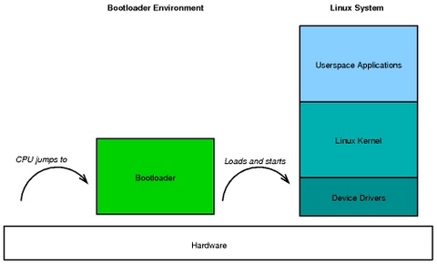
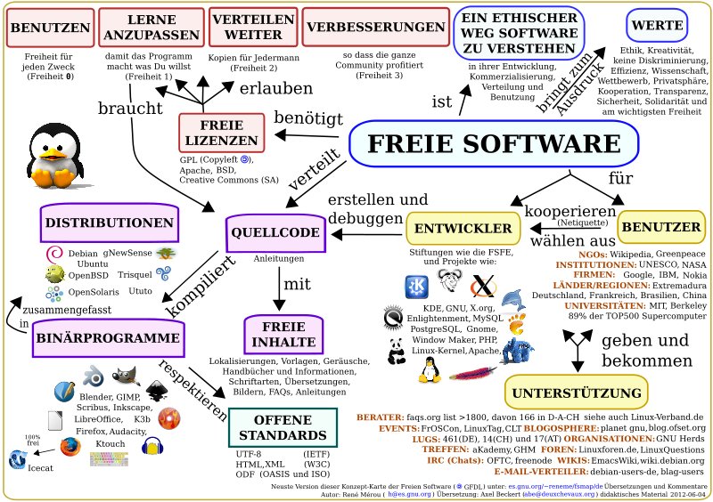

.. include:: etc/kopf.rst

Klausurvorbereitung Fragen
==========================

Embedded Linux Primer - A Practical, Real-World Approach
--------------------------------------------------------

Warum Linux?
++++++++++++

* Linux hat sich zu einer ausgereiften, hoch performanten und stabilen alternative zu üblichen proprietären Embedded-Betriebssystemen entwickelt
* Linux unterstützt eine große Bandbreite an Anwendungen und Netzwerkprotokollen
* Linux ist gut skalierbar, angefangen bei kleinen Konsumentenorientierten Geräten, bis hin zu großen Switches und Routern
* Linux kann ohne die nötigen lizensierungs Gebühren die für proprietäre Embedded-Betriebssystemen nötig sind eingesetzt werden
* Linux hat eine große Anzahl an Entwicklern angezogen, dies ermöglicht eine schnelle Unterstützung neuer Hardware-Architekturen, Plattformen und Geräten
* Eine steigende Anzahl an Hardware- und Software Herstellern, nahezu alle Marktführern und Unabhängige Softwarehersteller eingeschlossen unterstützen Linux

[EMLP]_

.. 6 Punkte

Was bedeutet die "GPL"?
+++++++++++++++++++++++

GPL - GNU Public License ist eine form der Softwarelizensierung und einer der Grundpfeiler der Open-Source Bewegung. Bei Freier Software bezieht sich das "frei" die Freiheiten und nicht auf den Preis. Die Grundpfeiler der GPL sind hierbei das sogenannte Copyleft-Prinzip und die vier Freiheiten der GPL. 

Das Copyleft-Prinzip besagt, dass Software, die auf unter der GNU General Public License (GPL_) veröffentlichten Software basiert nur mit den gleichen Freiheiten veröffentlicht werden darf. Dies stellt sicher, das freie Software für alle zugänglich und frei bleibt.

Niemand sollte von der Software, die er verwendet eingeschränkt werden. Es gibt vier Freiheiten, die jeder Benutzer haben sollte.

    * die Freiheit die Software für jeden Zweck zu verwenden
    * die Freiheit die Software an die eigenen Bedürfnisse anzupassen
    * die Freiheit die Software mit Freunden und Nachbarn zu teilen
    * die Freiheit die eigenen Änderungen zu teilen

Erfüllt ein Programm diese Kriterien kann es als freie Software bezeichnet werden.

[EMLP]_

.. 4 Punkte

Was ist "Open Source"?
++++++++++++++++++++++

Open-Source oder Quelloffene Software bezeichnet Software, die die Definitionen der Open Source Initiative (OSI) erfüllt. Das bedeutet, das die Software einer der Open-Source-Lizenzen unterliegen muss. Außerdem muss der Sourcecode für jeden Benutzer frei zugänglich ist. Im groben Ähneln sich die Ansätze der OSS und FSF, allerdings legt die OSS mehr Wert auf die praktischen Vorteile, wie zum Beispiel eine höhere Entwicklungsgeschwindigkeit durch Open-Source. Die FSF hingegen legt mehr Wert auf den sozialen, politischen und ethnischen Wert Freier Software ("Kontrolle des Nutzers über die Software und nicht umgekehrt").

[EMLP]_

.. 2 Punkte

Was verstehen Sie unter "Linux Standard Base"?
++++++++++++++++++++++++++++++++++++++++++++++

Linux Standard Base (kurz LSB_) ist einer der relevantesten Linux Standards. Er spezifiziert allgemeine Attribute einer Linuxdistribution, wie die Verzeichnisstruktur, Binärschnittstellen, Programmbibliotheken und andere Betriebssystem Bestandteile mit dem Ziel die Kompatiblität zwischen unterschiedlichen Linux Distributionen im Hinblick auf Lauffähigkeit von Programmen zu verbessern. An vielen Stellen sind diese Standards aber noch nicht ausreichend und es halten sich bei weitem nicht alle Distributionen an diese Standards.

[EMLP]_

.. 2 Punkte

Tipps for planning an embedded Linux project
--------------------------------------------

.. 16 Punkte

[TPEL]_

Welche Anforderungen sprechen für Linux?
++++++++++++++++++++++++++++++++++++++++

* Hohe Performance Anforderungen (z.B. Datenraten im Netzwerk)
* Erfordert komplexe, standartisierte Anwendungen (z.B. GUI, Webserver, etc. )
* Verwendung standartisierter, aber complexer Interfaces (z.B. USB, Ethernet, erweiterte Speicherverwaltung, etc. )
* Das System soll erweiterbar sein
* Das System soll skalierbar sein 

[TPEL]_

.. (5 Stück)

Wie "bezahlt" man die Vorteile von Linux?
+++++++++++++++++++++++++++++++++++++++++

[TPEL]_

Aus welchen Einzelteilen besteht Embedded Linux?
++++++++++++++++++++++++++++++++++++++++++++++++

.. 6 Punkte

[TPEL]_

Welche Fähigkeiten braucht man, um einen Rechner mit Embedded Linux auszustatten und zu programmieren?
++++++++++++++++++++++++++++++++++++++++++++++++++++++++++++++++++++++++++++++++++++++++++++++++++++++

[TPEL]_

Welche Kosten sind zu erwarten?
+++++++++++++++++++++++++++++++

[TPEL]_

Welche Risiken gibt es?
+++++++++++++++++++++++

[TPEL]_

Was umfasst der Lebenszyklus des Produktes?
+++++++++++++++++++++++++++++++++++++++++++

[TPEL]_

Was erwartet Sie hinsichtlich der Lizenzen, wenn Sie Linux wählen?
++++++++++++++++++++++++++++++++++++++++++++++++++++++++++++++++++

[TPEL]_

BeagleBone Black
----------------

.. Beschreiben Sie knapp die technischen Eigenschaften des Embedded Linux Boards, das Sie in Ihrem Projekt verwendet haben. Denken Sie an folgende Punkte: [8 Punkte, je 2]

Mikrocontroller (Taktfrequenz, CPU-Typ)
+++++++++++++++++++++++++++++++++++++++

Sitara AM3358BZCZ100 ARM® Cortex-A8 @ 1 GHz

Nicht-flüchtige Speicher
++++++++++++++++++++++++

.. ROM oder Festspeicher

4 GB eMMC (NAND-Flash)

Arbeitsspeicher
+++++++++++++++

512 MB DDR3L @ 800 MHz

Ungefähre Leistungsaufnahme
+++++++++++++++++++++++++++

.. Leistungsaufnahme nachschlagen

[TODO]_

Fragen zum Entwicklungsrechner
------------------------------

Für welche Aufgaben wird der Hostrechner (Entwicklungsrechner) verwendet?
+++++++++++++++++++++++++++++++++++++++++++++++++++++++++++++++++++++++++

.. 4 Punkte

Welche Programme installieren Sie darauf?
+++++++++++++++++++++++++++++++++++++++++

.. 4 Punkte

Nennen Sie zwei Terminalprogramme und geben Sie die üblichen Aufrufparameter an.
++++++++++++++++++++++++++++++++++++++++++++++++++++++++++++++++++++++++++++++++

.. 4 Punkte

Was ist ein Terminal Multiplexer und warum ist er auf dem Targetrechner (und auf dem Hostrechner) sehr praktisch?
+++++++++++++++++++++++++++++++++++++++++++++++++++++++++++++++++++++++++++++++++++++++++++++++++++++++++++++++++

.. 4 Punkte

Fragen zur Speichertechnik
--------------------------

NAND Flash Bausteine
++++++++++++++++++++

.. 12 Punkte

Was steckt in einer MicroSD Karte?
**********************************

* Serielle NAND-Flash Speicherblöcke
* Speicher-controller (Memmory-Management-Unit)
* 8 Pins als Schnittstelle zum Speicher-controller
  
+-----+-----------+----------------------------------+
| PIN | Abkürzung | Funktion                         |
+=====+===========+==================================+
| 1   | DAT2      | Datenleitung 2                   |
+-----+-----------+----------------------------------+
| 2   | DAT3      | Datenleitung 3 / Card Detect     |
+-----+-----------+----------------------------------+
| 3   | CMD       | Comand Line                      |
+-----+-----------+----------------------------------+
| 4   | VDD       | Versorgungsspannung 2,7 - 3,6 V  |
+-----+-----------+----------------------------------+
| 5   | CLK       | Clock (Takteingang)              |
+-----+-----------+----------------------------------+
| 6   | GND       | Ground                           |
+-----+-----------+----------------------------------+
| 7   | DAT0      | Datenleitung 0                   |
+-----+-----------+----------------------------------+
| 8   | DAT1      | Datenleitung 1                   |
+-----+-----------+----------------------------------+

Welche Filesysteme verwendet man meist bei MicoSD Karten?
*********************************************************

Da MicroSD Karten heute meist über eine relativ große Speicherkapazität verfügen verwendet man meist Desktop Filesysteme wie z.B.

* EXT3
* EXT4
* XFS
* oder REISERFS4

Wann verwendet man das "MTD" Subsystem?
***************************************

Memory-Technology-Device (MTD) bezeichnet eine Abstraktionsschicht mit einheitlicher Schnittstelle zur Kommunikation mit dem Speicher eines Linux-Systems. Der Benutzer kann somit ohne genaue Kenntnisse der Interna (z.B. des verwendeten Filesystems) mit Hilfe der API auf den Speicher zugreifen, außerdem können die selben Funktionen auch bei einem Wechsel des darunterliegenden Flash-Speichers angewandt werden. Es kommt hautsächlich bei der verwendung von "rohem Flash-Speicher" also Flash-Speicher ohne Memmory-Management-Unit (MMU) zum Einsatz.

Was ist JFFS2 und wozu braucht man es?
**************************************

Journalling-Flash-File-System-Version-2 (JFFS2) ist ein log-Datei basiertes Filesystem mit wear-leveling und wurde ursprünglich entwickelt und die Verwendung von Flash-Speicher bei eingebetteten Systemen zu verbessern. Bis zu seiner Entwicklung wurden Pseudo-filesysteme, die ein standartisiertes Blockspeicher Device emulierten und auf die dan ein normales Filesystem aufgespielt wurden eingesetzt.

wear-leveling := Schutz vor "Abnutzung" von Flash-Speicher durch wiederkehrende Schreiboperationen auf ständig gleichen Blöcken

Welche Vorteile hat das YAFFS im Vergleich zu JFFS2?
****************************************************

Vorteile:

	* Weniger Hauptspeicher verbrauch um den Status währen der Laufzeit festzuhalten, deshalb eignet es sich auch besser für skalierbare Projekte. Es eignet sich generell besser für die Verwaltung großer NAND-Speicher.
	* Die "Garbage Collection" ist einfacher und schneller, was typischer Weise für eine Bessere Performance bei vielen Schreibzugriffen sorgt
	* Als Fausregel lässt sich festhalten für NAND-Speicher > 64 MB eignet sich YAFFS besser als JFFS2

Nachteile:

	* Eignet sich kaum für NOR-Speicher
	* NOR-Speicher ist meist zu klein um von den Vorzügen von YAFFS zu profitieren
	* Benutzt eine komplette Page als Header für jede Datei und Unterstützt dabei keine Komprimierung. Das heißt auf kleinen Flash-Speichern, die mit gut komprimierbaren Dateien belegt werden sollen, sollte eher auf JFFS2 ausgewichen werden

[YVSJ]_

Was ist das CRAMFS?
*******************

Beim Compressed-ROM-File-System handelt es sich um ein einfaches, effizientes Filesystem mit integrierter Datenkompression, das hauptsächlich bei eingebetteten Systemen zum Einsatz kommt. Im Gegensatz zu komprimierten herkömmlichen Dateisystemen muss ein CramFS nicht erst entpackt werden. Die Dateien sind mit der "zlib" komprimiert, nur die Metainformationen liegen in unkomprimierter Form vor. Da ein schreibender Zugriff auf komprimierte Daten schwer realisierbar ist kann auf CramFS-Dateisysteme nur lesend zugegriffen werden.

Einschränkungen:

	* maximale Größe einer Datei 16 MB
	* maximale Größe eines Datenträgers 256 MB

Was bedeutet "XIP"?
+++++++++++++++++++

eXecute-In-Place (XIP_) bedeutet das ein Programm direkt vom Festspeicher (ROM) aus ausgeführt und nicht erst in den Hauptspeicher (RAM) gleaden wird. Unter anderem wird dies bei Level 1 Bootloadern eingesetzt, diese werden auf einer speziellen Adresse des ROM abgelegt und von dort aus ausgeführt.

.. 2 Punkte

Hauptspeicher
+++++++++++++

.. 4 Punkte

In welcher Speichertechnologie ist der Hauptspeicher des Embedded Linux Rechners realisiert?
********************************************************************************************

Der Hauptspeicher eines Embedded Linux Rechners ist in SDRAM realisiert. Bei neueren oder Leistungsstärkeren Boards (Siehe Raspberry Pi oder BeagleBone Black) wird häufig DDR3L RAM eingesetzt.

Minimale Grösse des Hauptspeichers, damit man aktuelle Distributionen ohne GUI verwenden kann?
**********************************************************************************************

Bereits mit 4 MB lässt sich eine sehr einfache Linuxdistribution auf einem Embedded System betreiben, allerdings lässt sich damit keines der üblichen Paket-Management-Systeme betreiben. Für diese sind mindestens 8 MB RAM nötig. Um das komplette Spektrum an üblichen Funktionen eines minimalen Embedded Systems abzudecken sind 16 MB RAM als mindestvorraussetzung empfohlen.

Fragen zum Bootloader
---------------------

Wie bootet ein Embedded Linux Rechner?
++++++++++++++++++++++++++++++++++++++

.. als Ergänzung zu den folgenden Fragen eingefügt

Der Prozessor springt zu einer spezifischen Adresse, an dieser erwartet er den bootloader zu finden. Deshalb benötigen unterschiedliche Prozessoren unterschiedliche Konfigurationen und Formatierungen beim Festspeicher (eMMC / SD). Der Prozessor beginnt nun den Code an der Stelle auszuführen.
Nachdem der Bootloader geladen und konfiguriert wurde werden alle Treiber und Geräte initialisiert und die Dateisysteme gemountet. Der Kernel wird geladen und die Userspace Programme werden geladen.

[ATES]_

Wozu braucht man einen Bootloader?
++++++++++++++++++++++++++++++++++

Initialisieren des Systems
**************************

Hierbei kann unter anderem auch eine UART-Schnittstelle als serielle Debug-Konsole gestartet werden (z.B. BeagleBone Black interaktion mit u-boot). Außerdem wird dabei der Memmory-Controller des Systems initialisiert so das sowohl auf den Haupt- als auch auf den Festspeicher entsprechend seiner Eigenschaften zugegriffen werden kann. Während der Initialisierung kann der Bootvorgang unterbrochen werden und man kann mit Hilfe der seriellen Konsole Boot-Befehle (engl. bootargs) absetzen.

Laden des Kernels
*****************

Erst nach der Initialisierung des Memmory-Controllers ist es überhaupt möglich gezielt auf den Festspecher zuzugreifen und genau darin besteht auch die nächste Aufgabe des Bootloaders. Er muss den häufig System-spezifischen Kernel in den Hauptspeicher des Embedded-Linux Rechners laden. Hierbei werden auch die Informationen des Device-Tree-Blob (einer low-level zusammenfassung der zugrunde liegenden Hardware) verwendet um die nötigen Kernelmodule mit zu laden.

[ATES]_

Nennen Sie zwei gebräuchliche Bootloader
++++++++++++++++++++++++++++++++++++++++

* Das u-boot
* RedBoot		(RedHat)
* rrload 		(ARM)
* FILO 
* CRL/OHH 
* PPCBOOT 
* Alios
* 

Wieso kann der first level bootloader im Mikrocontroller im Allgemeinen nicht den allgemeinen Bootvorgang des Linux Kernels einleiten?
++++++++++++++++++++++++++++++++++++++++++++++++++++++++++++++++++++++++++++++++++++++++++++++++++++++++++++++++++++++++++++++++++++++

Weil der first level bootloader nur eine begrenzte Menge an Bytes auf einmal laden kann, deshalb wird normalerweise der second level bootloader zwischengeschoben um den Kernel zu laden.

Wozu dient die folgende U-Boot Kommandosequenz:
+++++++++++++++++++++++++++++++++++++++++++++++

.. code:: bash

    set bootargs root=/dev/nfs nfsroot=192.168.1.1:/srv/rootfs \
    ip=192.168.1.2:192.168.1.1::255.255.255.0::eth0:none
    nfs 0x10400000 /srv/rootfs/boot/uImage
    bootm

Bei dieser Kommandosequenz handelt es sich um eine netboot Anweisung, bei der das uImage von einem Net-File-System Server (nfs-server) geladen wird. In diesem speziellen Fall wird von der adresse in Zeile 1 (nfsroot=192.168.1.1:/srv/rootfs) über den Ethernetanschluss das uImage geladen. Dies bedeutet, das sich zum Zeitpunkt des Startes nur der Bootloader und die Konfigurationsdatei (z.B. uEnv.txt) auf dem Festspeicher des Systems befindet.

Welche Möglichkeiten gibt es, die Bootzeiten zu reduzieren? [6 Punkte]
++++++++++++++++++++++++++++++++++++++++++++++++++++++++++++++++++++++

Fragen zum Kernel
-----------------

.. 10 Punkte

Auf der Tafel hatten wir ein Diagramm gezeichnet mit den wichtigsten Bereichen, mit denen man beim Kernel zu tun hat. Zeichnen Sie es hin.
++++++++++++++++++++++++++++++++++++++++++++++++++++++++++++++++++++++++++++++++++++++++++++++++++++++++++++++++++++++++++++++++++++++++++

        (siehe Tafel von 2014)

Wieso ist es wünschenswert, dass ein Embedded Linux Board im Mainline Kernel unterstützt wird?
++++++++++++++++++++++++++++++++++++++++++++++++++++++++++++++++++++++++++++++++++++++++++++++

Geben Sie die Kommandozeilen an, um einen Kernel mit einem Cross-Kompiler zu kompilieren
++++++++++++++++++++++++++++++++++++++++++++++++++++++++++++++++++++++++++++++++++++++++

Konfiguration erstellen
***********************

Kernel und Module bauen
************************

Installation
************

Wieso kann es wichtig sein, dass man bei einem Embedded System den Kernel auf eine neuere Version updaten kann?
+++++++++++++++++++++++++++++++++++++++++++++++++++++++++++++++++++++++++++++++++++++++++++++++++++++++++++++++

Gibt es im Kernel Quelltext auch eine Dokumentation?
++++++++++++++++++++++++++++++++++++++++++++++++++++

Ansteuerung von Peripherie
--------------------------

.. 10 Punkte

Nennen Sie fünf verschiedene Arten, wie Sie Hardware-Erweiterungen an Ihr Embedded Linux Board elektrisch anschliessen könnten.
+++++++++++++++++++++++++++++++++++++++++++++++++++++++++++++++++++++++++++++++++++++++++++++++++++++++++++++++++++++++++++++++

.. 5 Punkte

Welche alternativen Möglichkeiten gibt es zur programmiertechnischen Ansteuerung von Hardware-Erweiterungen aus dem Userspace?
++++++++++++++++++++++++++++++++++++++++++++++++++++++++++++++++++++++++++++++++++++++++++++++++++++++++++++++++++++++++++++++

.. 5 Punkte

Fragen zur Echtzeit mit Embedded Linux
--------------------------------------

.. 6 Punkte

Welche prinzipiellen Lösungsansätze gibt es, um Linux mit Echtzeit-Eigenschaften auszustatten?
++++++++++++++++++++++++++++++++++++++++++++++++++++++++++++++++++++++++++++++++++++++++++++++

Wie heissen die seit Jahren etablierten praktischen Implementierungen der prinzipiellen Lösungsansätze?
+++++++++++++++++++++++++++++++++++++++++++++++++++++++++++++++++++++++++++++++++++++++++++++++++++++++

Welchen Vorteil hat der "Preempt-RT" Ansatz, auch wenn er nicht für harte Echtzeit geeignet ist.
++++++++++++++++++++++++++++++++++++++++++++++++++++++++++++++++++++++++++++++++++++++++++++++++

Beschreiben Sie, wie das Debuggen über die JTAG-Schnittstelle des Mikroprozessors funktioniert [8 Punkte]
---------------------------------------------------------------------------------------------------------

In welchem Fall ist diese Debug-Art unbedingt notwendig?
++++++++++++++++++++++++++++++++++++++++++++++++++++++++

Wie sieht die Verschaltung der nötigen Einzelteile aus?
+++++++++++++++++++++++++++++++++++++++++++++++++++++++

Open-Source Programme und Schnittstellen für JTAG-Debugging
+++++++++++++++++++++++++++++++++++++++++++++++++++++++++++

.. Welches freie Programm wird auf dem Hostrechner benötigt, so dass man mit dem GNU Debugger gdb über JTAG debuggen kann? Welche Schnittstellen stellt das Programm bereit (Diagramm)?

Neben dem Debuggen gibt es eine weitere wichtige Funktion, die häufig über JTAG erledigt wird. Denken Sie an frisch aus der Fertigung kommende Boards.
++++++++++++++++++++++++++++++++++++++++++++++++++++++++++++++++++++++++++++++++++++++++++++++++++++++++++++++++++++++++++++++++++++++++++++++++++++++

Fragen zum Artikel Linux Debugging von Tim Schürmann aus der Leseliste
----------------------------------------------------------------------

.. 8 Punkte

In welchen unterschiedlichen Varianten kann man mit dem GDB Programme auf dem Zielrechner debuggen?
+++++++++++++++++++++++++++++++++++++++++++++++++++++++++++++++++++++++++++++++++++++++++++++++++++

.. 2 Punkte

Wozu dient das Programm strace?
+++++++++++++++++++++++++++++++

.. 2 Punkte

Wozu dient das Programm LTTng?
++++++++++++++++++++++++++++++

.. 2 Punkte

Wozu dient das Programm systemtap?
++++++++++++++++++++++++++++++++++

.. 2 Punkte

Unterschiede zwischen "Linux" und "Embedded-Linux"
==================================================

Markieren Sie von folgenden Begriffen diejenigen, die meist nur bei Embedded Linux relevant sind:
-------------------------------------------------------------------------------------------------

+------------------------------------------------+-----+-----+
| Begriff                                        | ES  | PC  |
+================================================+=====+=====+
| Netzwerk                                       |     |     |
+------------------------------------------------+-----+-----+
| U-Boot                                         |  x  |     |
+------------------------------------------------+-----+-----+
| JFFS                                           |  x  |     |
+------------------------------------------------+-----+-----+
| Systemprogrammierung                           |     |     |
+------------------------------------------------+-----+-----+
| Bootzeit                                       |     |     |
+------------------------------------------------+-----+-----+
| Shellprogrammierung                            |     |     |
+------------------------------------------------+-----+-----+
| Interrupts                                     |     |     |
+------------------------------------------------+-----+-----+
| Kernel-Module                                  |     |     |
+------------------------------------------------+-----+-----+
| Stromverbrauch                                 |  x  |     |
+------------------------------------------------+-----+-----+
| Buildroot                                      |  x  |     |
+------------------------------------------------+-----+-----+
| Watchdog/Ausfallschutz                         |     |     |
+------------------------------------------------+-----+-----+
| Hardware-Schnittstellen SPI/I2C/GPIO/UART      |  x  |     |
+------------------------------------------------+-----+-----+
| Kernel-Konfiguration                           |     |     |
+------------------------------------------------+-----+-----+
| Echtzeit                                       |  x  |     |
+------------------------------------------------+-----+-----+
| JTAG Debugger                                  |  x  |     |
+------------------------------------------------+-----+-----+
| Fernwartung                                    |     |     |
+------------------------------------------------+-----+-----+
| glibc                                          |     |  x  |
+------------------------------------------------+-----+-----+
| Kommandozeile                                  |     |     |
+------------------------------------------------+-----+-----+
| System-V init                                  |     |     |
+------------------------------------------------+-----+-----+
| uClibc                                         |  x  |     |
+------------------------------------------------+-----+-----+

Kernel
------

Wie kompiliert man den Kernel auf der Kommandozeile?
++++++++++++++++++++++++++++++++++++++++++++++++++++

Wo stehen die Namen der make targets?
*************************************
  
.. README
.. makefile.am
.. make help

.. code:: bash 

    make ARCH=arm CROSS_COMPILE=... menuconfig <PATH_TO_COMPILER>
    make ARCH=arm CROSS_COMPILE=... zImage
    make ARCH=arm CROSS_COMPILE=... modules
    make modules_install INSTALL_MOD_PATH=<your-module-path>

Sie möchten einen Linux Kernel kompilieren für ein Board auf dem bereits Linux läuft, haben aber keine .config Datei. Welche Möglichkeiten gibt es?
***************************************************************************************************************************************************

/prog/

Was macht das Kommando dmesg?
+++++++++++++++++++++++++++++

Wie sehen Sie sich im laufenden Linux die Kernel Kommandozeile an?
++++++++++++++++++++++++++++++++++++++++++++++++++++++++++++++++++

Was ist ein uImage und wie erzeugt man es?
++++++++++++++++++++++++++++++++++++++++++

Wie kann man das Embedded Linux Board booten, obwohl nur das U-Boot im Flash Speicher vorhanden ist? Das Board verfügt über eine Netzwerkschnittstelle.
+++++++++++++++++++++++++++++++++++++++++++++++++++++++++++++++++++++++++++++++++++++++++++++++++++++++++++++++++++++++++++++++++++++++++++++++++++++++

U-Boot ermöglicht es ein RootFS über das Netz zu booten, Hierfür benötigt man lediglich einen ftp-server, der nfs Unterstützung bietet.

.. code:: bash

	# from file env.txt

	tftpboot <file> [<load_addr>]
	...
	netboot=tftp ${image}; run addip;bootm

Tools
-----

Cross-Kompilierung für ARM mit configure, make und make install
+++++++++++++++++++++++++++++++++++++++++++++++++++++++++++++++

.. Sie haben die Sourcen eines Programmes, das man wie üblich mit configure, make, make install installieren kann. Sie möchten das Programm nun auf dem PC crosskompilieren für ARM. Was müssen Sie beim Konfigurieren angeben?

.. code:: bash

	tar xvfj linux-$ver.tar.bz2
	cd linux-$ver
	mkdir -p $DESTDIR/usr/include/asm
	make ARCH=arm INSTALL_HDR_PATH=$DESTDIR/usr headers_install
	tar xvfj glibc-$ver.tar.bz2
	cd glibc-$ver
	mkdir objdir; cd objdir
	CC=gcc ../configure --host=arm-linux-gnu --prefix=/usr --with-header=$DESTDIR/usr/include
	make -k cross-compiling=yes DESTDIR=$DESTDIR install-headers
	touch $DESTDIR/usr/include/gnu/stubs.h
	 
	tar xvfj binutils-$ver.tar.bz2
	cd binutils-$ver
	./configure --target=arm-linux-gnu --prefix=$TOOLSDIR
	make; make install
	tar xvfj gcc-$ver.tar.bz2
	cd gcc-$ver
	mkdir objdir; cd objdir
	../configure --target=arm-linux-gnu --disable-cpp --disable-shared --disable-multilib
	   --enable-languages="c" --prefix=$TOOLSDIR
	   --with-headers=$DESTDIR/usr/include
	make all; make install
	
	cd glibc-$ver/objdir
	../configure --host=arm-linux-gnu --prefix=/usr --with-header=$DESTDIR/usr/include
	make
	make DESTDIR=$DESTDIR install

[LMCC]_

[TODO]_

.. bisher nichts brauchbares gefunden

Wie kann man sich den Hexdump einer Binärdatei ausgeben?
++++++++++++++++++++++++++++++++++++++++++++++++++++++++

[TODO]_ 

.. hexdump editor finden

Root Filesystem
---------------

Welche Komponenten brauchen Sie für ein minimales RootFS, das in vier Megabyte Flash-Speicher passt?
++++++++++++++++++++++++++++++++++++++++++++++++++++++++++++++++++++++++++++++++++++++++++++++++++++

* Bootloader
* Kernel
* uClibc
* busybox

Welche Baukästen für Root Filesysteme kennen Sie, die auch für Embedded Boards geeignet sind?
+++++++++++++++++++++++++++++++++++++++++++++++++++++++++++++++++++++++++++++++++++++++++++++

* Buildroot
* Yocto Project
* Linux from Scratch (LFS)
* OpenEmbedded
* Embedded-Linux-Development-Kit (ELDK)
* Gentoo Embedded

Leseliste für die Klausur
=========================

A Typical Embedded System
=========================

Welche besonderen Filesysteme gibt es für Embedded Linux?
---------------------------------------------------------

[ATES]_

Welche Unterschiede gibt es beim Kernel im Vergleich zum PC?
------------------------------------------------------------

[ATES]_

Welche Bedeutung hat die C Bibliothek?
--------------------------------------

[ATES]_

Was ist die “Busybox”?
----------------------

[ATES]_

Wie funktioniert Cross-Kompilierung?
------------------------------------

[ATES]_

Welche Distribution für Embedded Linux werden erwähnt?
------------------------------------------------------

[ATES]_

Ist der Apache Webserver eine gute Wahl? Welche anderen Webserver gibt es noch?
-------------------------------------------------------------------------------

[ATES]_

Welche Werkzeuge gibt es zur Programmierung grafischer Oberflächen?
-------------------------------------------------------------------

[ATES]_

Fazit: Was ist der Unterschied zwischen Embedded Linux und “gewöhnlichem” Linux?
--------------------------------------------------------------------------------

[ATES]_

Tips for planning an embedded Linux project
===========================================

Aus welchen Einzelteilen besteht Embedded Linux? (6 Stück)
----------------------------------------------------------

[TPEL]_

Welche Fähigkeiten braucht man, um einen Rechner mit Embedded Linux auszustatten und zu programmieren?
------------------------------------------------------------------------------------------------------

[TPEL]_

Welche Kosten sind zu erwarten?
-------------------------------

[TPEL]_

Welche Risiken gibt es?
-----------------------

[TPEL]_

Was umfasst der Lebenszyklus des Produktes?
-------------------------------------------

[TPEL]_

Speichertechnologien und Filesystems
====================================

Wie funktioniert Flash Speicher?
--------------------------------

[STFS]_

Welche grundsätzlichen Bausteintypen gibt es?
---------------------------------------------

[STFS]_

Was ist SQUASHFS?
-----------------

[STFS]_

Anatomy of Flash Filesystems
============================

Was ist das Virtual File System VFS?
------------------------------------

[AFFS]_

Was sind “bad blocks” und “wear leveling”?
------------------------------------------

[AFFS]_

Was kann man über die Mount-Zeit von verschiedenen Flash Filesystemen sagen?
----------------------------------------------------------------------------

[AFFS]_

Embedded Linux Primer (Bootloader)
==================================

Wozu braucht man einen Bootloader?
----------------------------------

[ELPB]_

Wieso kann der first level bootloader im Mikrocontroller im Allgemeinen nicht den allgemeinen Bootvorgang des Linux Kernels einleiten?
--------------------------------------------------------------------------------------------------------------------------------------

[ELPB]_

Wie gross sind typische Bootloader wie z.B. U-Boot und Apex?
------------------------------------------------------------

[ELPB]_

Welchen Funktionsumfang hat der U-Boot Bootloader?
--------------------------------------------------

[ELPB]_

Fast Startup Linux
==================

Welche Möglichkeiten gibt es, die Bootzeit zu reduzieren?
---------------------------------------------------------

[FSTL]_

Linux Kernel Module
===================

Kann man in einem Kernelmodul auf die C Bibliothek zugreifen?
-------------------------------------------------------------

[LKMS]_

Beschreiben Sie, wie man ein einfaches Kernelmodul nativ als auch cross-kompiliert.
-----------------------------------------------------------------------------------

[LKMS]_

Wie lädt man ein Kernelmodul in den Kernel?
-------------------------------------------

[LKMS]_

Was sind Gerätenummern?
-----------------------

[LKMS]_

Wie legt man Gerätedateien an?
------------------------------

[LKMS]_

Was sind zeichenorientierte Treiber (character driver)?
-------------------------------------------------------

[LKMS]_

Standard UNIX wird echtzeitfähig
================================

Nennen Sie Anwendungsgebiete, die es notwendig machen, dem Linux Kern Echtzeit-Fähigkeit zu geben.
--------------------------------------------------------------------------------------------------

[SURT]_

Beschreiben Sie die wichtigsten Komponenten des Realtime-Preempt Patches.
-------------------------------------------------------------------------

[SURT]_

Welche Funktion hat die Organisation OSADL?
-------------------------------------------

[SURT]_

Wie kann man das Scheduling von Prozessen im Anwendungsprogramm setzen?
-----------------------------------------------------------------------

[SURT]_

Linuxtronix, Echtzeit - prinzipielle Ansätze
============================================

Welche prinzipiellen Lösungsansätze gibt es, um Linux mit Echtzeit-Eigenschaften auszustatten?
----------------------------------------------------------------------------------------------

[LTRT]_

Wie heissen die seit Jahren etablierten praktischen Implementierungen der prinzipiellen Lösungsansätze?
-------------------------------------------------------------------------------------------------------

[LTRT]_

Welchen Vorteil hat der “Preempt-RT” Ansatz, auch wenn er nicht für “harte” Echtzeit geeignet ist.
--------------------------------------------------------------------------------------------------

[LTRT]_

Echtzeitsysteme mit Linux
=========================

Was versteht man unter “Interrupt Latenzzeiten”?
------------------------------------------------

[GRTL]_

Wie werden im Kernel kritische Abschnitte geschützt?
----------------------------------------------------

[GRTL]_

Linux Debugging
=============== 

Beschreiben Sie kurz den Zweck von Strace, LTTng und Systemtap.
---------------------------------------------------------------

[TSLD]_

Embedded Debugging
==================

[EMDB]_ 

Freie / offene Software
=======================

Freie_Software_

[WIKI]_

+--------------------------------------------------------------------------------+-----+------+------+-----+-----+-----+
| Kriterium                                                                      | GPL | LGPL | AGPL | BSD | MPL | CC  |
+================================================================================+=====+======+======+=====+=====+=====+
| kann für jeden Zweck verwendet werden                                          |  X  |  X   |  X   |     |     |     |
+--------------------------------------------------------------------------------+-----+------+------+-----+-----+-----+
| kann den eigenen Bedürfnissen angepasst werden                                 |  X  |  X   |  X   |  X  |     |     |
+--------------------------------------------------------------------------------+-----+------+------+-----+-----+-----+
| kann mit Freunden und Nachbarn geteilt werden                                  |  X  |  X   |  X   |  X  |     |     |
+--------------------------------------------------------------------------------+-----+------+------+-----+-----+-----+
| eigene Änderungen dürfen verbreitet werden                                     |  X  |  X   |  X   |  X  |     |     |
+--------------------------------------------------------------------------------+-----+------+------+-----+-----+-----+
| auf Freier Software basierende Programme müssen freie Software bleiben         |  X  |      |      |     |     |     |
+--------------------------------------------------------------------------------+-----+------+------+-----+-----+-----+
| Aufzählung aller Copyright besitzer der vorhergehenden Sources                 |     |      |  X   |  X  |     |     |
+--------------------------------------------------------------------------------+-----+------+------+-----+-----+-----+
| Änderungen müssen dem Urheber der Software angezeigt und übermittelt werden    |     |      |  X   |     |     |     |
+--------------------------------------------------------------------------------+-----+------+------+-----+-----+-----+

Erläutern Sie das Prinzip des Copyleft.
---------------------------------------

Das Copyleft-Prinzip besagt, dass Software, die auf unter der GNU General Public License (GPL_) veröffentlichten Software basiert nur mit den gleichen Freiheiten veröffentlicht werden darf. Dies stellt sicher, das freie Software für alle zugänglich und frei bleibt.

Welche vier Freiheiten gewährt die GPL?
---------------------------------------

Niemand sollte von der Software, die er verwendet eingeschränkt werden. Es gibt vier Freiheiten, die jeder Benutzer haben sollte.

    * die Freiheit die Software für jeden Zweck zu verwenden
    * die Freiheit die Software an die eigenen Bedürfnisse anzupassen
    * die Freiheit die Software mit Freunden und Nachbarn zu teilen
    * die Freiheit die eigenen Änderungen zu teilen

Erfüllt ein Programm diese Kriterien kann es als freie Software bezeichnet werden.

Wie unterscheidet sich die LGPL von der GPL?
--------------------------------------------

Die Lesser GNU Public License (LGPL_) unterscheidet sich von der GNU Public License (GPL_) in der Copyleft Regelung während bei der GPL alle von der Software abgeleiteten Programme ebenfalls unter der selben Lizenz veröffentlicht werden müssen kann aus unter der LGPL veröffentlichten Quellen auch proprietäre Software geschrieben werden.

Wie unterscheidet sich die BSD Lizenz von der GPL?
--------------------------------------------------

Die BSD_Licence_ verlangt, dass nach einer Änderung der Urheber entsprechende des Musters "Copyright (c) <YEAR>, <OWNER>" auch in der geänderten Version bekannt gegeben wird.

Was sind Duale Lizenzen? Nennen Sie ein Beispiel.
-------------------------------------------------

Mehrfach_Lizenzen_ erlauben es 

Beispiele: Qt, MySQL, Asterisk, Sendmail und Perl

Vorteile
++++++++

Mit diesem Lizenzierungsprinzip können Unternehmen eigene Anwendungen entwickeln, ohne diese selbst wieder der Open-Source-Lizenz unterwerfen zu müssen. So ist es einerseits möglich, das Open-Source-Modell zur Entwicklung und Distribution von Software zu fördern, und andererseits ein professionelles Geschäftsmodell zu etablieren, bei dem Softwarelizenzen ohne Einschränkungen verkauft werden können. Für eine Mehrfachlizenzierung spricht des Weiteren die Möglichkeit, die Software mit proprietären Erweiterungen zu versehen.

Käufer einer mehrfach lizenzierten Software sind darüber hinaus nicht an die teils sehr restriktiven Vorgaben zur Weitergabe von Software unter einer freien Lizenz gebunden. Die Entwicklung freier Software wird gefördert, ohne auf Spenden angewiesen zu sein.

Nachteile
+++++++++

Gegen eine Mehrfachlizenzierung spricht, dass das lizenzierende Unternehmen die Arbeit der Open-Source-Entwickler ausnutzen könnte. Darüber hinaus könnte das entwickelnde Unternehmen es sich vorbehalten, irgendwann die Weiterentwicklung der offenen Version zu stoppen.

Umstritten und selten erwähnt ist jedoch die Tatsache, dass bei einigen Open-Source-Lizenzen die Kontrolle über die Entwicklung der Software leicht an die Community oder an finanziell überlegene Unternehmen gehen kann. Ein Entwicklungsstopp einer unter GPL lizenzierten Software besagt noch lange nicht, dass die Software nicht mehr weiterentwickelt wird. Die GPL räumt jedem Nutzer das Recht ein, die Software beliebig zu modifizieren, also auch weiterzuentwickeln.

Heftig umstritten ist, ob der Initiator eines Open-Source-Projektes, welcher seine Software unter einer dualen Lizenz auf den Markt bringt, die Weiterentwicklungen der Community in sein Produkt einfließen lassen kann, um diese unter einer anderen Lizenz als der GPL zu vertreiben.

Kleine Unternehmen laufen generell Gefahr, ihre Open-Source-Softwareprojekte an große Unternehmen zu „verlieren“.

Darf man Programme im Linux Userspace unter einer proprietären Lizenz vertreiben?
---------------------------------------------------------------------------------

Darf man mit dem freien GNU C Compiler kommerzielle geschlossene Programme schreiben?
-------------------------------------------------------------------------------------

Was halten Sie von geschlossenen Kernelmodulen?
-----------------------------------------------

Linux auf eingebetteten Systemen
================================

Suchen Sie Geräte, die unter Linux laufen. Sie haben sicher schon selber welche entdeckt. Sie können sich aber auch von folgenden Seiten inspirieren lassen:  

linuxgizmos_
elinux_
linuxfordevices_

Was erwartet Sie hinsichtlich der Lizenzen, wenn Sie Linux wählen?
------------------------------------------------------------------

[TBP]_

Was zeichnet Embedded Systems aus?
----------------------------------

Vergleichen Sie BIOS und Bootloader.
------------------------------------

Aus welchen wesentlichen Funktionsblöcken bestehen Embedded Systems?
--------------------------------------------------------------------

Aus welcher Hardware besteht die Entwicklungsumgebung?
------------------------------------------------------

Wie startet Embedded Linux? (von U-Boot bis init Prozess)
---------------------------------------------------------

Welche Arten von Flash Speicher gibt es?
----------------------------------------

1) Permanent

    a) 
    b) 
    c) 

2) Non-Permanent

    a) NOR-Flash
    b) NAND-Flash

        managed

        not managed

In welche Regionen ist der Flash Speicher bei Linux in der Regel aufgeteilt?
----------------------------------------------------------------------------

Wie sieht grob die memory map des gesamten Rechners aus?
--------------------------------------------------------

Beschreiben Sie den Ausführungskontext mit Applikation, C Bibliothek, Kernel und Gerätetreibern. Was läuft im Kernel-Kontext, was im User-Kontext?

        

Was macht die MMU und wo ist sie eingebaut?
-------------------------------------------

Wie nennt man die nicht-native Kompilierung auch?
-------------------------------------------------

"Cross-Kompilierung" - Das kompilieren von nativer Software auf einem Hostrechner für ein spezifisches Target mit Hilfe von Cross-Kompilierungs Toolchain und im Terminal gesetzten Variablen wie z.B. "$ARCH", "$CC", etc.

Was ist native Kompilierung? Ab welcher Rechenleistung macht sie Sinn?
----------------------------------------------------------------------

Was ist eine Embedded Linux Distribution?
-----------------------------------------

Aus wie vielen Paketen besteht eine Distribution ungefähr?
----------------------------------------------------------

.. Beantworten Sie folgende Fragen:

Welche anderen CPUs unterstützt Linux neben dem x86?
----------------------------------------------------

Was ist ein monolithischer Kern?
--------------------------------

Warum lässt sich Linux einfach auf fast beliebige Prozessoren portieren?
------------------------------------------------------------------------

Wie unterscheiden sich die Befehlssätze der Prozessorfamilien?
--------------------------------------------------------------

Virtual Memory Management
-------------------------

.. Damit die Linux Speicherverwaltung (virtual memory) funktioniert, muss der Mikrocontroller eine bestimmte Hardware-Komponente haben. Wie heisst diese?

Wie heisst die Linux Variante, die ohne diese Hardware-Komponente auskommt?
---------------------------------------------------------------------------

Was ist ein “System on Chip” (SoC)?
-----------------------------------

Wie sieht die Schichtung der Software eines Embedded Linux Systems in etwa aus?
-------------------------------------------------------------------------------

+---------------------+---------------+-----------------------------------------------------------------+
| Komponente          | Beispiel      | Aufgabe                                                         |
+=====================+===============+=================================================================+
| CPU                 |               | springt an eine spezifische Stelle im Festspeicher und lädt     |
+---------------------+---------------+-----------------------------------------------------------------+
| bootloader          | u-boot        | lädt das u-image                                                |
+---------------------+---------------+-----------------------------------------------------------------+
| u-image             | uImage        | lädt den Device-Tree-Blob & das Betriebssystem                  |
+---------------------+---------------+-----------------------------------------------------------------+
| Device-Tree-Blob    | <xyz>.dtb     | Enthält Informationen über die verbauten Komponenten des Boards |
+---------------------+---------------+-----------------------------------------------------------------+
| Kernel              | vmlinuz       | Der Linux Kernel als Basis des Embedded-Linux                   |
+---------------------+---------------+-----------------------------------------------------------------+
| System Software     |               | Unterstützung des OS bei seinen Aufgaben                        |
+---------------------+---------------+-----------------------------------------------------------------+
| User-Space-Software | browser       | System/Benutzer interaktion                                     |
+---------------------+---------------+-----------------------------------------------------------------+

Welches Dateisystem wird bei Flash Speicher häufig verwendet?
-------------------------------------------------------------

Welche Sprachen werden zur Programmierung verwendet?
----------------------------------------------------

Welche Bootloader werden bei Embedded Linux verwendet? Ist grub auch eine Option?
---------------------------------------------------------------------------------

Der Entwicklungsrechner
=======================

Installieren Sie Linux auf Ihrem Hostrechner, entweder in einer eigenen Partition oder in einer virtuelle Maschine wie z.B. VirtualBox_.

Sehen Sie sich auf Ihrem GNU/Linux Desktop PC oder Laptop den Kernel und das Root Filesystem an. Wie viel Platz beanspruchen die einzelnen Teile?

Für welche Aufgaben wird der Hostrechner (Entwicklungsrechner) verwendet?
-------------------------------------------------------------------------

Im Skript steht eine Liste von Werkzeugen für den Entwicklungsrechner. Was macht jedes einzelne dieser Werkzeuge?.

Lernen Sie die Bedienung Ihres Linux Rechners ausschliesslich über die Kommandozeile.
-------------------------------------------------------------------------------------

Installieren Sie einen Teminal Multiplexer, z.B. screen_ oder tmux_. Auch auf dem Zielrechner ist so ein Werkzeug sehr praktisch.

Welche Terminalprogramme gibt es unter Linux, um auf die Konsole über die serielle Schnittstelle zu gehen? Wie lauten die üblichen Einstellungen?

Wie kann man Daten im Terminalprogramm mit dem Protokoll X/Y/Z-Modem übertragen? Warum sollten nur kleinere Dateien bis zu ein paar 100 KByte übertragen werden?

Wie arbeitet man mit folgenden Programmen: ssh, scp, ftp (ncftp)?
-----------------------------------------------------------------

ssh
+++

Ssh bietet die Möglichkeit sich auf entfernten Geräten anzumelden hierfür benötigt man eine Netzwerkverbindung (IP-Adresse), einen laufenden ssh-server / service und eingerichtete "rsa-Fingerprints". Sind diese richtig eingerichtet kann man sich über das einfache Muster:

.. code:: bash

    ssh <USER>@<IP-Adress>
    # alternativ
    ssh <USER>@<hostname-des-Target>

scp
+++

ftp
+++

ncftp
+++++

Wie ändert man die Netzwerkeinstellungen für die Schnittstellen eth0 und eth1 mit den Werkzeugen ifconfig, route, ethtool und iptables.

Wie richtet man auf dem Host eine zweite Ethernet-Schnittstelle ein, um ein Netzwerkkabel mit dem Target zu verbinden? Wie lauten die Einstellungen auf dem Target und auf dem Host?

Installieren Sie den Quelltext des Linux Kernels auf dem Hostrechner und kompilieren Sie ihn.
---------------------------------------------------------------------------------------------

Installieren Sie auf Ihrem Entwicklungsrechner eine Toolchain für die ARMv5 Architektur (ELDK oder Debian).
-----------------------------------------------------------------------------------------------------------

Wie richtet man auf dem Host einen NFS Server ein?
--------------------------------------------------

Wie richtet man auf dem Host einen TFTP Server ein?
---------------------------------------------------

Literatur und sonstige Quellen
==============================

.. [AELS] Architekturen eingebetteter Linux Systeme, Rene Rebe, 2008

    http://elk.informatik.fh-augsburg.de/cdrom-elinux/Lesen/rebe-linux-ueberall.pdf

.. [ATES] Johan Thelin, Introduction: A Typical Embedded System, 12/2009

    http://www.linuxjournal.com/article/10565

    http://elk.informatik.fh-augsburg.de/pub/rtlabor/elinux/intro/thelin/

.. [AFFS] M. Tim Jones, Anatomy of Flash Filesystems, 2008

    http://elk.informatik.fh-augsburg.de/pub/rtlabor/elinux/speicher/l-flash-filesystems-pdf.pdf

.. [BSD2] Berkley Software Distribution

.. _BSD_Licence: http://opensource.org/licenses/BSD-2-Clause

.. [ELPB] Hallinan, Kap. 7 (Bootloader)

    http://elk.informatik.fh-augsburg.de/pub/rtlabor/elinux/boot/hallinan_embedded_linux_primer_chap_7_bootloaders.pdf

.. [EMLP] Embedded Linux Primer: A Practical, Real-World Approach, Christoper Hallinan, Prentice Hall, 2010

	Chapter 1: Introduction
	Chapter 7: Bootloaders

	http://proquest.tech.safaribooksonline.de/book/operating-systems-and-server-administration/embedded-linux/9780137061129

.. [EMDB] Anselm Busse, Jan Richling, Embedded Debugging. Linux Magazin, 9/2013.

    http://elk.informatik.fh-augsburg.de/pub/rtlabor/elinux/debug/lm-9-2013-debug/

.. [FSTL] Fast Startup Linux

    http://elk.informatik.fh-augsburg.de/pub/rtlabor/elinux/boot/637_Fast_Startup_Linux.pdf

.. [GRTL] Eva-Katharina Kunst, Jürgen Quade, Grundlagen: Echtzeitsysteme mit Linux, 2008

    http://www.linux-magazin.de/Ausgaben/2008/06/Gerade-echtzeitig

.. [GNU] GNU Software Foundation

.. _GPL: http://www.gnu.org/licenses/quick-guide-gplv3.html

.. _LGPL: http://www.gnu.org/licenses/why-not-lgpl.html

.. _AGPL: http://www.gnu.org/licenses/why-affero-gpl.html

.. [LKMS] Boguslaw Sylla, Patrick Schorn, Linux Kernel Module.

    http://elk.informatik.fh-augsburg.de/pub/rtlabor/elinux/kernel/linuxkernel.pdf

.. [LMCC] Linux Magazin, 4/2008 - GNU-Tools mal kreuzweise

	http://www.linux-magazin.de/Ausgaben/2008/04/GNU-Tools-mal-kreuzweise

.. [LTRT] Linuxtronix, Echtzeit - prinzipielle Ansätze

    http://elk.informatik.fh-augsburg.de/pub/rtlabor/elinux/rt/WP_2011_Linux_+_Echtzeit_prinzipielle_Ansaetze_V1_0.pdf

.. [STFS] Plattner/Schnepp Speichertechnologien und Filesystems

    http://elk.informatik.fh-augsburg.de/pub/rtlabor/elinux/speicher/speichertechnologie.pdf

.. [SURT] Emde, Gleixner, Standard UNIX wird echtzeitfaehig, 2007

    http://elk.informatik.fh-augsburg.de/pub/rtlabor/elinux/rt/elektronik-2007-03.pdf

.. [TBP] The Big Picture, Hallinan

    http://proquest.tech.safaribooksonline.de/book/operating-systems-and-server-administration/embedded-linux/9780137061129

.. [TPEL] Tipps for planning an embedded Linux project, Cliff Brake, 2006

    http://elk.informatik.fh-augsburg.de/cdrom-elinux/planning-tips.txt

.. [TSLD] Tim Schürmann, Linux Debugging, Linux Magazin 1/2013

    http://elk.informatik.fh-augsburg.de/pub/rtlabor/elinux/debug/lm-1-2013-debug/

.. [WIKI] Wikipedia the free Encyclopedia

.. _Freie_Software: http://de.wikipedia.org/wiki/Freie_Software

.. _BSD: http://de.wikipedia.org/wiki/Berkeley_Software_Distribution

.. _Mehrfach_Lizenzen: http://de.wikipedia.org/wiki/Mehrfachlizenzierung

.. _linuxgizmos: http://linuxgizmos.com

.. _elinux: http://elinux.org

.. _linuxfordevices: http://www.linuxfordevices.com

.. _VirtualBox: https://www.virtualbox.org

.. _screen: http://www.gnu.org/software/screen

..  _tmux: http://sourceforge.net/projects/tmux

.. _LSB: https://de.wikipedia.org/wiki/Linux_Standard_Base

.. _XIP: https://en.wikipedia.org/wiki/Execute_in_place

.. [YVSJ]: Comparision between YAFFS2 and JFFS2, Charles F Johnson, 2007

	http://www.yaffs.net/comparison-yaffs-vs-jffs

.. [TODO] Still things to do 
    Kommentare beachten

.. vim: et sw=4 ts=4
